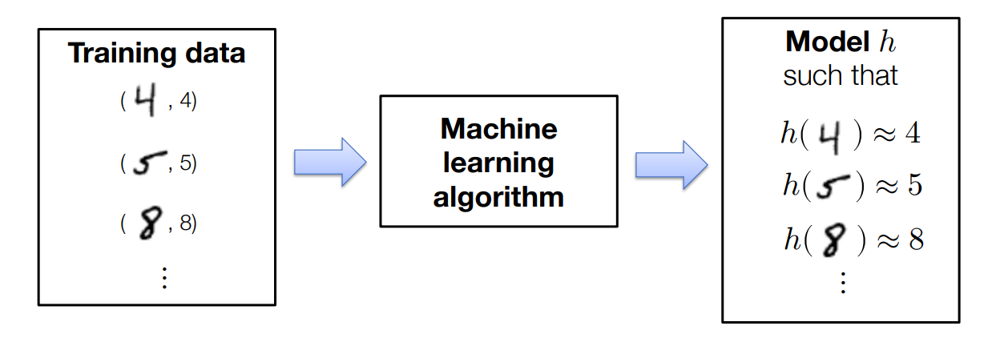
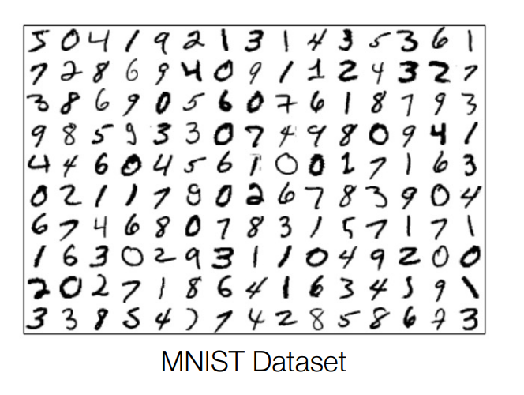
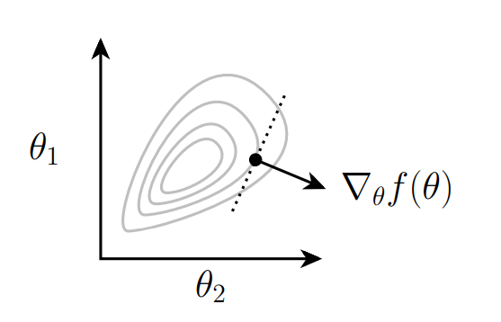
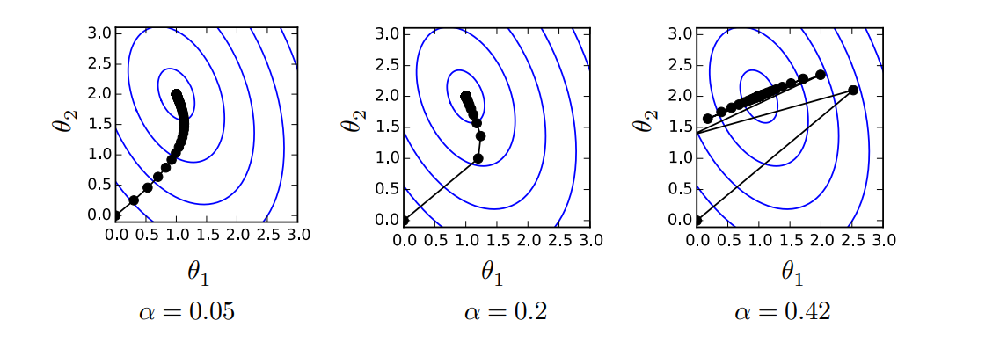

# ML Refresher / Softmax Regression

## 1 机器学习基础

### 1.1 机器学习是数据驱动的编程

假设要编写一个程序，将手写的数字图分类为适当的类别：0,1,…,9；

认真思考数字的性质，尝试确定表示数字类型的逻辑，并编写一个程序来编码此逻辑，但这样的实现很困难

{width="500"}

一个简单的方式是使用机器学习，特别的，有监督学习：收集一组具有已知标签的图像训练集，并将其输入机器学习算法，该算法（如果做得好）将自动生成解决此任务的“程序”：

{width="500"}

### 1.2 机器学习算法的三要素

每个机器学习算法都包含三个不同的元素，通常由以下内容组成：

- 假设类：“程序结构”，通过一组参数参数化，描述了我们如何将输入（例如，数字图像）映射到输出（例如，类标签或不同类标签的概率）；

- 损失函数：指定给定假设（即参数的选择）在感兴趣的任务上执行得有多“好”的函数；

- 优化方法：确定一组参数的过程，这些参数（近似地）最小化训练集的损失总和；

## 2 Softmax回归

### 2.1 多分类问题设置

让我们考虑一个$k$分类问题，我们有：

- 训练数据：$x^{(i)}\in \mathbb R^n,y\in \{1,\ldots, k\}, i=1,\ldots, m$
- 其中$n$为输入数据的维度，$m$为训练数据的数量，$k$分类类别的数量

示例：28x28 MNIST手写数字分类：

- $n=28*28=784$
- $k = 10$
- $m = 60,000$

### 2.2 线性假设函数

我们的假设函数将输入$x\in \mathbb R^n$映射到$k$维向量：

$$
h: \mathbb{R}^n \rightarrow \mathbb{R}^k.
$$

其中$h_i(x)$表示将$x$分类为第$i$类的置信度。

**线性假设函数** 是使用线性变换描述该映射：

$$
h_\theta(x)=\theta^T x,\theta \in \mathbb R^{n\times k.}
$$

#### 2.2.1 批量矩阵符号

因为实际计算时涉及到多个样本，所以引入批量矩阵符号：

$$
X \in \mathbb{R}^{m\times n}= \begin{bmatrix} {x^{(1)}}^T \\ \vdots \\ {x^{(m)}}^T \end{bmatrix} \quad y = \begin{bmatrix} y^{(1)} \\ \vdots \\ y^{(m)} \end{bmatrix}
$$

那么线性假设类可以写成：

$$ 
h_\theta(X)=\left[\begin{array}{c}
-h_\theta\left(x^{(1)}\right)^T- \\
\vdots \\
-h_\theta\left(x^m\right)^T-
\end{array}\right]=\left[\begin{array}{c}
-x^{(1)^T} \theta- \\
\vdots \\
-x^{(m)^T} \theta-
\end{array}\right]=X \theta
$$ 

### 2.3 损失函数

####  2.3.1 分类误差

最简单的损失函数就是根据是否预测正确，如：

$$
\ell_{\text {err }}(h(x), y)= \begin{cases}0 & \text { if } \operatorname{argmax}_i h_i(x)=y \\ 1 & \text { otherwise }\end{cases}
$$

我们通常使用这个损失函数来评估分类器的质量；但是这个函数有一个重大的缺陷是非连续，因此我们无法使用梯度下降等优化方法来优化这个函数。

#### 2.3.2 softmax / cross-entropy loss

让我们通过取幂和归一化它的项（使它们全部为正且总和为一），将假设函数转换为“概率”：

$$
z_i=p(\text { label }=i)=\frac{\exp \left(h_i(x)\right)}{\sum_{j=1}^k \exp \left(h_j(x)\right)} \Leftrightarrow z \equiv \operatorname{normalize}(\exp (h(x))) 
\Leftrightarrow z \equiv \operatorname{softmax(h(x))}) 
$$

然后让我们将损失定义为真实类别的（负）对数概率：这称为softmax或交叉熵损失：

$$
\ell_{c e}(h(x), y)=-\log p(\text { label }=y)=-h_y(x)+\log \sum_{j=1}^k \exp \left(h_j(x)\right)
$$

### 2.4 softmax回归优化问题

机器学习算法的第三个组成部分是解决相关优化问题的方法，即最小化训练集平均损失的问题：

$$
\underset{\theta}{\operatorname{minimize}} \frac{1}{m} \sum_{i=1}^m \ell\left(h_\theta\left(x^{(i)}\right), y^{(i)}\right)
$$

对于softmax回归（即线性假设类和softmax损失函数）：

$$
\underset{\theta}{\operatorname{minimize}} \frac{1}{m} \sum_{i=1}^m \ell_{c e}\left(\theta^T x^{(i)}, y^{(i)}\right)
$$

那么我们如何找到解决这个优化问题的$\theta$呢？

#### 2.4.1 优化：梯度下降

对于函数$f: \mathbb{R}^{n \times k} \rightarrow \mathbb{R}$，梯度定义为：

$$
\nabla_\theta f(\theta) \in \mathbb{R}^{n \times k}=\left[\begin{array}{ccc}
\frac{\partial f(\theta)}{\partial \theta_{11}} & \cdots & \frac{\partial f(\theta)}{\partial \theta_{1 k}} \\
\vdots & \ddots & \vdots \\
\frac{\partial f(\theta)}{\partial \theta_{n 1}} & \cdots & \frac{\partial f(\theta)}{\partial \theta_{n k}}
\end{array}\right]
$$

梯度指向$f$减小最多的方向（局部）：

{width="500"}

为了最小化函数，梯度下降算法通过在负梯度方向上迭代地执行步骤来进行：

$$
\theta:=\theta-\alpha \nabla_\theta f(\theta)
$$

其中$\alpha>0$是步长大小或学习率：

{width="500"}

注意学习率不能太大或者太小，太大会不收敛，太小会收敛的太慢。

#### 2.4.2 随机梯度下降

如果我们的目标函数（如机器学习中的情况）是个体损失的总和，我们不想使用所有示例计算梯度来对参数进行一次更新；

相反，采取许多梯度更新步骤，每个步骤都基于一个小批量（数据的小部分），使用一次“传递”数据进行多次参数更新；

重复：

- 采样$X \in \mathbb{R}^{B \times n}, y \in\{1, \ldots, k\}^B$
- 更新参数$\theta:=\theta-\frac{\alpha}{B} \sum_{i=1}^B \nabla_\theta \ell\left(h_\theta\left(x^{(i)}\right), y^{(i)}\right)$

#### 2.4.3 softmax目标函数的梯度

接下来的任务是计算softmax目标函数的梯度：

$$
\nabla_\theta \ell_{c e}\left(\theta^T x, y\right)=?
$$

对于$h\in \mathbb R^k$，我们有：

$$
\begin{aligned}
\frac{\partial \ell_{c e}(h, y)}{\partial h_i} & =\frac{\partial}{\partial h_i}\left(-h_y+\log \sum_{j=1}^k \exp h_j\right) \\
& =-1\{i=y\}+\frac{\exp h_i}{\sum_{j=1}^k \exp h_j}
\end{aligned}
$$

向量形式为：

$$
\begin{aligned}
\nabla_h \ell_{c e}(h, y)&=z-e_y\\
z&=\text { softmax }(h)
\end{aligned}
$$

所以接下来我们该如何计算$\nabla_\theta \ell_{c e}\left(\theta^T x, y\right)$呢？

- 方法1：使用链式法则逐步计算；
- 方法2：假设每一项都是标量，先计算标量的结果，然后通过维度决定运算顺序；

方法2是方便的方式，这里举个例子，首先假设结果都是标量，那么$\frac{\partial \theta^T x}{\partial \theta}= x$：

$$
\begin{aligned}
\frac{\partial}{\partial \theta} \ell_{c e}\left(\theta^T x, y\right) & =\frac{\partial \ell_{c e}\left(\theta^T x, y\right)}{\partial \theta^T x} \frac{\partial \theta^T x}{\partial \theta} \\
& =\left(z-e_y\right)(x)
\end{aligned}
$$

注意此时维度对不上，注意到$x\in \mathbb R^n, z-e_y \in \mathbb R^{k},\frac{\partial}{\partial \theta} \ell_{c e}\left(\theta^T x, y\right)\in \mathbb R^{n\times k}$，所以：

$$
\nabla_\theta \ell_{c e}\left(\theta^T x, y\right) \in \mathbb{R}^{n \times k}=x\left(z-e_y\right)^T
$$

Batch形式为：

$$
\nabla_\theta \ell_{c e}(X \theta, y) \in \mathbb{R}^{n \times k}=X^T\left(Z-I_y\right), \quad Z=\operatorname{softmax}(X \theta)
$$

### 2.5 小结

最终softmax回归算法是：

重复直到收敛：

- 采样$X \in \mathbb{R}^{B \times n}, y \in\{1, \ldots, k\}^B$
- 更新参数$\theta:=\theta-\frac{\alpha}{B} X^T\left(Z-I_y\right)$