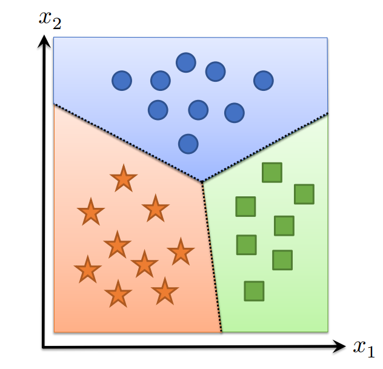
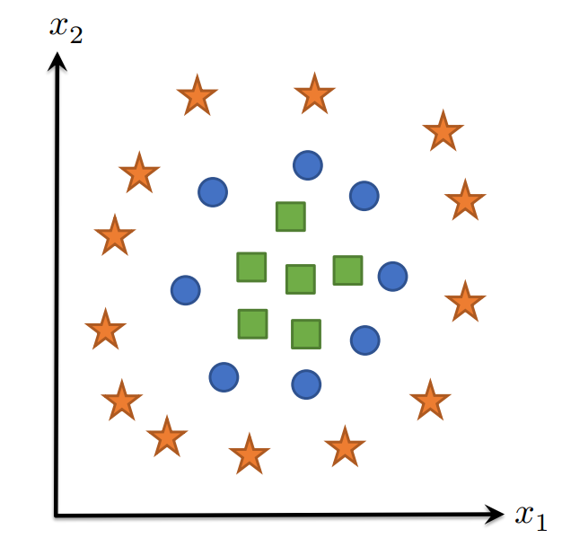
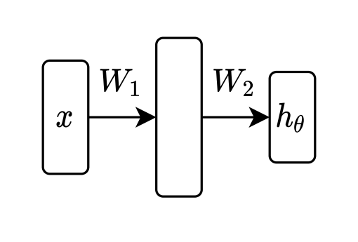
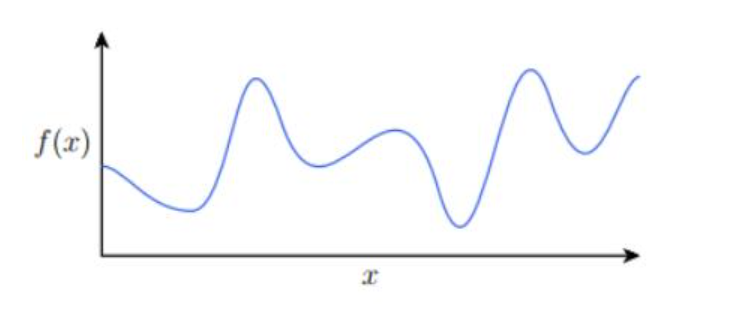

# Manual Neural Networks / Backprop

## 1 从线性到非线性假设类

### 1.1 线性假设类的问题

回想一下，我们需要一个假设函数来将$\mathbb R^n$中的输入映射到$\mathbb R^k$中的输出，因此我们最初使用线性假设类：

$$
h_\theta(x)=\theta^T x, \quad \theta \in \mathbb{R}^{n \times k}
$$

这个分类器本质上形成了输入的$k$个线性函数，然后预测值最大的类，相当于把输入分成每个类对应的$k$个线性区域：

{width="300"}

### 1.2 非线性分类边界呢？

如果我们的数据不能被一组线性区域分开怎么办？我们想要一些方法通过一组非线性的类边界来分离这些点：

一个想法：将线性分类器应用于数据的某些（可能是更高维度的）特征：

$$
\begin{gathered}
h_\theta(x)=\theta^T \phi(x) \\
\theta \in \mathbb{R}^{d \times k}, \phi: \mathbb{R}^n \rightarrow \mathbb{R}^d
\end{gathered}
$$

如图：

{width="300"}

### 1.3 我们如何创建特征？

我们如何创建特征函数$\phi$？

- 通过手动设计与问题相关的特征（机器学习的“旧”方式）；
- 以一种从数据中学习的方式（机器学习的“新”方式）；

最简单的方式：如果将$\phi$设置为线性函数会怎么样？

$$
\phi(x)=W^T x
$$

不起作用，因为它只是相当于另一个线性分类器：

$$
h_\theta(x)=\theta^T \phi(x)=\theta^T W^T x=\tilde{\theta} x
$$

### 1.4 非线性特征

既然线性函数无效，那什么有效呢？ 只要是线性特征的任何非线性函数即可：

$$
\phi(x)=\sigma\left(W^T x\right)
$$

其中$W \in \mathbb{R}^{n \times d}$，并且$\sigma: \mathbb{R}^d \rightarrow \mathbb{R}^d$是任意非线性函数。

例子：设$W$为随机高斯样本的（固定）矩阵，并设$\sigma$为余弦函数$\Rightarrow$“随机傅里叶特征”（适用于许多问题）。

但也许我们也想训练$W$来最小化损失？ 或者我们想将多个特征组合在一起？

## 2 神经网络

### 2.1 神经网络/深度学习

神经网络是指一种特定类型的假设类，由多个参数化的可微分函数（又名“层”）组成，以任何方式组合在一起以形成输出。

该术语源于生物学灵感，但在这一点上，从字面上看，上述类型的任何假设函数都被称为神经网络。

“深度网络”只是“神经网络”的同义词，“深度学习”只是指“使用神经网络假设类的机器学习”；

但现代神经网络确实涉及将许多函数组合在一起，因此“深度”通常是一个合适的限定词；

### 2.2 “两层”神经网络

{width="300"}

这里就从两层神经网络，这种神经网络的最简单形式入手，讨论神经网络的正向计算和优化方法。与前面的线性模型相比，就是引入了一个新的可学习参数和非线性映射，即

$$
\begin{aligned}
& h_\theta(x)=W_2^T \sigma\left(W_1^T x\right) \\
& \theta=\left\{W_1 \in \mathbb{R}^{n \times d}, W_2 \in \mathbb{R}^{d \times k}\right\}
\end{aligned}
$$

其中$\sigma: \mathbb{R} \rightarrow \mathbb{R}$是按元素应用于向量的非线性函数（例如 sigmoid、ReLU）

如果输入是小批量矩阵，则有

$$
h_\theta(X)=\sigma\left(X W_1\right) W_2
$$

那么神经网络能做什么呢？一个重要的事实就是神经网络可以拟合任意函数。

### 2.3 通用函数逼近

定理（一维情况）：给定任意平滑函数$f:\mathbb R\to \mathbb R$，闭区域$\mathcal D \subset \mathbb R$，和$\epsilon > 0$，我们可以构造一个单隐藏层神经网络$\hat f$，使得：

$$
\max _{x \in \mathcal{D}}|f(x)-\hat{f}(x)| \leq \epsilon
$$

{width="500"}

即两层神经网络可以在给定区间很好地拟合任何平滑函数——这也说明了神经网络究竟有多么大的威力。这里只在一维情况（输入为标量）的情况下做一证明，但是实际上该定理对任意维度的输入都适用：在$\mathcal D$上稠密地采样若干点$\left(x^{(i)}, f\left(x^{(i)}\right)\right)$，可以将$f(x)$在$\mathcal D$的部分分割成若干小段，每一小段可以使用线性函数近似（点与点之间使用线段连接）。由于$f$是连续的，因此可以通过这种逐段线性近似完成对整个底层函数的近似。而神经网络可以做到创建这些线性函数，只需要满足如下形式

$$
\hat{f}(x) = \sum_{i=1}^{d} \pm max \{ 0,w_{i}x+b_{i} \}
$$

可以预料到，点越多，$d$越大，神经网络对底层的拟合越好，不过其容量也更大（也更容易过拟合）

### 2.4 全连接深度网络

两层神经网络可以很容易地扩展到更深层的情况，因此可以对通用形式做一讨论：假设神经网络有$L$层，每一层对前一层都做相同的非线性变换，$L$层神经网络的一种更通用的形式——又名“多层感知机”（MLP）、前馈网络、全连接网络——以批处理形式，可以表述为：

$$
\begin{aligned}
& Z_{i+1}=\sigma_i\left(Z_i W_i\right), i=1, \ldots, L \\
& Z_1=X \\
& h_\theta(X)=Z_{L+1} \\
& {\left[Z_i \in \mathbb{R}^{m \times n_i}, W_i \in \mathbb{R}^{n_i \times n_{i+1}}\right]}
\end{aligned}
$$

其中非线性函数$\sigma_i: \mathbb{R} \rightarrow \mathbb{R}$按元素应用，参数为：

$$
\theta=\left\{W_1, \ldots, W_L\right\}
$$

这里也可以加入偏置项，不过为了方便，在后面的课程中暂不考虑

$Z$称为（隐藏）层，也称为激活或神经元，实际上就是提取出的特征

既然两层神经网络已经可以逼近任何函数，那么为什么要使用更多的层（真正的“深层网络”）？并不是因为它跟人脑的工作原理更像，也不是效率更高，而更多来自于实践经验

## 3 反向传播（即计算梯度）

这里slide里举了一个两层神经网络的计算例子，计算过程与Lecture2中相似，不多赘述

### 3.1 一般形式的反向传播

对于$L$层全连接神经网络，记第$i$层的输出为：

$$
Z_{i+1}=\sigma_i\left(Z_i W_i\right), \quad i=1, \ldots, L
$$

那么根据链式法则，有：

$$
\frac{\partial \ell\left(Z_{L+1}, y\right)}{\partial W_i}=\frac{\partial \ell}{\partial Z_{L+1}} \cdot \frac{\partial Z_{L+1}}{\partial Z_L} \cdot \frac{\partial Z_{L-1}}{\partial Z_{L-2}} \cdot \ldots \cdot \frac{\partial Z_{i+2}}{\partial Z_{i+1}} \cdot \frac{\partial Z_{i+1}}{\partial W_i}
$$

记：

$$
G_{i+1}=\frac{\partial \ell\left(Z_{L+1}, y\right)}{\partial Z_{i+1}}
$$

然后我们有一个简单的“反向”迭代来计算：

$$
G_i=G_{i+1} \cdot \frac{\partial Z_{i+1}}{\partial Z_i}=G_{i+1} \cdot \frac{\partial \sigma_i\left(Z_i W_i\right)}{\partial Z_i W_i} \cdot \frac{\partial Z_i W_i}{\partial Z_i}=G_{i+1} \cdot \sigma^{\prime}\left(Z_i W_i\right) \cdot W_i
$$

### 3.2 计算实际梯度

要将这些量转换为“真实”梯度，请考虑矩阵大小：

$$
G_i=\frac{\partial \ell\left(Z_{L+1}, y\right)}{\partial Z_i}=\nabla_{Z_i} \ell\left(Z_{L+1}, y\right) \in \mathbb{R}^{m \times n_i}
$$

所以使用矩阵运算可得：

$$
G_i=G_{i+1} \cdot \sigma^{\prime}\left(Z_i W_i\right) \cdot W_i=\left(G_{i+1} \circ \sigma^{\prime}\left(Z_i W_i\right)\right) W_i^T
$$

实际参数梯度的类似公式：

$$
\begin{aligned}
& \frac{\partial \ell\left(Z_{L+1}, y\right)}{\partial W_i}=G_{i+1} \cdot \frac{\partial \sigma_i\left(Z_i W_i\right)}{\partial Z_i W_i} \cdot \frac{\partial Z_i W_i}{\partial W_i}=G_{i+1} \cdot \sigma^{\prime}\left(Z_i W_i\right) \cdot Z_i \\
& \Longrightarrow \nabla_{W_i} \ell\left(Z_{L+1}, y\right)=Z_i^T\left(G_{i+1} \circ \sigma^{\prime}\left(Z_i W_i\right)\right)
\end{aligned}
$$

### 3.3 反向传播：前向和反向传播

综上所述，我们可以按照以下过程有效地计算神经网络所需的所有梯度。

前向传播：

- 初始化：$Z_1=X$
- 迭代：$Z_{i+1}=\sigma_i(Z_i W_i),i=1,\ldots, L$

反向传播：

- 初始化：$G_{L+1}=\nabla_{Z_{L+1}} \ell\left(Z_{L+1}, y\right)=S-I_y$
- 迭代：$G_i=\left(G_{i+1} \circ \sigma_i^{\prime}\left(Z_i W_i\right)\right) W_i^T, \quad i=L, \ldots, 1$

我们可以计算所需要的梯度：

$$
\nabla_{W_i} \ell\left(Z_{k+1}, y\right)=Z_i^T\left(G_{i+1} \circ \sigma_i^{\prime}\left(Z_i W_i\right)\right)
$$

由此可见，反向传播实际上就是链式求导+中间结果变量缓存的过程——注意这里存在一个权衡问题：如果想尽快求出参数的梯度，就需要缓存尽可能多的变量结果$Z$和$G$，从而耗费更多内存

注意这里面每个中间层的作用：除了在正向计算时计算自己的输出，还要在反向计算时把“收到的梯度”$G_{i+1}$
和它自己的导数$\frac{\partial Z_{i+1} }{\partial W_i}$相乘。这个过程实际上是一个很通用的操作，可以模块化，甚至还有一个名字：向量-雅可比乘积，它也是自动微分的基石