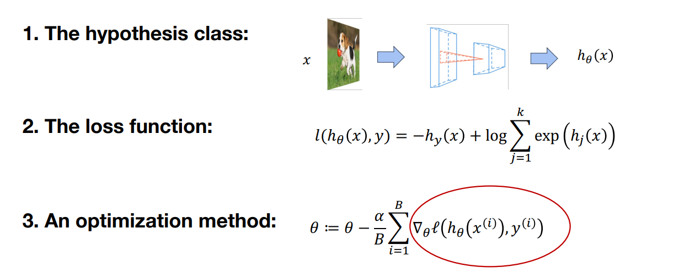
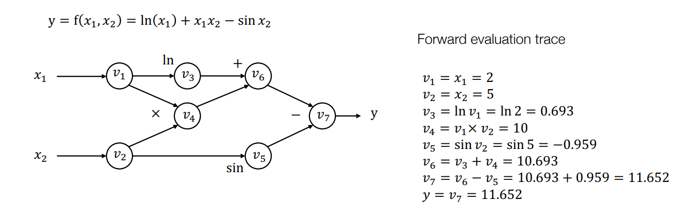
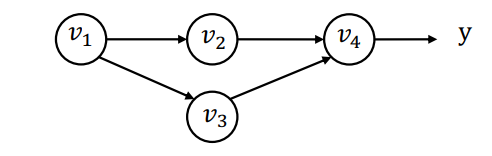
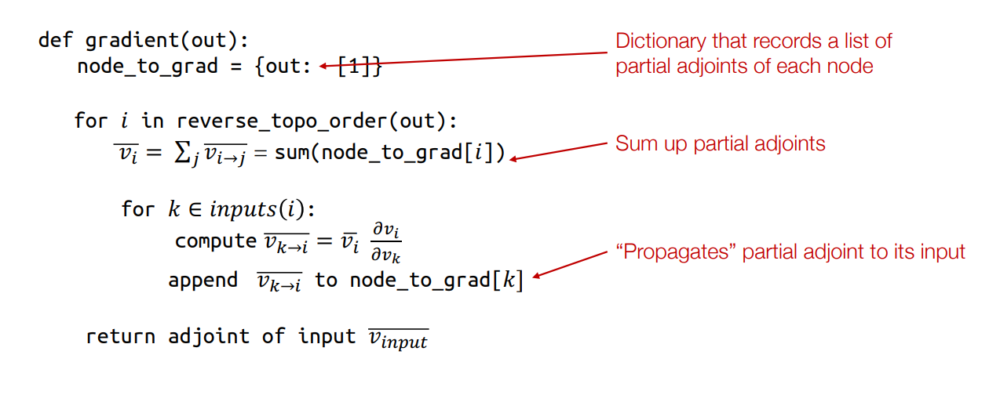
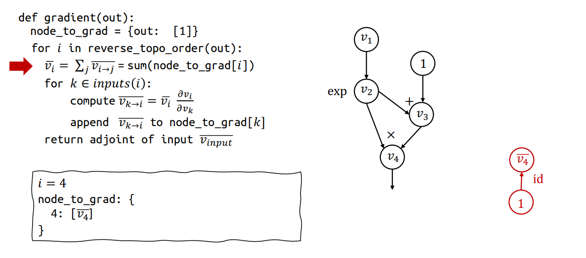
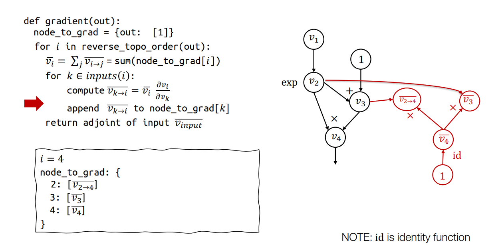
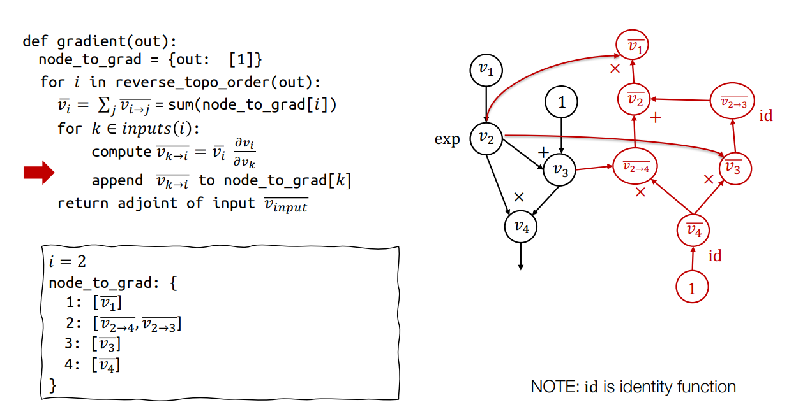
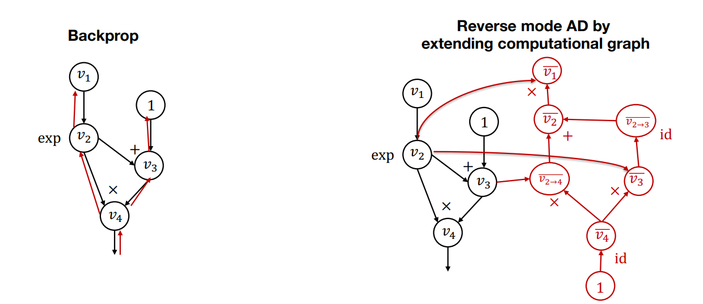
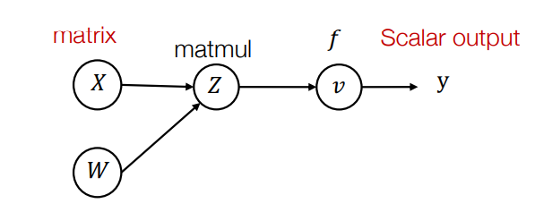
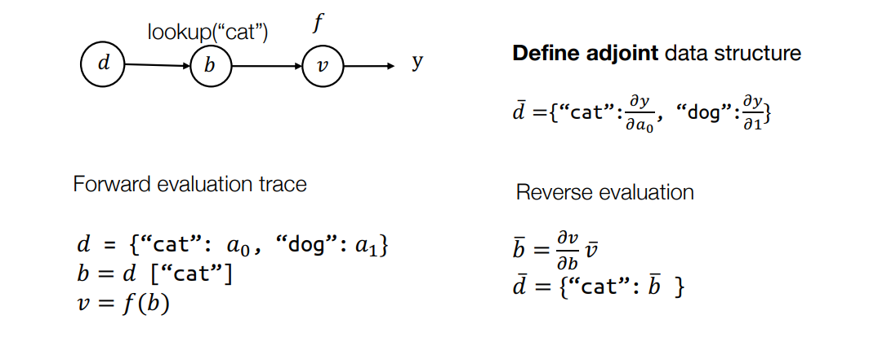

# Automatic Differentiation 

## 1 不同微分方法的介绍

## 1.1 微分在机器学习中如何应用？

回顾：每个机器学习算法都包含三个不同的元素。计算关于假设类参数的损失函数梯度是机器学习中最常见的操作：

{width="500"}

## 1.2 数值微分

数值微分是根据定义直接计算梯度：

$$
\frac{\partial f(\theta)}{\partial \theta_i}=\lim _{\epsilon \rightarrow 0} \frac{f\left(\theta+\epsilon e_i\right)-f(\theta)}{\epsilon}
$$

一种更精确的近似梯度的方法（根据泰勒展开）：

$$
\frac{\partial f(\theta)}{\partial \theta_i}=\frac{f\left(\theta+\epsilon e_i\right)-f\left(\theta-\epsilon e_i\right)}{2 \epsilon}+o\left(\epsilon^2\right)
$$

尽管如此，在实践中上式用得也不多，因为仍然存在数值误差，需要使用很小的$\delta$做计算。

另外，这里对每个维度都需要计算做两次正向计算，总体的计算代价也太大。不过，该方法可以用来检查自动微分计算出来的结果是否合理。为了避免选取$d$个单位向量，使用从球面空间中采样的向量$\delta$，则如果自动微分框架计算的结果$\nabla_\theta f(\theta)$正确，有：

$$
\delta^T \nabla_\theta f(\theta)=\frac{f(\theta+\epsilon \delta)-f(\theta-\epsilon \delta)}{2 \epsilon}+o\left(\epsilon^2\right)
$$

## 1.3 符号微分

通过求和、乘积和链式法则推导出梯度，这种方法跟人手推公式的思路类似，比较直观。

$$
\begin{aligned}
\frac{\partial(f(\theta)+g(\theta))}{\partial \theta}&=\frac{\partial f(\theta)}{\partial \theta}+\frac{\partial g(\theta)}{\partial \theta}\\
\frac{\partial(f(\theta) g(\theta))}{\partial \theta}&={g}(\theta) \frac{\partial f(\theta)}{\partial \theta}+{f}(\theta) \frac{\partial g(\theta)}{\partial \theta} \\
\frac{\partial f(g(\theta))}{\partial \theta}&=\frac{\partial f(g(\theta))}{\partial g(\theta)} \frac{\partial g(\theta)}{\partial \theta}
\end{aligned}
$$

但是会引起很多重复计算，例如下面这个例子：

$$
\begin{aligned}
f(\theta)&=\prod_{i=0}^n \theta_i\\
\frac{f(\theta)}{\partial \theta_k}&=\prod_{j \neq k}^n \theta_j
\end{aligned}
$$

计算这个梯度需要$n(n-1)$次乘法，尽管稍微优化一下计算过程能降低到$n$次乘法，但是如果只是简单的把规则实现出来，就会忽视掉很多可以被复用的结果。但是，有时候，的确可以把自动微分看做是符号微分的一种简洁形式

## 1.4 计算图

自动微分的核心内容是计算图，其本质是一个有向无环图，表示某个特定函数的所有操作，例如下图：

{width="700"}

注意同样的函数可以有不同的计算图，例如对三个元素$a$、$b$、$c$相乘的结果，可以先计算$a$和$b$的乘积，也可以先计算$b$和$c$的乘积。因此，计算图也可以看做是对函数操作计算顺序的定义说明

计算图中的每个节点都是一个中间计算过程，而边表示输入与输出之间的关系。例如，$v_3$对应的节点的输入就是$v_1$的输出，做$ln$操作后的结果输出给$v_6$作为其输入

## 1.5 正向模式自动微分

即在有了计算图以后，就可以根据拓扑排序的顺序计算各个中间结点的结果，进而得到最后结果。而且，可以通过该图得到微分的结果，这种方法叫做 **正向模式自动微分**：从图中最初的节点开始，顺着正向计算的过程（也是计算图正向拓扑逻辑的过程）对每个中间节点计算其对原始输入的导数。

记

$$
\dot{v}_i=\frac{\partial v_i}{\partial x_1}
$$

则对上面的计算图，可以计算正向自动微分结果如下

$$
\begin{aligned}
& \dot{v}_1=1 \\
& \dot{v}_2=0 \\
& \dot{v}_3=\dot{v}_1 / v_1=0.5 \\
& \dot{v}_4=\dot{v}_1 v_2+\dot{v}_2 v_1=1 \times 5+0 \times 2=5 \\
& \dot{v}_5=\dot{v}_2 \cos v_2=0 \times \cos 5=0 \\
& \dot{v}_6=\dot{v}_3+\dot{v}_4=0.5+5=5.5 \\
& \dot{v}_7=\dot{v}_6-\dot{v}_5=5.5-0=5.5
\end{aligned}
$$

因此：

$$
\frac{\partial y}{\partial x_1}=\dot{v_7}=5.5
$$

对于正向模式自动微分而言，它是从正向计算图的起点开始计算，而起点的中间变量对输入的梯度很容易可以获取到：如果变量和输入相同，那么梯度就为1，否则就是0。接着，对其它中间节点，就可以通过计算该节点对输入的导数，结合输入的自动微分结果，得到该节点的自动微分结果

正向模式自动微分也存在一定的局限性。对函数$f:\mathbb R^n \to \mathbb R^k$，由于该方法对一个参数正向计算一遍就可以获得损失对它的梯度结果，因此当$n$比较小的时候，计算量较小。但是在深度学习的场景下，通常输出是标量，而输入参数数量庞大，使用这种方法就会造成大量的计算代价。所以，需要设计另一种方法来计算自动微分结果——这也就引出了本次课的主题：反向模式自动微分

## 2 反向模式自动微分

### 2.1 例子

反向模式自动微分是从结果反推到输入的过程。由于要计算得到一个标量可能需要有多个输入，因此在该场景下定义一个新的术语伴随值（adjoint）：

$$
\bar{v}_i=\frac{\partial y}{\partial v_i}
$$

然后我们可以按照计算图的反向拓扑顺序迭代计算$\bar{v}_i$

$$
\begin{aligned}
& \overline{v_7}=\frac{\partial y}{\partial v_7}=1 \\
& \overline{v_6}=\bar{v}_7 \frac{\partial v_7}{\partial v_6}=\overline{v_7} \times 1=1 \\
& \overline{v_5}=\bar{v}_7 \frac{\partial v_7}{\partial v_5}=\overline{v_7} \times(-1)=-1 \\
& \overline{v_4}=\overline{v_6} \frac{\partial v_6}{\partial v_4}=\overline{v_6} \times 1=1 \\
& \overline{v_3}=\overline{v_6} \frac{\partial v_6}{\partial v_3}=\overline{v_6} \times 1=1 \\
& \overline{v_2}=\overline{v_5} \frac{\partial v_5}{\partial v_2}+\overline{v_4} \frac{\partial v_4}{\partial v_2}=\overline{v_5} \times \cos v_2+\bar{v}_4 \times v_1=-0.284+2=1.716 \\
& \overline{v_1}=\bar{v}_4 \frac{\partial v_4}{\partial v_1}+\overline{v_3} \frac{\partial v_3}{\partial v_1}=\overline{v_4} \times v_2+\bar{v}_3 \frac{1}{v_1}=5+\frac{1}{2}=5.5
\end{aligned}
$$

因此，通过巧妙地定义伴随值，可以从函数的结果递归计算中间节点的梯度：下一个节点的伴随值乘以输出对输入的偏导数。这样，通过一次反向传播，就可以得到所有参数的梯度

### 2.2 multiple path情形

当$v_1$被用于计算图的多条路径上（$v_2$和$v_3$）：

{width="300"}

即$y=f(v_2, v_3)$，那么：

$$
\overline{v_1}=\frac{\partial y}{\partial v_1}=\frac{\partial f\left(v_2, v_3\right)}{\partial v_2} \frac{\partial v_2}{\partial v_1}+\frac{\partial f\left(v_2, v_3\right)}{\partial v_3} \frac{\partial v_3}{\partial v_1}=\overline{v_2} \frac{\partial v_2}{\partial v_1}+\overline{v_3} \frac{\partial v_3}{\partial v_1}
$$

定义部分伴随：

$$
\overline{v_{i \rightarrow j}}=\bar{v}_j \frac{\partial v_j}{\partial v_i}
$$

则有：

$$
\bar{v}_i=\sum_{j \in \text { next }(i)} \overline{v_{i \rightarrow j}}
$$

总结后即可得到反向AD算法。

### 2.3 反向AD算法

{width="700"}

由于是根据反向拓扑排序确定的节点计算顺序，在计算节点$i$的梯度时，其后续的所有节点梯度都已经计算完毕，即所有以节点$i$为输入的节点都已经被访问过，相关的部分伴随值都已经备妥

### 2.4 通过扩展计算图的反向AD

在具体实现时，一个问题是使用什么样的数据结构存储adjoint_i（$\bar{v}_i$）和partial_adjoint_i_j（$\overline{v_{i \rightarrow j}}$）。虽然自然的想法是使用numpy的多维数组，但是真实实现时可以使用计算图来表达。例如，假设要计算的函数为
，对应的正向计算图和第一步反向传播计算图如下（id这里是相等函数）。这一步得到了$v_4$

{width="700"}

接下来第一次进入内层for循环，需要遍历$v_4$的输入计算$\overline{v_{k \rightarrow 4}}$。对于$k = 2$，有
$\overline{v_{2 \rightarrow 4}} = \overline{v_4} \cdot \frac{\partial v_4}{\partial v_2}$。
由于$v_4 = v_2 \times v_3$，因此$\overline{v_4} \cdot \frac{\partial v_4}{\partial v_2} = \overline{v_4} \cdot v_3$。相应地，$v_3$只有一个输入（在前向图中表现为$v_3$只有一个输出），因此可以直接计算得到$\overline{v_3} = v_2 \cdot \overline{v_4}$。

{width="700"}

接下来在外层for循环会遍历$v_3$、$v_2$、$v_1$，最后得到如下扩展计算图。扩展计算图不仅包含了正向计算信息，计算中间变量，还包含了梯度计算信息，同时计算各个伴随值。而且图更加灵活，可以接受任意输入

{width="700"}

这里有两点需要再说明一下。一是计算$v_2$时，因为在正向计算图中$v_2$有两个输出，所以在反向计算图中$v_2$有两个输入，对应部分伴随值$\overline{v_{2 \rightarrow 3}}$和$\overline{v_{2 \rightarrow 4}}$，然后要根据全微分定理把它们相加来得到$\overline{v_2}$。二是计算$v_1$时，根据定义有$\overline{v_1} = \overline{v_2} \cdot \frac{\partial v_2}{\partial v_1}$。而$v_2 = \exp(v_1)$，所以$\frac{\partial v_2}{\partial v_1} = \exp(v_1) = v_2$不变。因此在反向计算图中可以直接复用$v_2$这个节点，即$\overline{v_1} = \overline{v_2} \cdot v_2$，不需要再额外引入指数函数计算。

### 2.5 反向AD vs 反向传播

{width="700"}

在看到反向模式自动微分对应的计算图以后，很容易引出的问题是反向模式自动微分和反向传播之间有什么联系和区别。

做反向传播时，只构建正向计算图，在同样的图上计算梯度，不会在反向传播的过程中创建新的节点，用于第一代深度学习框架（caffe、cuda-convnet）

为什么现在的框架（例如TensorFlow、PyTorch）都使用反向模式自动微分，而不直接使用反向传播了呢？有时候我们对梯度的函数感兴趣，而反向传播只能解决如何计算梯度的问题，但是难以计算梯度的梯度——但是在反向模式自动微分中，由于我们有一个独立的计算图，就可以通过进一步扩展节点得到想要的结果。另外，由于反向模式自动微分的产出结果是计算图，我们可以直接在上面运行一次计算过程，进而有更多机会对这个图做进一步优化，例如在上面例子中去掉id操作

### 2.6 张量上的反向模式

上面讲述的是标量对标量的操作，不过上述方法可以容易扩展到多维向量和张量，只需要扩展伴随值到伴随张量上即可，对于高维情形，利用向量微积分即可，考虑下例：

{width="300"}

前向计算为：

$$
\begin{aligned}
 Z&=X W \\
 v&=f(Z)
\end{aligned}
$$

对于中间变量矩阵$Z$，根据矩阵乘法法则，有$Z_{ij} = \sum_{k} X_{ik} W_{kj}$。

因此反过来，对于伴随值$\overline{X_{i, k}}$，有：

$$
\overline{X_{i, k}}=\sum_j \frac{\partial z_{i, j}}{\partial X_{i, k}} \bar{Z}_{i, j}=W_{k, j} \bar{Z}_{i, j}
$$

写成矩阵形式就是$\bar{X}=\bar{Z} W^T$，其中伴随张量为

$$
\bar{Z}=\left[\begin{array}{ccc}
\frac{\partial y}{\partial z_{1,1}} & \ldots & \frac{\partial y}{\partial z_{1, n}} \\
\vdots & \ldots & \vdots \\
\frac{\partial y}{\partial z_{m, 1}} & \ldots & \frac{\partial y}{\partial z_{m, n}}
\end{array}\right]
$$

### 2.7 在其他数据结构上的反向AD

需要注意有时候中间变量或者输入甚至不是张量形式，而是某种数据结构。例如输入`d = {"cat": a0, "dog": a_1}`，然后对该输入进行的中间计算是查找：`b = d["cat"]`。这时可以将伴随值“升级”为伴随数据结构，如下

{width="700"}

简而言之，“伴随值”最好和正向传播中对应的值有同样的数据结构，这样示例中的算法就可以正常工作。