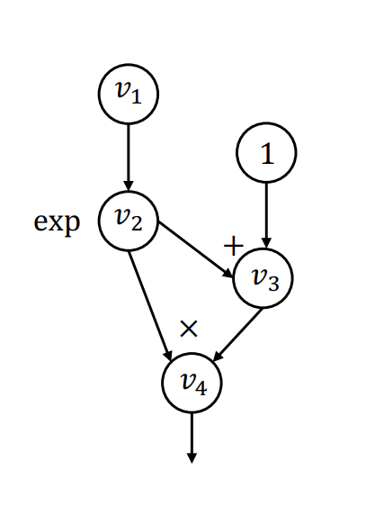
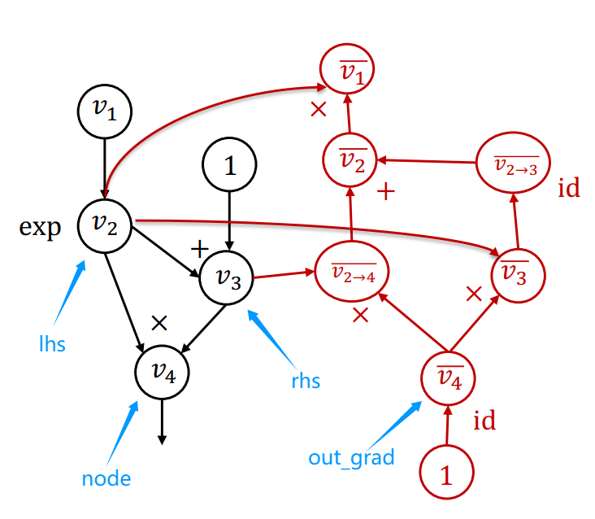

# Automatic Differentiation Implementation

本次课程使用的框架称为needle，是necessary elements of deep learning的缩写，它封装了实现一个深度学习模型所必要的一些模块。needle的基本代码库包含三个文件

- `needle/python/needle`
- `__init__.py`，定义所需要的所有import
- `autograd.py`，包含必要数据结构和自动微分机制的定义
- `ops.py`，包含所有算子的定义

## 1 初识needle

needle实现了一些基本功能，例如张量的基本操作（创建、算术计算）

```python
import needle as ndl
x = ndl.Tensor([1, 2, 3], dtype='float32')
y = x + 1  # y: needle.Tensor([2. 3. 4.])

# 实际上是执行了下面的语句。下面的语句进行了运算符重载
# y = ndl.add_scalar(x, 1)
```

可以通过`y.numpy()`将一个needle张量转换为numpy数组。本课开始两次作业使用numpy作为后端基石，因此此时实际就是返回底层的numpy数组。但是当后面引入GPU计算以后，这个操作就变得不那么平凡。编写测试用例的时候，都尽量把张量转换成numpy数组进行操作，这样可以处理在各种设备上运行的数据needle张量背后的核心是两个数据结构

needle张量背后的核心是两个数据结构

- `Value`，实际上`Tensor`是`Value`的一个子类。`Value`类包含如下属性：
    - `cached_data`：NDArray类型，当前该类性实际对应于`numpy.ndarray`。该字段缓存表示该张量的数据。在上面的例子中，y的`cached_data`就是结果`[2, 3, 4]`
    - `op`：指明要计算这个值需要做什么操作
    - `inputs`：`List["Value"]`类型，对应就是计算图中的输入，所以包含的不是某个`ndarray`列表，而是试着捕捉这些值是如何计算得到的。结合使用`Value`类里定义的上述成员变量`cached_data`和`op`就可以达到这个目的
    - `require_grad`：`bool`类型，指明该`Value`对象是否需要进行梯度计算。定义张量时，该字段默认为`True`。设计复杂神经网络时，有些节点可能不需要计算梯度，就需要把这个字段设成`False`
- `Op`，包含算子定义，实际上是一个抽象基类，需要继承该类来对具体算子做具体实现。最终的子类定义算子的实际计算逻辑

## 2 计算图

在Lecture4中提到的函数$y=(exp(v_1) + 1 ) * exp(v_1)$，其对应的正向计算图如下

<center>{width="200"}</center>

图中每个点$v_i$都对应一个`Value`对象。对于节点$v_4$，其`Value`对象的`inputs`是一个包含$v_2$和$v_3$的列表，`op`就是乘法操作$\times$。对于叶子节点（例如图中的$v_1$），其`op`是`None`，`inputs`是一个空列表

节点$v_3$的`op`对应于上面提到的张量和标量相加操作，由`Op`的子类`AddScalar`定义

```python
# 实际的继承关系为 Op -> TensorOp -> AddScalar
# 继承TensorOp的类调用__call__以后返回的都是张量
class AddScalar(TensorOp):
    def __init__(self, scalar):
        self.scalar = scalar
    
    # compute方法定义对底层数组的计算逻辑
    def compute(self, a: NDArray):
        return a + self.scalar
        
    # 计算伴随值。给定输出的部分伴随值，如何计算输入的部分伴随值
    def gradient(self, out_grad: Tensor, node: Tensor):
        return out_grad
```

通过如下方式可以定义图中的各个节点

```python
v1 = ndl.Tensor([0], dtype='float32')
v2 = ndl.exp(v1)
v3 = v2 + 1
v4 = v2 * v3

# v4 = needle.Tensor([2.])
print(v4)
assert v4.inputs[0] is v2
# needle.ops.EWiseMul
print(v4.op)
# 叶子节点没有op
assert v4.inputs[0].inputs[0].op is None
# 存储v4的计算结果，== np.ndarray([2.])
print(v4.cached_data)
# v3只有一个input。标量存储在op的属性中
# 下面的输出是{'scalar': 1}
print(v3.op.__dict__)
```

## 3 执行计算图

计算图定义好了以后，其会在什么时机执行呢？为了观察，定义两个张量

```python
x1 = ndl.Tensor([3], dtype='float32')
x2 = ndl.Tensor([4], dtype='float32')
x3 = x1 + x2
```
执行`x3 = x1 + x2`这条语句时实际调用了一个重载方法，在`autograd.py`中的`Tensor`类，有如下定义

```python 
def __add__(self, other):
    if isinstance(other, Tensor):
        return needle.ops.EWiseAdd()(self, other)
    else:
        # 这里通过定义一个算子实现了张量和标量相加的具体逻辑
        return needle.ops.AddScalar(other)(self)
```

由于`x2`也是张量，根据上述逻辑，调用了`needle.ops.EWiseAdd()(self, other)`。调用`EWiseAdd()`构造函数时，会调用`TensorOp`类的`__call__`函数

```python 
class TensorOp(Op):
    def __call__(self, *args):
        return Tensor.make_from_op(self, args)
```

该方法会创造一个计算图节点，并填充成员变量

```python
class Tensor(Value):
    ...
    @staticmethod
    def make_from_op(op: Op, inputs: List["Value"]):
        # 除去调用__init__方法以外的另一种初始化方法
        # 调用该方法的原因是__init__已经被重载过了
        tensor = Tensor.__new__(Tensor)
        # 初始化对应成员变量
        tensor._init(op, inputs)
        # 如果设置LAZY_MODE，realize_cached_data不会被调用
        # 该函数实际执行计算逻辑。所以在LAZY_MODE下初始化张量后不会马上得到计算结果
        if not LAZY_MODE:
            # 尝试计算并写入cached_data成员变量
            tensor.realize_cached_data()
        # LAZY_MODE模式下，可以通过调用y.data获得计算结果
        # 该方法会调用detach方法，进一步调用realize_cached_data进行计算
        # 如果计算特别耗时，可以考虑设置LAZY_MODE，这样可以省去计算时间，先建图，再优化
        return tensor
```

`_init`方法在基类`Value`中定义，主要就是填充一些成员变量，但是不做具体计算

```python
def _init(
    self,
    op: Optional[Op],
    inputs: List["Tensor"],
    *,
    num_outputs: int = 1,
    cached_data: List[object] = None,
    requires_grad: Optional[bool] = None,
):
    # 全局变量，跟踪内存中活跃张量的数量
    global TENSOR_COUNTER
    TENSOR_COUNTER += 1
    # 如果输入中存在requires_grad的Value，这个Value也需要计算梯度
    if requires_grad is None:
        requires_grad = any(x.requires_grad for x in inputs)
    self.op = op
    self.inputs = inputs
    self.num_outputs = num_outputs
    self.cached_data = cached_data
    self.requires_grad = requires_grad
```

计算真正发生于`tensor.realize_cached_data()`这一行，该函数尝试调用计算逻辑，对给定的算子和输入计算输出值，并将该值写入`cached_data`字段。如果`cached_data`非`None`，则直接返回

```python
class Value:
    def realize_cached_data(self):
        # 如果cached_data非None，说明已经调用过，直接返回，避免重复计算
        if self.cached_data is not None:
            return self.cached_data
        # 调用对应算子的底层计算逻辑
        # 输入是各个input的cached_data，这里实现了递归计算
        self.cached_data = self.op.compute(
            *[x.realize_cached_data() for x in self.inputs]
        )
        # 源码中的确有下面这一行，但是实际上是不需要的
        self.cached_data
        return self.cached_data
```

每个`Op`对象的`compute`方法定义正向计算逻辑

```python
class EWiseAdd(TensorOp):
    def compute(self, a: NDArray, b: NDArray):
        return a + b
```

由于输入实际上是两个numpy数组，因此只需要使用numpy的加法操作即可

简言之，对于

```python
x1 = ndl.Tensor([3], dtype='float32')
x2 = ndl.Tensor([4], dtype='float32')
x3 = x1 * x2
```

实际调用路径如下

- `autograd.TensorOp.__call__`
- `autograd.Tensor.make_from_op`
- `autograd.Tensor.realize_cached_data`
- `x3.op.compute`

当输入张量不是一个简单数组，而是一个计算图数据结构时，情况会变得有些微妙。例如，对于如下代码片段

```python
x = ndl.Tensor([1], dtype='float32')
sum_loss = ndl.Tensor([0], dtype='float32')
for i in range(100):
    sum_loss += x * x
```

对于这段代码的底层实现，不仅会累加损失值，而且实际上会一直在重复建图过程，最后会得到一个很长的计算图

```python
print(sum_loss.inputs[0].inputs[0])
# 输出为needle.Tensor([98.])，即这里包含了至少100个节点
```

修改方法是调用`detach`函数，该方法只会返回一个普通的张量（`inputs`为空列表，`op`为`None`）

```python
for i in range(100):
    sum_loss = (sum_loss + x * x).detach()
assert len(sum_loss.inputs) == 0
```

## 4 反向模式自动微分

如前所述，可以在正向计算图的基础上进行扩展，生成反向模式自动微分需要的节点，组成反向计算图，计算得到各节点的梯度。这里主要利用的是各个`Op`对象的`gradient`方法。例如对`EWiseMul`这个`Op`

```python
class EWiseMul(TensorOp):
    def compute(self, a: NDArray, b: NDArray):
        return a * b
    
    def gradient(self, out_grad: Tensor, node: Tensor):
        lhs, rhs = node.inputs
        return out_grad * rhs, out_grad * lhs
```
`gradient`方法的输入不再是`NDArray`，而是两个`Tensor`节点，因为这里要做的不仅是计算梯度值，还要递归计算整个计算图

对于最开始的计算图，有$v_4 = v_2 \times v_3$，那么在反向模式下，需要计算两个伴随值$\overline{v_{2 \rightarrow 4}}$和$\overline{v_{3 \rightarrow 4}}$。回顾伴随值的计算方法，有

$$
\overline{v_{i \rightarrow j}} = \overline{v_j} \cdot \frac{\partial v_j}{\partial v_i}
$$

因此

$$
\overline{v_{2 \rightarrow 4}} = \overline{v_4} \cdot \frac{\partial v_4}{\partial v_2} \\
= \overline{v_4} \cdot v_3
$$

类似地，$\overline{v_{3 \rightarrow 4}} = \overline{v_4} \cdot v_2$。对应于代码中的逻辑，`out_grad`就是$\overline{v_4}$，`lhs`就是$v_2$，`rhs`就是$v_3$，返回值`out_grad * rhs`为$\overline{v_4} \cdot v_3$，`out_grad * lhs`为$\overline{v_4} \cdot v_2$，两者分别为$\overline{v_{2 \rightarrow 4}}$和$\overline{v_{3 \rightarrow 4}}$，和定义相吻合。其与计算图有如下对应关系

<center>{width="400"}</center>

有时候返回的梯度可能只有一个值。为了可以统一处理，通过`gradient_as_tuple`方法使得梯度总是为元组类型
