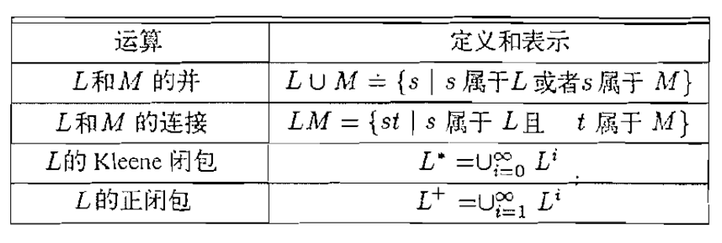
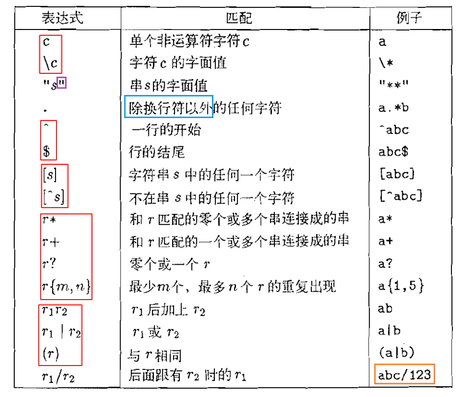
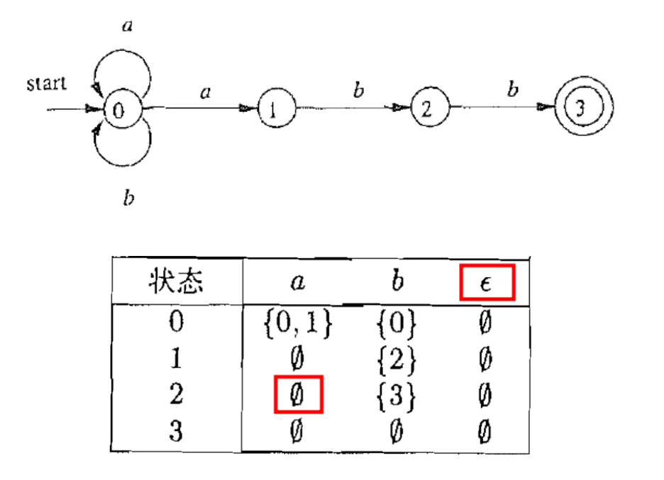
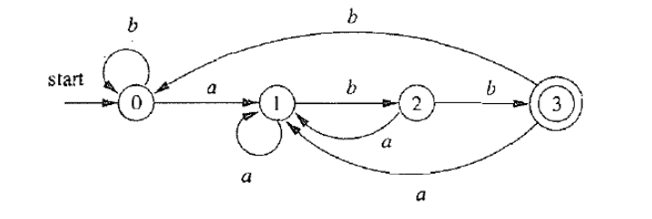
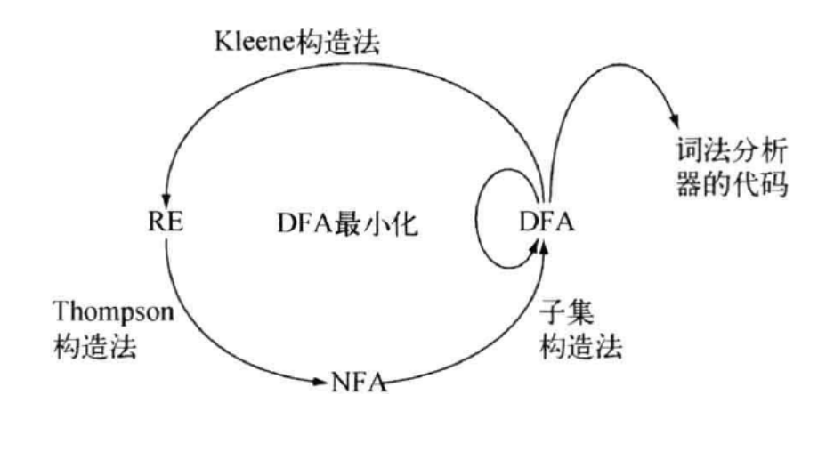

## 串和语言

$Definition$ **字母表**：字母表 $\sum$ 是一个有限的符号集合。

$Definition$ **串**：字母表 $\sum$ 上的串是由 $\sum$ 中符号构成的一个 **有穷** 序列。其中空串：$|\epsilon| = 0$

$Definition$ **串上的“连接”运算**：

例如$x = dog, y=house \Longrightarrow xy=doghouse$

其中满足：$s\epsilon = \epsilon s = s$

$Definition$ **串上的“指数”运算**：$s^0 \triangleq \epsilon \quad s^{i} \triangleq ss^{i-1},i>0$

$Definition$ **语言**：语言是给定字母表 $\sum$ 上任意的 **可数的** 串集合。例如：$\emptyset$, $\{\epsilon\}$, $id:\{a,b,a_1,a_2,...\}$, $ws:\{blank,tab,newline\}$...

**语言是串的集合**。因此，可以通过集合操作构造新的语言。

{width="500"}

$L^{*} \left( L^{+} \right)$ 允许我们构造 **无穷** 集合。（意义在于：例如我们永远没办法写完所有的C语言源程序）

## 正则表达式

每个正则表达式$r$对应一个正则语言$L(r)$

正则表达式是 **语法**，正则语言是 **语义**。
例如：$ID:[a-zA-Z][a-zA-Z0-9]^{*} \Longrightarrow \{a1,a2,ab,...\}$

$Definition$ **正则表达式**：给定字母表$\sum$，$\sum$上的正则表达式由且仅由以下规则定义：
  
- $\epsilon$是正则表达式
- $\forall a \in \sum$, $a$是正则表达式
- 如果$r$是正则表达式，则$(r)$是正则表达式
- 如果$r$与$s$是正则表达式，则$r|s,rs,r^*$也是正则表达式

运算优先级：$() > * > 连接 > |$

$Definition$ **正则表达式对应的正则语言**：

- $L(\epsilon)=\{\epsilon\}$
- $L(a) = \{a\}, \forall a \in \sum$
- $L((r)) = L(r)$
- $L(r|s) = L(r)\cup L(s) \quad L(rs)=L(r)L(s) \quad L(r^*)=(L(r))^*$

如下为lex的正则表达式的扩展表示方法

{width="500"}

## NFA | 非确定性有穷自动机

$Definition$ NFA(Nondeteministic Finite Automaton)：非确定性有穷自动机$\mathcal{A}$ 是一个五元组 $\mathcal{A} = (\Sigma, S, s_{0}, \delta, F)$：

- 字母表 $\sum$（$\epsilon \notin \sum$）
- 有穷的 **状态集合** $S$
- *唯一* 的初始状态 $s_0 \in S$
- **状态转移函数** $\delta \qquad \delta:S\times (\sum \cup \{\epsilon \}) \to 2^S$
- 接受状态集合 $F	\subseteq S$ 

{width="500"}

**约定**：所有没有对应出边的字符默认指向 **“空状态”** $\emptyset$

（非确定性）有穷自动机可以识别（接受/拒绝）$\sum$ 上的字符串

$Definition$ **接受**：（非确定性）有穷自动机 $\mathcal{A}$ 接受字符串$x$, 当且仅当 **存在** 一条从开始状态$s_0$到某个接受状态$f\in F$、标号为$x$的路径。

因此，$\mathcal{A}$定义了一种语言$L(\mathcal{A})$：它能接受的所有字符串构成的集合

???+Example

    对于上述图示中的自动机，显然$aabb \in L(\mathcal{A}) \quad ababab\notin L(\mathcal{A})$

    可以很容易将这个定义的语言转化为正则表达式 $L(\mathcal{A}) = L((a|b)^*abb)$

    关于自动机$L(\mathcal{A})$的 **两个基本问题**：

    - **Membership问题**：给定的字符串$x,x\in L(\mathcal{A})?$
    - $L(\mathcal{A})$究竟是什么？

    上述示例就是这两个基本问题的具体化

## DFA | 确定性有穷自动机

$Definition$ DFA(Deteministic Finite Automaton)：确定性有穷自动机$\mathcal{A}$ 是一个五元组 $\mathcal{A} = (\Sigma, S, s_{0}, \delta, F)$：

- 字母表 $\sum$（$\epsilon \notin \sum$）
- 有穷的 **状态集合** $S$
- *唯一* 的初始状态 $s_0 \in S$
- **状态转移函数** $\delta \qquad \delta:S\times \sum  \to S$
- 接受状态集合 $F	\subseteq S$ 

{width="500"}

**约定**：所有没有对应出边的字符默认指向一个 **“死状态”**

## 小结

$NFA$ 简洁易于理解，便于描述语言$L(\mathcal{A})$

$DFA$ 易于判断$x \in L(\mathcal{A})$，适合产生词法分析器

因此，可以用$NFA$描述语言，用$DFA$实现词法分析器

> $RE \Longrightarrow NFA \Longrightarrow DFA \Longrightarrow$ 词法分析器

{width="500"}

## 从 RE 到 NFA: Thompson 构造法

Thompson 构造法的基本思想: **按结构归纳**

