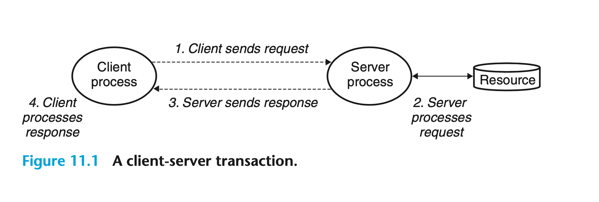
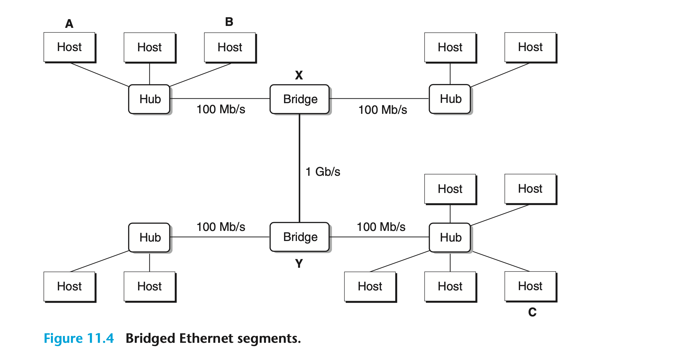
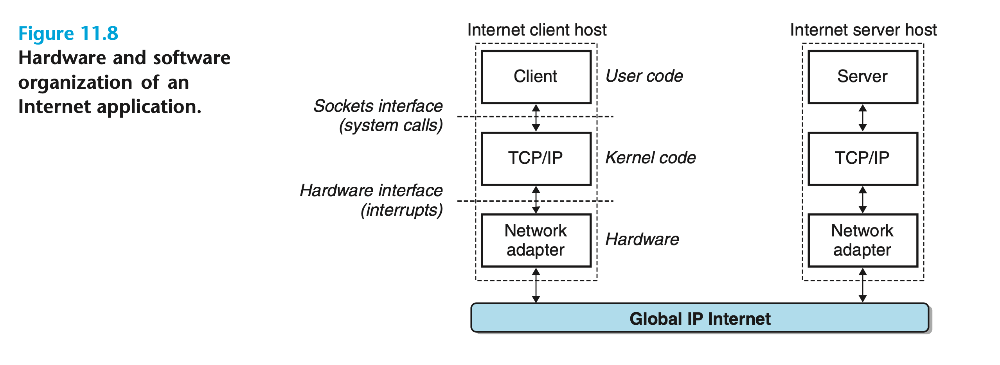
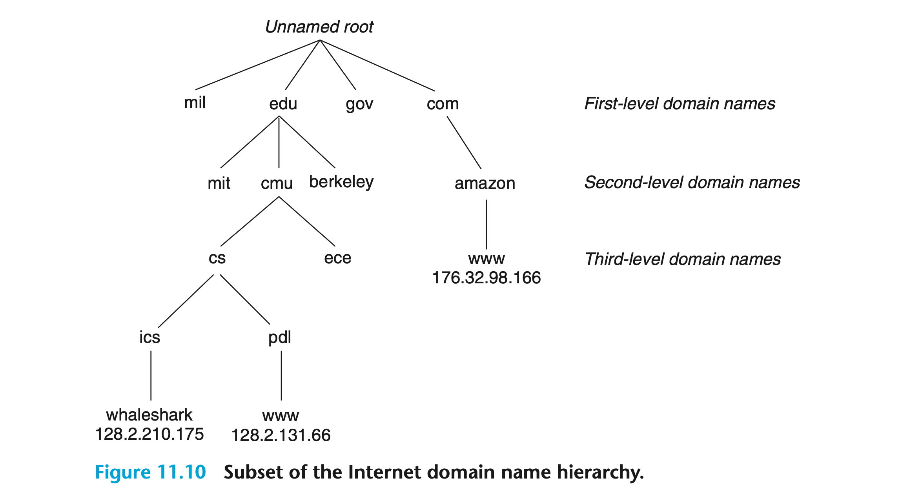
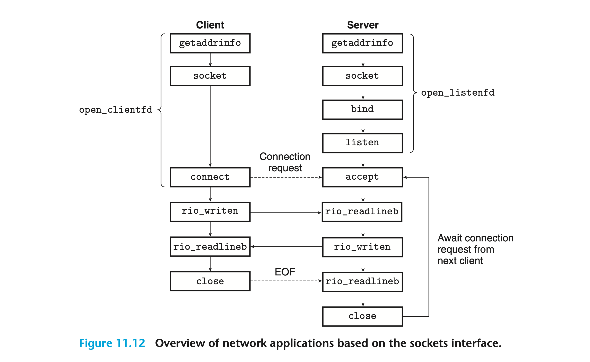
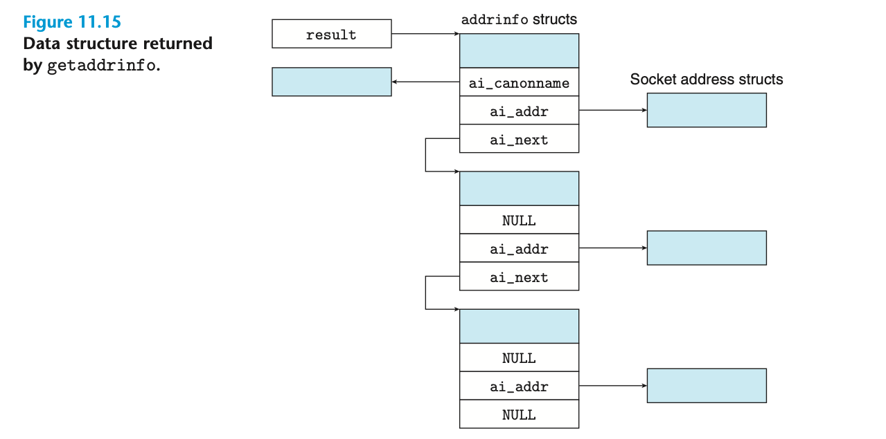
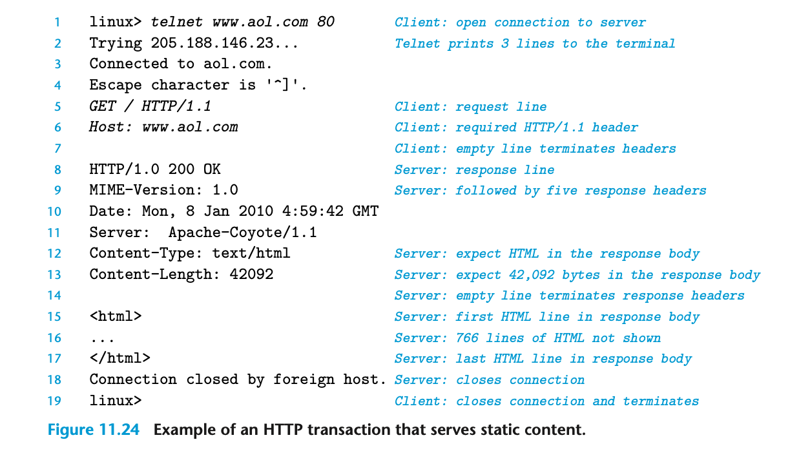

# 网络编程

所有的网络应用程序都基于相同的基本编程模型，具有相似的整体逻辑结构，并且依赖于相同的编程接口。

## 客户端-服务器编程模型

每个网络应用程序都基于客户端-服务器模型（Client-Server Model），并由一个服务器进程和多个客户端进程组成。服务器管理资源，操作它们以向客户端提供服务。

客户端-服务器模型中的基本操作是事务（Transaction），它由以下四个步骤组成：


请注意，这里的客户端和服务器指的是进程而非机器或主机（Host）。单台主机能够同时运行多个不同的客户端和服务器，客户端和服务器事务也可以在相同或不同的主机上执行。

## 网络

不过，客户端和服务器通常在不同的主机上运行，两者使用计算机网络的软硬件资源进行通信。对于主机来说，网络只是一种 I/O 设备。如下图所示，主机使用 DMA 技术将网络数据通过 I/O 总线和存储器总线从适配器复制到主存（反之亦然）：


网络是按地理邻近度组织的分层系统，其最低层是覆盖一个建筑物或校园的局域网（Local Area Network，LAN）。迄今为止最流行的局域网技术是以太网（Ethernet）：


在更高层，多个互不连通的局域网可以通过路由器连接为互联网（Interconnected Network，Internet），而多个路由器点对点连接便形成了广域网（Wide Area Network，WAN）：


互联网可以由使用完全不同且不兼容技术的局域网和广域网组成，这是它的一个关键特性。因此，我们必须在每台主机和路由器上运行协议软件（Protocol Software）来消除不同网络之间的差异。该软件实现的协议将管理主机和路由器如何协作以传输数据，它必须提供两个基本功能：

- 命名方案（Naming Scheme）：为主机地址定义统一的格式，并为每台主机分配至少一个唯一标识它的互联网地址；
- 交付机制（Delivery Mechanism）：定义一种统一的方式将数据位封装为若干个块，即数据包（Packet）。其大小和源/目的主机地址位于包的头部（Header），而源主机发送的数据位则在有效负载（Payload）之中。

## 全球 IP 互联网


几乎所有的现代计算机系统都支持 TCP/IP 协议（Transmission Control Protocol/Internet Protocol），因此每台互联网主机上均运行着实现了该协议的软件。客户端和服务器使用 Socket 接口函数和 Unix I/O 函数混合的方式进行通信。前者通常为系统调用，它们会请求内核（Trap into Kernel）调用 TCP/IP 中的各种内核态函数。

在程序员看来，互联网是具有以下属性的主机集合：

- 所有主机均映射到一组 32 位的 IP 地址；
- 所有 IP 地址均映射到一组标识符，即域名（Domain Name）；
- 一台主机上的进程可以通过连接（Connection）与其他任何主机上的进程通信。

### IP 地址

IP 地址是一个无符号的 32 位整数。由于历史原因，网络程序将其存储在如下结构体中：

```c
/* IP address structure */
struct in_addr {
    uint32_t  s_addr; /* Address in network byte order (big-endian) */
};
```

互联网中主机存储字节的顺序可能不同，因此 TCP/IP 必须为整型数据项（如数据包头部的 IP 地址）定义一个统一的网络字节顺序（大端）。即使主机的字节顺序是小端，`in_addr`结构体中的 IP 地址也会以网络字节顺序存储。Unix 提供了用于转换字节顺序的函数：

```c
#include <arpa/inet.h>
// host to network
uint32_t htonl(uint32_t hostlong);
uint16_t htons(uint16_t hostshort);
// Returns: value in network byte order

// network to host
uint32_t ntohl(uint32_t netlong);
uint16_t ntohs(unit16_t netshort);
// Returns: value in host byte order
```

为了便于人类阅读，IP 地址通常以点分十进制（Dotted-Decimal）的形式表示。应用程序可以使用函数`inet_pton`和`inet_ntop`对上述两种方式进行转换：

```c
#include <arpa/inet.h>
int inet_pton(AF_INET, const char *src, void *dst);
// Returns: 1 if OK, 0 if src is invalid dotted decimal, −1 on error

const char *inet_ntop(AF_INET, const void *src, char *dst,
                      socklen_t size);
// Returns: pointer to a dotted-decimal string if OK, NULL on error
```

### 域名

像 IP 地址这样较大的整数很难让人记住，因此互联网定义了一组更加人性化的域名集合并将其与 IP 地址映射。域名是由句点分隔的单词（字母、数字和破折号）序列，如`whaleshark.ics.cs.cmu.edu`。域名的层级结构如下图所示：


### 连接

客户端和服务器通过连接来收发字节流并进行通信。连接是点对点，全双工（数据可以同时在两个方向上传输）且可靠的——除非发生一些灾难性的故障。

Socket 是连接的端点，每个 Socket 都对应了一个 Socket 地址。该地址由 IP 地址和 16 位整型的端口（Port）组成，表示为：`address:port`。

客户端 Socket 地址中的端口通常是其发起连接请求时由内核自动分配的，被称为临时端口（Ephemeral Port）；而服务器 Socket 地址中的端口则通常与服务永久关联，被称为知名端口（Well-known Port）。

连接由两个端点的 Socket 地址（即 Socket Pair）唯一标识，可以用元组表示为：`(cliaddr:cliport, servaddr:servport)`。


## Socket 接口

上文提到，Socket 接口是一组函数，它们与 Unix I/O 函数一同用于构建网络应用程序：


### Socket 地址结构体

从 Linux 内核的角度来看，Socket 是连接的一个端点；而从 Linux 程序的角度来看，Socket 则是一个与描述符对应的打开文件。IPv4 Socket 地址存储在 `sockaddr_in`类型的 16 字节结构体中：

```c
/* IP socket address structure */
struct sockaddr_in  {
    uint16_t        sin_family;  /* Protocol family (always AF_INET) */
    uint16_t        sin_port;    /* Port number in network byte order */
    struct in_addr  sin_addr;    /* IP address in network byte order */
    unsigned char   sin_zero[8]; /* Pad to sizeof(struct sockaddr) */
};
```

`sin_family`字段为`AF_INET`，`sin_port`字段为 16 位端口号，`sin_addr`字段中包含 32 位 IP 地址。IP 地址和端口号始终以网络字节顺序（大端）存储。

在调用函数`connect`、`bind`和`accept`时，我们需要传入一个指向 Socket 地址结构体的指针。由于 Socket 有多种类型，不同协议的 Socket 地址结构体类型也有所不同。如 IPv6 Socket 地址存储在`sockaddr_in6`类型的结构体中，`sin_family`字段为`AF_INET6`；Unix Domain Socket 地址存储在`sockaddr_un`类型的结构体中，`sin_family`字段为`AF_UNIX`。然而在 Socket 接口设计者所处的时代，C 还并不支持使用`void *`指针。于是他们只好重新定义一个适用于所有协议的`sockaddr`结构体，然后要求应用程序将任何与协议有关的结构体指针转换为这种通用的结构体指针：

```c
/* Generic socket address structure (for connect, bind, and accept) */
struct sockaddr {
    uint16_t  sa_family;    /* Protocol family */
    char      sa_data[14];  /* Address data  */
};
```

### `socket`函数

客户端和服务器使用`socket`函数创建一个 Socket 文件描述符：

```c
#include <sys/types.h>
#include <sys/socket.h>
int socket(int domain, int type, int protocol);
// Returns: nonnegative descriptor if OK, −1 on erro
```

如果我们希望 Socket 成为连接的端点，那么可以使用以下参数调用该函数：

```c
clientfd = Socket(AF_INET, SOCK_STREAM, 0);
```

其中，`AF_INET`代表使用 32 位 IP 地址，`SOCK_STREAM`表示 Socket 将成为连接的端点。该函数返回的描述符`clientfd`只是部分打开，还不能进行读写。

### `connect`函数

客户端调用`connect`函数与服务器建立连接：

```c
#include <sys/socket.h>
int connect(int clientfd, const struct sockaddr *addr,
            socklen_t addrlen);
//Returns: 0 if OK, −1 on error
```

该函数尝试连接 Socket 地址为`addr`的服务器，参数`addrlen`是结构体`sockaddr_in`的大小。`connect`函数在连接建立或发生错误前会一直阻塞，若建立成功则 Socket 描述符`clientfd`便可进行读写。

### `bind`函数

`bind`函数请求内核将参数`addr`中的服务器 Socket 地址与 Socket 描述符`sockfd`相关联，参数`addrlen`是结构体`sockaddr_in`的大小：

```c
#include <sys/socket.h>
int bind(int sockfd, const struct sockaddr *addr,
         socklen_t addrlen);
// Returns: 0 if OK, −1 on error
```

### `listen`函数

默认情况下，内核假定`socket`函数创建的描述符是用于客户端连接的。因此服务器需要调用`listen`函数告诉内核参数`sockfd`用于服务器而非客户端：

```c
#include <sys/socket.h>
int listen(int sockfd, int backlog);
// Returns: 0 if OK, −1 on error
```

参数`backlog`是内核开始拒绝请求前应当排队的未完成连接请求数，通常设为 1024。

### `accept`函数

服务器调用`accept`函数等待客户端的连接请求到达监听描述符`listenfd`，然后将客户端 Socket 地址写入到`addr`中，最后返回一个可使用 Unix I/O 函数与客户端通信的连接描述符：

```c
#include <sys/socket.h>
int accept(int listenfd, struct sockaddr *addr, int *addrlen);
// Returns: nonnegative connected descriptor if OK, −1 on error
```

监听描述符作为客户端发起连接请求的端点，通常只会创建一次，在服务器的生命周期内存在；连接描述符是客户端与服务器之间已建立的连接的端点，在每次服务器接受连接请求时创建，并且仅在服务器为客户端提供服务时存在：


在连接建立之后，客户端和服务器可以分别通过读写`clientfd`和`connfd`来传输数据。

### 主机和服务转换

我们可以将`getaddrinfo`和`getnameinfo`函数与 Socket 接口函数结合，编写适用于任何版本 IP 协议的网络程序。

#### `getaddrinfo`函数

`getaddrinfo`函数将主机名（或主机地址）和服务名（或端口号）转换为 Socket 地址结构体：

```c
#include <sys/types.h>
#include <sys/socket.h>
#include <netdb.h>

struct addrinfo {
    int     ai_flags;           /* Hints argument flags */
    int     ai_family;          /* First arg to socket function */
    int     ai_socktype;        /* Second arg to socket function */
    char    ai_protocol;        /* Third arg to socket function  */
    char    *ai_canonname;      /* Canonical hostname */
    size_t  ai_addrlen;         /* Size of ai_addr struct */
    struct  sockaddr *ai_addr;  /* Ptr to socket address structure */
    struct  addrinfo *ai_next;  /* Ptr to next item in linked list */      
}

int getaddrinfo(const char *host, const char *service,
                const struct addrinfo *hints,
                struct addrinfo **result);
// Returns: 0 if OK, nonzero error code on error
```

该函数会根据`hints`指定的规范分配并初始化一个`addrinfo`结构体链表，其中每个结构体的`ai_addr`字段都指向一个与`host`和`service`对应的 Socket 地址，`result`指向链表头部：


参数`host`可以是域名，也可以是数字地址（如点分十进制 IP 地址）；参数`service`可以是服务名称（如 `http`），也可以是十进制端口号。如果我们不需要 Socket 地址中的主机名，就可以将`host`设为`NULL`。对于服务名来说也是如此，不过两者不能同时为`NULL`。

客户端在调用该函数后会遍历上述链表，依次使用每个 Socket 地址作为参数调用`socket`和`connect`直至成功并建立连接；服务器在调用该函数后会遍历上述链表，依次使用每个 Socket 地址作为参数调用`socket`和`bind`直至成功且描述符被绑定到一个有效的 Socket 地址。

细心的读者可能会疑惑为什么`getaddrinfo`会为同一个`host`和`service`初始化多个`addrinfo`结构体，这是因为：主机可能是多宿主的（Multihomed），可以通过多种协议（如 IPv4 和 IPv6）访问；客户端可以通过不同的 Socket 类型（如`SOCK_STREAM`和`SOCK_DGRAM`）访问相同的服务。因此通常我们会根据需求设置`hints`参数，以使函数生成我们期望的 Socket 地址。

当`hints`作为参数传递时，只有`ai_family`、`ai_socktype`、`ai_protocol`和`ai_flags`字段可以被设置，其他字段必须为 0 或`NULL`。在实际使用中，我们调用 [`memset`](https://pubs.opengroup.org/onlinepubs/7908799/xsh/memset.html) 函数将`hints`归零，然后设置以下字段：

- `ai_family`为`AF_INET`时，该函数将生成 IPv4 Socket 地址；`ai_family`为`AF_INET6`时，该函数将生成 IPv6 Socket 地址；
- 对于面向连接的网络应用程序，`ai_socktype`应当设为`SOCK_STREAM`；
- `ai_flags`是能够修改函数默认行为的位掩码，主要包括：
  - `AI_ADDRCONFIG`：仅当本地主机使用 IPv4 时生成 IPv4 Socket 地址；
  - `AI_CANONNAME`：默认情况下，`addrinfo`结构体内的`ai_canonname`字段为`NULL`。若设置该掩码，函数会将链表中第一个`addrinfo`结构体内的`ai_canonname`字段指向主机的规范（官方）名称（如上图所示）；
  - `AI_NUMERICSERV`：强制参数`service`使用端口号；
  - `AI_PASSIVE`：服务器可以使用该函数生成的 Socket 地址创建监听描述符。在这种情况下，参数`host`应当设为`NULL`，表示服务器的所有 IP 地址均可用于连接（即`INADDR_ANY`或 0.0.0.0）；

当`getaddrinfo`初始化`addrinfo`结构体链表时，它会填充除`ai_flags`之外的所有字段。`ai_family`、`ai_socktype`和`ai_protocol`可以直接传递给`socket`函数，`ai_addr`和`ai_addrlen`可以直接传递给`connect`和`bind`函数。因此我们能够使用它编写适用于任何版本 IP 协议的客户端和服务器。

为了避免内存泄漏，应用程序最终必须调用`freeaddrinfo`函数释放链表：

```c
void freeaddrinfo(struct addrinfo *result);
// Returns: nothing
```

`getaddrinfo`函数会返回非零错误码，应用程序可以调用`gai_strerror`函数将其转换为消息字符串：

```c
const char *gai_strerror(int errcode);
// Returns: error message
```

#### `getnameinfo`函数

`getnameinfo`函数是`getaddrinfo`的逆函数，它将 Socket 地址结构体转换为对应的主机名和服务名：

```c
#include <sys/socket.h>
#include <netdb.h>
int getnameinfo(const struct sockaddr *sa, socklen_t salen,
                char *host, size_t hostlen,
                char *service, size_t servlen, int flags);
// Returns: 0 if OK, nonzero error code on error
```

参数`sa`指向一个大小为`salen`字节的 Socket 地址结构体，`host`指向一个大小为`hostlen`字节的缓冲区，而`service`则指向一个大小为`servlen`字节的缓冲区。该函数将`sa`转换为主机名和服务名字符串，然后将它们复制到`host`和`service`指向的缓冲区。如果该函数返回非零错误代码，应用程序可以调用`gai_strerror`将其转换为消息字符串。

如果我们不需要主机名，就可以将`host`设为`NULL`。对于服务名来说也是如此，不过两者不能同时为`NULL`。

参数`flags`是修改函数默认行为的位掩码，包括：

- `NI_NUMERICHOST`：默认情况下，函数将在`host`指向的缓冲区中生成一个域名。若设置该掩码，函数会生成一个数字地址字符串；
- `NI_NUMERICSERV`：默认情况下，函数将在`/etc/services`文件中查找并生成服务名。若设置该掩码，函数会跳过查找并生成端口号。

如下示例程序使用`getaddrinfo`和`getnameinfo`函数实现域名解析：

```c
#include "csapp.h"
int main(int argc, char **argv)
{
    struct addrinfo *p, *listp, hints;
    char buf[MAXLINE];
    int rc, flags;
    if (argc != 2)
    {
        fprintf(stderr, "usage: %s <domain name>\n", argv[0]);
        exit(0);
    }
    /* Get a list of addrinfo records */
    memset(&hints, 0, sizeof(struct addrinfo));
    hints.ai_family = AF_INET;       /* IPv4 only */
    hints.ai_socktype = SOCK_STREAM; /* Connections only */
    if ((rc = getaddrinfo(argv[1], NULL, &hints, &listp)) != 0)
    {
        fprintf(stderr, "getaddrinfo error: %s\n", gai_strerror(rc));
        exit(1);
    }
    
    /* Walk the list and display each IP address */
    flags = NI_NUMERICHOST; /* Display address string instead of domain name */
    for (p = listp; p; p = p->ai_next)
    {
        getnameinfo(p->ai_addr, p->ai_addrlen, buf, MAXLINE, NULL, 0, flags);
        printf("%s\n", buf);
    }
    
    /* Clean up */
    freeaddrinfo(listp);
    exit(0);
}
```

### Socket 接口的辅助函数

`getaddrinfo`和 Socket 接口函数并不易于使用，我们可以使用更高级的辅助函数`open_clientfd`和`open_listenfd`包装它们。

#### `open_clientfd`函数

客户端调用`open_clientfd`函数与服务器建立连接：

```c
#include "csapp.h"
int open_clientfd(char *hostname, char *port);
// Returns: descriptor if OK, −1 on error
```

参数`hostname`是服务器所在的主机名，参数`port`是服务器监听的端口号。函数返回一个打开的 Socket 描述符，客户端可以使用 Unix I/O 函数对其读写。该函数的代码如下：

```c
int open_clientfd(char *hostname, char *port)
{
    int clientfd;
    struct addrinfo hints, *listp, *p;

    /* Get a list of potential server addresses */
    memset(&hints, 0, sizeof(struct addrinfo));
    hints.ai_socktype = SOCK_STREAM; /* Open a connection */
    hints.ai_flags = AI_NUMERICSERV; /* ... using a numeric port arg. */
    hints.ai_flags |= AI_ADDRCONFIG; /* Recommended for connections */
    getaddrinfo(hostname, port, &hints, &listp);

    /* Walk the list for one that we can successfully connect to */
    for (p = listp; p; p = p->ai_next)
    {
        /* Create a socket descriptor */
        if ((clientfd = socket(p->ai_family, p->ai_socktype, p->ai_protocol)) < 0)
            continue; /* Socket failed, try the next */
        /* Connect to the server */
        if (connect(clientfd, p->ai_addr, p->ai_addrlen) != -1)
            break;       /* Success */
        Close(clientfd); /* Connect failed, try another */
    }

    /* Clean up */
    freeaddrinfo(listp);
    if (!p) /* All connects failed */
        return -1;
    else    /* The last connect succeeded */
        return clientfd;
}
```

`open_clientfd`中不存在任何依赖于特定版本协议的代码，调用`socket`和`connect`时使用的参数是由`getaddrinfo`自动生成的，因此该函数干净且可移植。

#### `open_listenfd`函数

服务器调用`open_listenfd`函数创建一个能够接受连接请求的监听描述符：

```c
#include "csapp.h"
int open_listenfd(char *port);
// Returns: descriptor if OK, −1 on error
```

参数`port`是服务器监听的端口号。该函数的代码如下：

```c
int open_listenfd(char *port)
{
    struct addrinfo hints, *listp, *p;
    int listenfd, optval = 1;

    /* Get a list of potential server addresses */
    memset(&hints, 0, sizeof(struct addrinfo));
    hints.ai_socktype = SOCK_STREAM;             /* Accept connections */
    hints.ai_flags = AI_PASSIVE | AI_ADDRCONFIG; /* ... on any IP address */
    hints.ai_flags |= AI_NUMERICSERV;            /* ... using port number */
    getaddrinfo(NULL, port, &hints, &listp);

    /* Walk the list for one that we can bind to */
    for (p = listp; p; p = p->ai_next)
    {
        /* Create a socket descriptor */
        if ((listenfd = socket(p->ai_family, p->ai_socktype, p->ai_protocol)) < 0)
            continue; /* Socket failed, try the next */
        /* Eliminates "Address already in use" error from bind */
        Setsockopt(listenfd, SOL_SOCKET, SO_REUSEADDR,
                   (const void *)&optval, sizeof(int));
        /* Bind the descriptor to the address */
        if (bind(listenfd, p->ai_addr, p->ai_addrlen) == 0)
            break;       /* Success */
        Close(listenfd); /* Bind failed, try the next */
    }
    /* Clean up */
    freeaddrinfo(listp);
    if (!p) /* No address worked */
        return -1;
    /* Make it a listening socket ready to accept connection requests */
    if (listen(listenfd, LISTENQ) < 0)
    {
        Close(listenfd);
        return -1;
    }
    return listenfd;
}
```

在第 20 行中我们使用`Setsockopt`函数（见 [csapp.c](<http://csapp.cs.cmu.edu/2e/ics2/code/src/csapp.c>)）配置服务器，使其能够在重新启动后立即开始接受连接请求。默认情况下，重新启动的服务器会在大约 30 秒内拒绝来自客户端的连接，这将严重影响调试。

### 示例 Echo 客户端和服务器

学习 Socket 接口函数的最佳方法便是阅读示例代码。一个简单的客户端程序如下：

```c
#include "csapp.h"

int main(int argc, char **argv)
{
    int clientfd;
    char *host, *port, buf[MAXLINE];
    rio_t rio;

    if (argc != 3)
    {
        fprintf(stderr, "usage: %s <host> <port>\n", argv[0]);
        exit(0);
    }
    host = argv[1];
    port = argv[2];
    clientfd = Open_clientfd(host, port);
    Rio_readinitb(&rio, clientfd);
    while (Fgets(buf, MAXLINE, stdin) != NULL)
    {
        Rio_writen(clientfd, buf, strlen(buf));
        Rio_readlineb(&rio, buf, MAXLINE);
        Fputs(buf, stdout);
    }
    Close(clientfd);
    exit(0);
}
```

在与服务器建立连接之后，客户端进入 While 循环。它不断从标准输入中读取文本行（`Fgets`），然后将文本行发送到服务器（`Rio_writen`）。接下来再读取服务器的返回（`Rio_readlineb`），最终将结果打印到标准输出（`Fputs`）。当用户键入 Ctrl+D 时，循环中止，客户端随后关闭描述符`clientfd`。

该客户端连接的服务器代码如下：

```c
#include "csapp.h"

typedef struct sockaddr SA;

void echo(int connfd)
{
    size_t n;
    char buf[MAXLINE];
    rio_t rio;

    Rio_readinitb(&rio, connfd);
    while ((n = Rio_readlineb(&rio, buf, MAXLINE)) != 0)
    {
        printf("server received %d bytes\n", (int)n);
        Rio_writen(connfd, buf, n);
    }
}

int main(int argc, char **argv)
{
    int listenfd, connfd;
    socklen_t clientlen;
    struct sockaddr_storage clientaddr; /* Enough space for any address */
    char client_hostname[MAXLINE], client_port[MAXLINE];
    if (argc != 2)
    {
        fprintf(stderr, "usage: %s <port>\n", argv[0]);
        exit(0);
    }
    listenfd = Open_listenfd(argv[1]);
    while (1)
    {
        clientlen = sizeof(struct sockaddr_storage);
        connfd = accept(listenfd, (SA *)&clientaddr, &clientlen);
        getnameinfo((SA *)&clientaddr, clientlen, client_hostname, MAXLINE,
                    client_port, MAXLINE, 0);
        printf("Connected to (%s, %s)\n", client_hostname, client_port);
        echo(connfd);
        Close(connfd);
    }
    exit(0);
}
```

代码第 23 行声明的变量`clientaddr`是一个`sockaddr_storage`类型的 Socket 地址结构体，`accept`函数会在返回前将客户端的 Socket 地址填入其中。我们使用`sockaddr_storage`而非`sockaddr_in`的原因在于前者足够大，可以保存任何类型的 Socket 地址，从而使代码与协议独立（详见：[Reasoning behind C sockets sockaddr and sockaddr_storage](https://stackoverflow.com/questions/16010622/reasoning-behind-c-sockets-sockaddr-and-sockaddr-storage)）。

服务器打开监听描述符后进入无限循环。它等待来自客户端的连接请求，打印客户端的主机名和端口，然后调用`echo`函数。该函数重复读取并写入文本行，直到`Rio_readlineb`遇到 EOF（对于网络连接，当一端的进程关闭连接，另一端的进程尝试读取流中的最后一个字节时将检测到 EOF）。一旦客户端和服务器均关闭了各自的描述符，连接便会终止。

请注意，示例的简单服务器一次只能处理一个客户端的连接请求，我们称这种类型的服务器为迭代服务器（Iterative Server）。更加复杂的并发服务器（Concurrent Server）则可以同时处理多个客户端的连接请求。

## Web 服务器

### Web 内容

对于 Web 客户端和服务器，内容（Content）是与某种 MIME（Multipurpose Internet Mail Extensions）类型关联的字节序列：

Web 服务器通过两种不同方式向客户端提供内容：

- 获取磁盘文件（静态内容）并将其返回给客户端；
- 运行一个可执行文件并将其输出结果（动态内容）返回给客户端。

Web 服务器返回的每条内容都与其管理的某个文件相关联，每个文件都有一个唯一的名称，即 URL（Universal Resource Locator）。

### HTTP 事务

我们可以使用`telnet`命令与互联网上任意 Web 服务器建立事务：

