# 链接


链接（Linking）是将各部分代码和数据收集并组成单个文件的过程，该文件可以被加载（复制）到内存中执行。链接可以在编译时（即源代码被翻译成机器代码时）执行，也可以在加载时（即程序被加载到内存并由加载器执行时）执行，甚至还可以在运行时由应用程序执行。在现代系统中，能够自动执行链接的程序被称为链接器（Linker）。

链接器支持单独编译（Separate Compilation），因此在软件开发中起着至关重要的作用。与其将大型应用程序组织为一个单一的大块源文件，不如将其分解为一些更小、更易于管理并且可以单独修改和编译的模块。一旦我们修改了其中的某个模块，只需重新编译该模块并将其链接到应用程序，不必再次编译其他文件。

## 编译器驱动

大多数编译系统都提供了一个编译器驱动（Compiler Driver），它可以根据用户需求调用语言预处理器（Language Preprocessor）、编译器、汇编器和链接器等。例如要在 GNU 编译系统中构建下列程序，我们可以   使用命令`gcc -Og -o prog main.c sum.c`:


编译器驱动将示例程序从 ASCII 源文件转换为可执行目标文件时的过程如下图所示：


首先，驱动运行 C 预处理器（C Preprocessor，CPP），将源文件`main.c`转换为 ASCII 中间文件`main.i`；接下来，驱动运行 C 编译器 (C Compiler，CC)，将`main.i`转换为 ASCII
汇编语言文件`main.s`；然后，驱动运行汇编器，将`main.s`转换为二进制可重定位（Relocatable）目标文件`main.o`（`sum.o`的生成过程相同）；最后，驱动运行链接器，将`main.o`、`sum.o`和一些必要的系统目标文件组合，创建二进制可执行目标文件`prog`。

## 静态链接

静态链接器（Static Linker）将可重定位目标文件和命令行参数作为输入，生成完全链接的可执行目标文件。可重定位目标文件由各种代码和数据组成，指令、初始化的全局变量和未初始化的变量分别处于不同部分。

链接器需要完成两个主要任务：

- 符号解析（Symbol Resolution）：目标文件定义并引用符号，每个符号对应一个函数、全局变量或静态变量（即使用`static`声明的任何变量）。符号解析的目的是将每个符号引用与一个符号定义相关联；
- 重定位（Relocation）：编译器和汇编器生成的代码和数据段是从地址 0 开始的，链接器会重定位所有的符号定义并修改其对应的符号引用。

目标文件只是字节块的集合，其中可能包含代码、数据或指导链接器和加载器的数据结构。链接器将各个块连接在一起，确定整个块的运行时位置，并修改代码和数据块中的不同位置。编译器和汇编器在生成目标文件时已经完成了大部分工作，因而链接器对目标机器的了解甚少。

## 目标文件

目标文件（Object File）有三种形式：

- 可重定位目标文件：包含二进制代码和数据，可以在编译时与其他可重定位目标文件组合以创建可执行目标文件；
- 可执行目标文件：包含二进制代码和数据形式，可直接被复制到内存中执行；
- 共享目标文件：一种特殊类型的可重定位目标文件，可以在加载时或运行时被加载到内存中并动态链接。

## 可重定位目标文件

典型的 ELF（Executable and Linkable Format）可重定位目标文件格式如下图所示：


- ELF 头（ELF Header）：开头是一个表征系统字长（Word Size）和字节顺序（Byte Ordering）的 16 字节序列。其余部分包括 ELF 头的大小、目标文件的类型（如可重定位、可执行或共享）、机器类型（如 x86-64）、节头表（Section Header Table）的文件偏移量以及其中条目的大小和数量；
- 节头表：描述了目标文件中每个 Section 的位置和大小；
- Section：位于 ELF 头和节头表之间，包括：
  - .text：编译后程序的机器码；
  - .rodata：只读数据，例如`printf`中的格式字符串，Switch 语句的 **跳转表** 等；
  - .data：已初始化的全局变量和静态变量。非静态局部变量在运行时位于栈中，不会出现在 .data 或 .bss 中；
  - .bss：未初始化的静态变量，以及初始化为 0 的全局变量和静态变量。此 Section 只是一个占位符，在目标文件中不占用实际空间，因此可以提升空间效率。这些变量在运行时被分配到内存中，初始值为零；
  - .symtab ：一个保存了在程序中被定义和引用的函数和全局变量信息的符号表（Symbol Table）。与编译器中的符号表不同，.symtab 中的符号表不包含任何局部变量；
  - .rel.text：当链接器将目标文件与其他文件组合时，.text 中的许多位置都需要被修改，而 .rel.text 中则保存了与之相关的重定位信息。通常，任何调用外部函数或引用全局变量的指令都需要被修改，而调用局部函数的指令则不变。可执行目标文件一般不需要重定位信息，因此这部分可以省略；
  - .rel.data：被引用或定义的任何全局变量的重定位信息。通常，所有初始值为全局变量地址或外部定义函数地址的已初始化全局变量都需要被修改；
  - .debug：调试符号表，仅在使用`-g`选项调用编译器驱动时出现；
  - .line：原始程序中行号与 .text 中机器代码指令之间的映射关系，仅在使用`-g`选项调用编译器驱动时出现；
  - .strtab：一个以`NULL`结尾，包含 .symtab 和 .debug 中的符号表以及 Section 名称的字符串序列。

## 符号和符号表

每个目标文件都有一个符号表，其中包含了该文件所定义和引用的符号信息。符号有以下三种：

- 全局符号（Global Symbols）：由该文件定义并且可以被其他文件引用的符号；
- 外部符号（Externals）：被该文件引用但由其他文件定义的符号；
- 局部符号（Local Symbols）：由该文件定义且无法被其他文件引用的符号，即使用`static`声明的函数和变量。

上节提到，非静态局部变量在运行时位于栈中，与链接器无关。而静态局部变量则保存在 .data 或 .bss 中，编译器会在符号表中为其创建名称唯一的局部符号。例如同一文件中的两个函数都定义了静态局部变量`x`：

```c
int f()
{
    static int x = 0;
    return x;
}
int g()
{
    static int x = 1;
    return x;
}
```

那么编译器可能将`x.1`作为函数`f()`中的变量符号，将`x.2`作为函数`g()`中的变量符号发送给汇编器。汇编器使用接收到的`.s`文件中的符号构建符号表，其中每个条目的数据结构为：

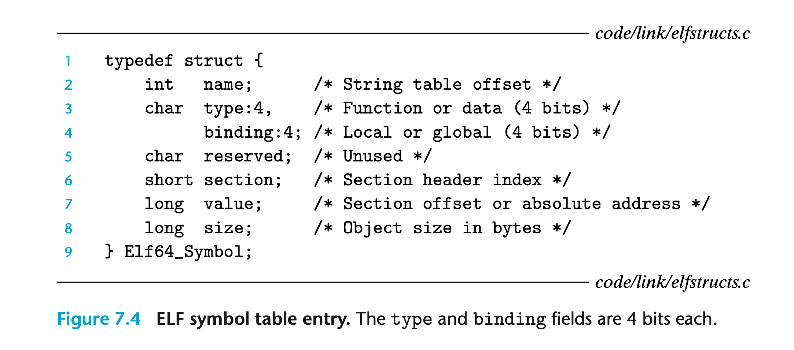
- `name`：符号名在字符串表 .strtab 中的偏移量；
- `value`：对于可重定位目标文件是符号在其 Section 中的偏移量，对于可执行目标文件是符号的运行时地址；
- `size`：符号的大小；
- `type`：符号的类型；
- `binding`：符号是局部的还是全局的；
- `section`：符号所在的 Section 在节头表中的索引。

值得一提的是，有三个伪 Section 在节头表中没有条目：

- ABS：不应重定位的符号；
- UNDEF：在此文件中引用但在其他文件中定义的符号；
- COMMON：未初始化的全局符号。

上述三个 Section 仅存在于可重定位目标文件，在可执行目标文件中并不存在。我们可以使用 [READELF](https://man7.org/linux/man-pages/man1/readelf.1.html) 工具阅读目标文件中的内容，**示例程序 main.c** 生成的目标文件符号表条目如下：


READELF 通过整数索引 Ndx 标识每个 Section，1 表示 .text，3 表示 .data。全局符号`main`和`array`分别位于上述两个 Section 首部，因此其偏移量`value`均为 0。外部符号`sum`未在本文件中定义，位于 UNDEF。

## 符号解析

链接器将每个符号引用与符号表中的符号定义相关联以完成符号解析（Symbol Resolution）。当编译器遇到未在当前文件中定义的符号时，它会假设该符号已在其他文件中定义，然后生成对应的符号表条目。如果链接器无法在任何输入文件中找到该符号的定义，那么它就会终止链接。

不同文件可能定义了相同名称的全局符号。对于这种情况，链接器要么直接报错，要么选取其中之一。

> C++ 和 Java 允许重载名称相同但参数列表不同的方法。编译器会将每个方法和参数列表组合为一个唯一的名称，这样链接器就可以区分它们。例如，`Foo::bar(int, long)`会被编码为`bar__3Fooil`。其中，3 代表类名 Foo 的字符数，i 和 l 则分别代表参数列表中的`int`和`long`。

### 解析名称重复的符号

Linux 编译系统会在编译时将全局符号分为两种类型：函数和已初始化的全局变量是强符号，未初始化的全局变量是弱符号。汇编器将符号的强弱信息隐式地编码到目标文件的符号表中。

链接器解析名称重复的符号的规则为：

- 不允许多个强符号名称重复；
- 若一个强符号和多个弱符号名称重复，选择强符号；
- 若多个弱符号名称重复，从中任选其一。

> 注：最新版本的 GCC（如 GCC 10）默认使用标识位`-fno-common`，因此若程序包含多个名称重复的弱符号将引发链接错误。

```c
/* foo3.c */
#include <stdio.h>
void f(void);

int x = 15213;
int main()
{

    f();
    printf("x = %d\n", x);
    return 0;
}
/* bar3.c */
int x;

void f()
{
    x = 15212;
}
```

示例程序中，文件`bar3.c`中的函数`f`是强符号，文件`foo3.c`中的函数`f`是弱符号，因此主函数的输出`x`的值为 15212。

上文提到，未初始化的全局变量保存在 COMMON 中，而未初始化的静态变量，以及初始化为 0 的全局变量和静态变量保存在 .bss 中。这是因为前者是弱符号，编译器无法知晓其他文件中是否定义了相同名称的变量，必须将其分配到 COMMON 中并随后由链接器处理。已初始化为 0 的全局变量是强符号，根据第二条解析规则，该变量一定是唯一的，因此编译器可以安心地把它放到 .bss 中。静态变量无法被其他文件引用，自然也无需担心名称重复的问题。

### 与静态库链接

编译系统将一些相关的目标模块打包到一个文件中，该文件被称为静态库（Static Library）。在构建可执行目标文件时，链接器仅复制静态库中被应用程序引用的目标模块，从而减小了磁盘和内存中可执行文件的大小。静态库为我们提供了 I/O、字符串操作和数学运算等标准函数。

在 Linux 系统中，静态库以特定的文件格式（后缀为`.a`）存储在磁盘上。应用程序可以在命令行中指定文件名来使用静态库中定义的任何函数（实际上，C 编译器驱动总是将`libc.a`传递给链接器），如：

```c
linux> gcc main.c /usr/lib/libm.a /usr/lib/libc.a
```

我们使用 AR 命令将下列程序打包为静态库文件`libvector.a`：

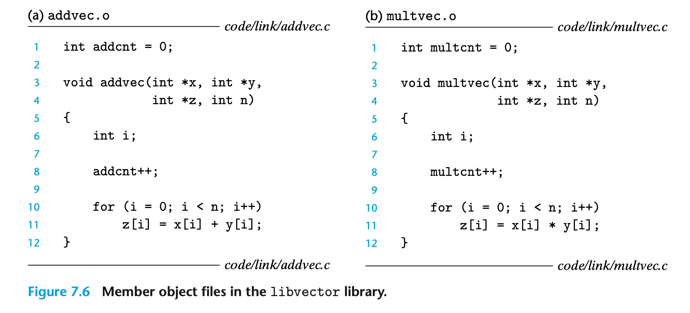
```c
linux> gcc -c addvec.c multvec.c
linux> ar rcs libvector.a addvec.o multvec.o
```

接下来再编写一个程序`main2.c`调用该静态库，头文件`vector.h`定义了库文件中的函数原型：

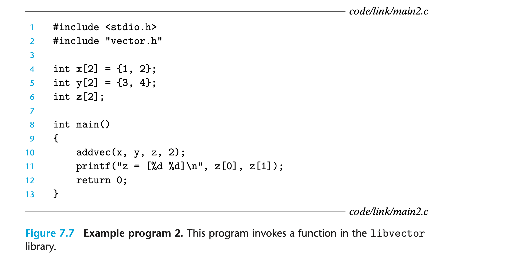
最后使用如下命令编译并链接`main2.o`和`libvector.a`：

```c
linux> gcc -c main2.c
linux> gcc -static -o prog2c main2.o ./libvector.a
```

`-static`参数表示链接器应当构建一个完全链接的可执行目标文件，该文件可以被加载到内存中运行而无需进一步地链接。完整的链接流程如下图所示：

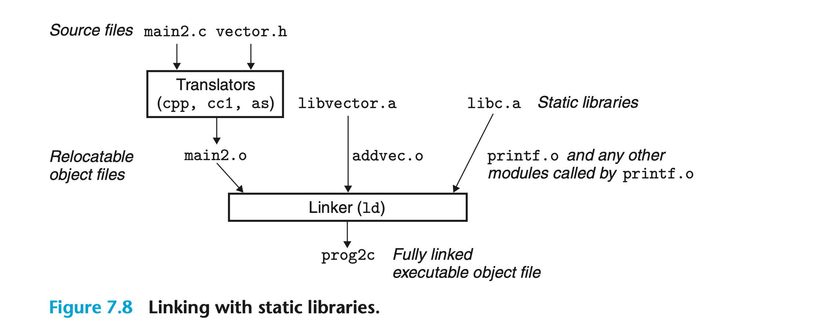
### 静态库的符号解析

符号解析时，链接器会按照从左到右的顺序依次扫描命令行中的目标文件和静态库。在这个过程中，E 为可重定位目标文件的集合，U 为被引用但还未找到定义的符号，D 为已扫描过的文件定义的符号，开始时三者均为空。

- 若命令行中的输入文件为可重定位目标文件，则链接器将其添加到 E 中并更新 U 和 D 中的符号；
- 若命令行中的输入文件为静态库，则链接器会将 U 中的符号与该静态库中定义的符号相匹配。匹配成功的模块会被添加到 E 中，随后链接器更新 U 和 D 中的符号。当 U 和 D 中的符号不再改变时，匹配结束，任何不在 E 中的静态库模块都将被直接丢弃；
- 若扫描全部完成时 U 为空，则链接器合并并重定位 E 中所有的目标文件以构建可执行文件。否则，链接器将报错并终止。

链接器的这种行为限制了命令行中的文件顺序。如果定义符号的静态库出现在引用该符号的目标文件之前，链接就会失败。

## 重定位

符号解析完成后，链接器会将代码中的每个符号引用与一个符号定义相关联。接下来，链接器开始对目标文件重定位：

- 重定位 Section 和符号定义：链接器将所有输入模块中相同类型的 Section 合并为一个新的聚合 Section，然后将运行时地址分配给每个 Section 和符号；
- 在 Section 内重定位符号引用：链接器修改代码和数据段中的每个符号引用，使其指向正确的运行时地址。

### 重定位条目

汇编器在生成目标文件时，并不知晓代码、数据和引用的外部符号在内存中的最终位置。它只会为每个引用生成一个重定位条目（Relocation Entry），指导链接器如何修改它们。上文提到，代码的重定位条目放在 .rel.text 中，数据的重定位条目则放在 .rel.data 中。

ELF 重定位条目的数据结构为：

```c
typedef struct {
    long offset;    /* Offset of the reference to relocate */
    long type:32,   /* Relocation type */
         symbol:32; /* Symbol table index */
    long addend;    /* Constant part of relocation expression */
} Elf64_Rela;
```

`offset`是被修改的引用在其 Section 中的偏移量；`symbol`是引用指向的符号在符号表中的索引；`type`告知链接器如何修改引用；`addend`是一个有符号常量，某些类型的重定位使用它来偏置被修改的引用值。

最基本的两种重定位类型为：

- R_X86_64_PC32：使用 32 位 PC 相对地址重定位引用。当 CPU 执行一条使用 PC 相对地址的指令时，它会将指令中的目标地址与 PC 当前值（即下一条指令在内存中的地址）相加得到有效地址（在 **跳转指令** 一节中我们讨论过这一问题）；
- R_X86_64_32：使用 32 位绝对地址重定位引用。CPU 直接使用指令中的目标地址作为有效地址，无需进一步地修改。

### 重定位符号引用

重定位算法的伪码如下图所示：

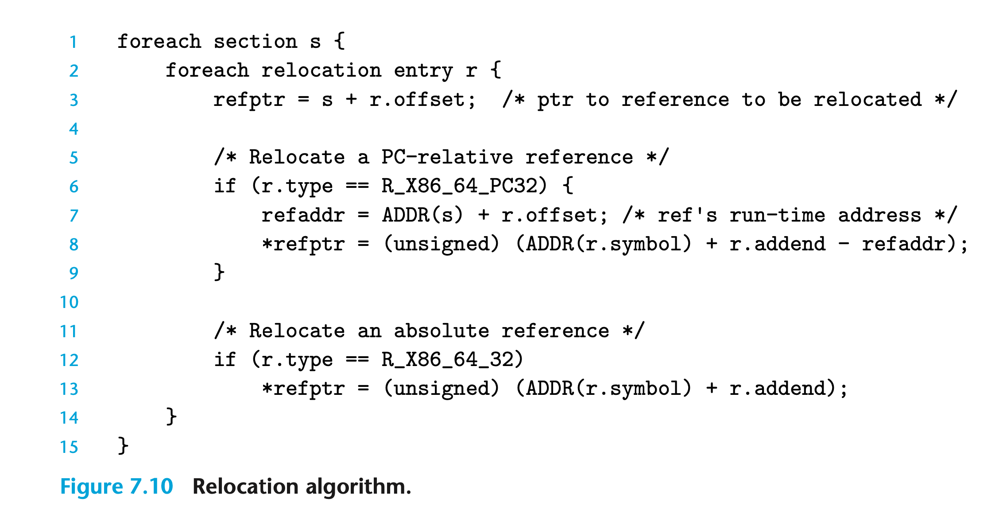
链接器遍历每个 Section（`s`）中的每个重定位条目（`r`），`s`是一个字节数组，`r`是上一节介绍的`Elf64_Rela`类型的结构体，`*refptr`是指令中的目标地址。假设该算法运行时，链接器已经为每个 Section 和每个符号选择了运行时地址`ADDR(s)`和`ADDR(r.symbol)`。

我们使用命令`objdump -dx main.o`得到汇编器为 **示例程序 main.c** 生成的机器码和重定位条目：


重定位条目（图中第 5 行和第 7 行）告知链接器对符号`array`的引用使用绝对地址重定位，而对符号`sum()`的引用则使用 PC 相对地址重定位。

#### PC 相对地址重定位

如上图第 6 行所示：指令`callq`在其 Section 中的偏移量为 0xe，它包含一个一字节的指令码 0xe8 和一个用于指向`sum()`的 32 位 PC 相对引用的占位符。该引用对应的重定位条目为：

```c
r.offset = 0xf
r.symbol = sum
r.type   = R_X86_64_PC32
r.addend = -4
```

上述字段告诉链接器需要修改从偏移量 0xf 开始的 32 位 PC 相对引用，使其在运行时指向`sum()`。 假设`ADDR(s) = ADDR(.text) = 0x4004d0`，`ADDR(r.symbol) = ADDR(sum) = 0x4004e8`，那么首先我们可以计算得到该引用的运行时地址为：

```c
refaddr = ADDR(s)  + r.offset
        = 0x4004d0 + 0xf
        = 0x4004df
```

然后根据上节中的算法更新引用使其指向`sum()`：

```c
*refptr = (unsigned) (ADDR(r.symbol) + r.addend - refaddr)
        = (unsigned) (0x4004e8       + (-4)     - 0x4004df)
        = (unsigned) (0x5)
```

指令`callq`的运行时地址为 0x4004de（`0x4004df -1`）。当 CPU 执行该指令时，PC 中的值为该指令的下一条指令的地址 0x4004e3（`0x4004de + (0xe - 9)`）。CPU 将该值压入栈中，然后加上 0x5（即`*refptr`），就得到了`sum()`的地址 0x4004e8。

#### 绝对地址重定位

如上图中的第四行所示：指令`mov`将数组地址拷贝到寄存器 %edi 中，它在 Section 中的偏移量为 0x9，包含一个一字节的指令码 0xbf 和一个用于指向`array`的 32 位绝对引用的占位符。该引用的重定位条目为：

```c
r.offset = 0xa
r.symbol = array
r.type   = R_X86_64_32
r.addend = 0
```

上述字段告诉链接器需要修改从偏移量 0xa 开始的 32 位 PC 绝对引用，使其在运行时指向`array`。 假设`ADDR(r.symbol) = ADDR(array) = 0x601018`，那么我们可以根据上节中的算法更新该引用为：

```c
*refptr = (unsigned) (ADDR(r.symbol) + r.addend)
        = (unsigned) (0x601018       + 0)
        = (unsigned) (0x601018)
```

下图展示了最终生成的可执行目标文件中的 .text 和 .data：

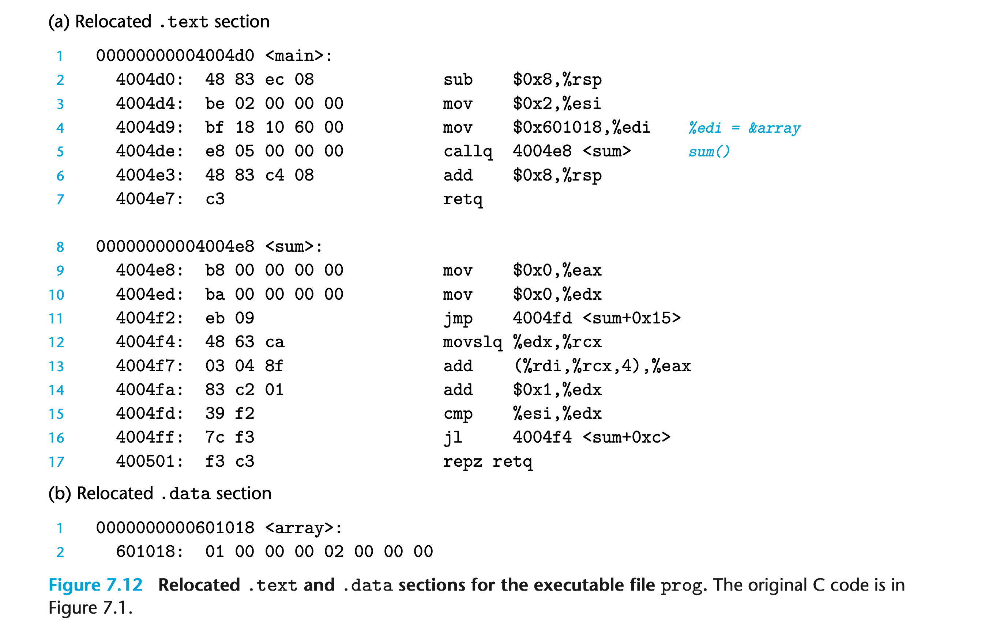
加载器在加载时将这些 Section 中的字节直接拷贝到内存中，无需任何修改便可以执行其中的指令。

## 可执行目标文件

ELF 可执行目标文件的结构如下：

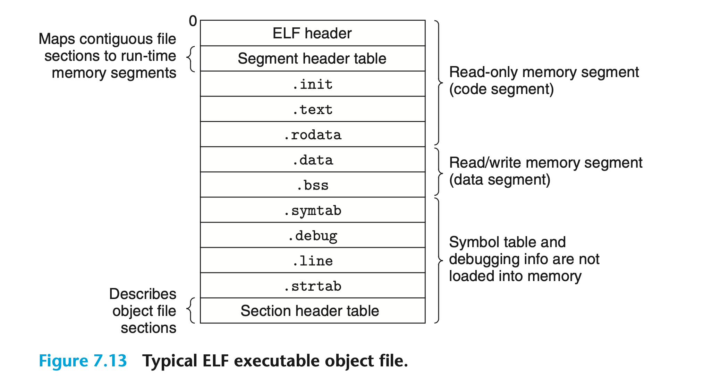
ELF 头描述了文件的整体格式，并包含了程序在运行时执行的第一条指令的地址。.init 定义了一个名为`_init`的函数，它将被程序的初始化代码所调用。其余 Section 与可重定位目标文件类似，只不过它们已被重定位到运行时的内存地址。正因如此，该文件中没有 .rel.text 和 .rel.data。

可执行目标文件的连续块与连续内存段之间的映射关系由程序头表（Program Header Table）描述：

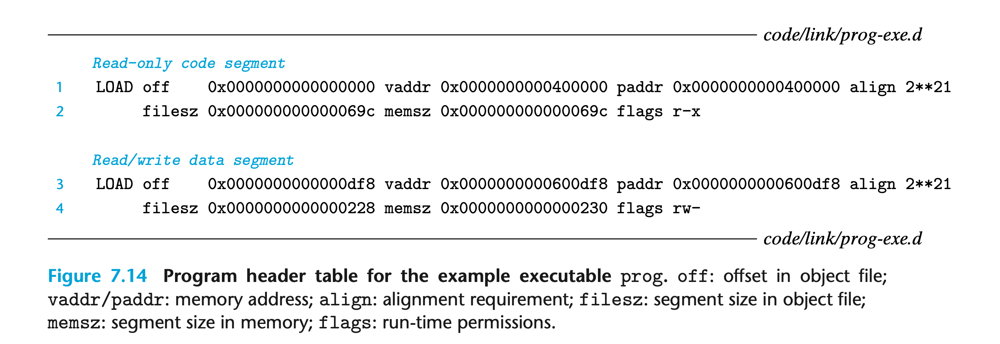
第一个内存段具有读取和执行权限，从内存地址 0x400000 开始，大小为 0x69c 个字节。该内存段是由可执行目标文件的前 0x69c 个字节（偏移量为 0）初始化得到的，包含了 ELF 头、程序头表、.init、.text 和 .rodata。

第二个内存段具有读取和写入权限，从内存地址 0x600df8 开始，大小为  0x230 个字节。该内存段对应了可执行目标文件中偏移量为 0xdf8 的 0x228 个字节，包含了 .data 和 .bss（两者大小之差的 8 个字节即保存在 .bss 并将在运行时初始化为 0 的数据）。

对于每个内存段，链接器必须选择一个起始地址 vaddr，使得：

$$vaddr\space mod\space align = off\space mod\space align$$

其中，off 是该内存段中第一个 Section 在目标文件中的偏移量，align 是程序头表中指定的对齐方式。这种对齐要求是一种优化，它可以使目标文件被更加有效地加载到内存中。

## 加载可执行目标文件

下图展示了 Linux 程序的运行时内存结构：

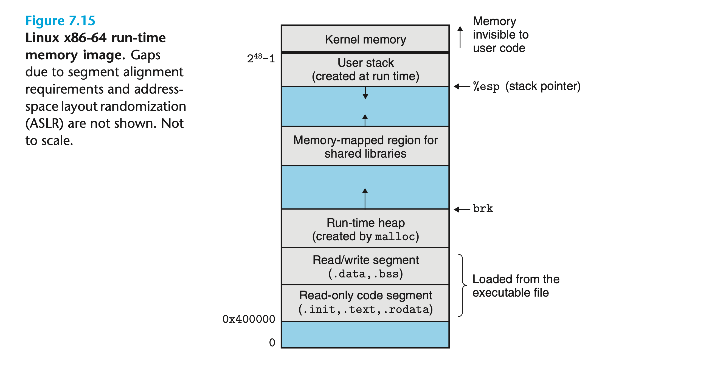
加载器首先根据程序头表将可执行目标文件中的块复制到内存中的代码和数据段，然后跳转到程序入口，即`_start_`函数（在系统目标文件`crt1.o`中定义）的地址。该函数再调用`libc.so`中定义的系统启动函数`__libc_start_main`，由它初始化执行环境，调用用户级的主函数并处理其返回。

## 使用共享库动态链接

静态库会被定期维护和更新，因此程序员需要知晓其变动并将重新链接程序。此外，几乎所有 C 程序都会使用一些标准 I/O 函数，例如`printf`。这些函数的代码将在运行时被复制到每个进程的代码段中，从而导致严重的内存浪费。

共享库（Shared Libraries）可以解决上述静态库的缺点。它是一种可以在加载时或运行时于任意内存地址加载并与程序链接的目标模块，该过程被称为动态链接（Dynamic Linking）。共享库在 Linux 系统中以`.so`为后缀，而在 Windows 系统中则被称为 DLL（Dynamic Linking Libraries）。

在任意文件系统中，每个共享库都只有一个`.so`文件。与静态库不同的是，该文件中的代码和数据可以被引用该库的所有可执行文件共享，而不需要复制到可执行文件中。

示例程序的动态链接过程如下图所示：
```c
/* $begin main2 */
/* main2.c */
#include <stdio.h>
#include "vector.h"

int x[2] = {1, 2};
int y[2] = {3, 4};
int z[2];

int main() 
{
    addvec(x, y, z, 2);
    printf("z = [%d %d]\n", z[0], z[1]);
    return 0;
}
/* $end main2 */
```
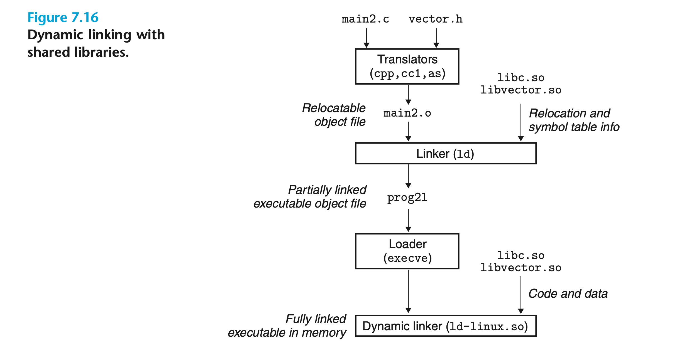

我们使用如下指令将 **addvec.c 和 multvec.c**（见上图7.6） 构建为共享库文件`libvector.so`:

```c
linux> gcc -shared -fpic -o libvector.so addvec.c multvec.c
```

其中，`-fpic`指示编译器生成 **与位置无关代码**（Position-Independent Code），而`-shared`则指示链接器创建共享目标文件。一旦共享库文件创建成功，就可以将其链接到示例程序中：

```c
inux> gcc -o prog2l main2.c ./libvector.so
```

我们需要明确的是，`libvector.so`的任意代码和数据都没有被复制到可执行文件`prog2l`中。链接器只会复制一些重定位和符号表信息，它们将在加载时用于解析引用了共享库的符号。

加载器随后读取可执行文件中包含的动态链接器路径，加载并运行它。动态链接器也是一个共享库文件，如 Linux 系统的`ld-linux.so`。它通过执行以下重定位操作来完成链接：

- 将`libc.so`的代码和数据重定位到某个内存段；
- 将`libvector.so`中的代码和数据重定位到另一个内存段；
- 将`prog2l`中所有引用了共享库的符号重定位。

最终，动态链接器将控制权转移给应用程序，共享库的位置不会在程序执行期间改变。

## 从应用程序中加载和链接共享库

应用程序还可以在运行时请求动态链接器加载和链接共享库，其应用场景包括：Windows 应用程序的开发人员使用共享库来分发软件更新；现代 Web 服务器使用动态链接有效地更新或添加功能。

Linux 系统为应用程序提供了一些简单接口以实现上述功能：

```c
#include <dlfcn.h>
void *dlopen(const char *filename, int flag);
// Returns: pointer to handle if OK, NULL on error
```

函数`dlopen`加载并链接共享库文件`filename`，参数`flag`可以是`RTLD_GLOBAL`、`RTLD_NOW`和`RTLD_LAZY`中的一个或多个（详见 [dlopen](https://man7.org/linux/man-pages/man3/dlopen.3.html)）。

```c
#include <dlfcn.h>
void *dlsym(void *handle, char *symbol);
// Returns: pointer to symbol if OK, NULL on error
```

类似的接口函数还有 [dlsym](https://man7.org/linux/man-pages/man3/dlsym.3.html)、[dlclose](https://man7.org/linux/man-pages/man3/dlclose.3.html) 和 [dlerror](https://man7.org/linux/man-pages/man3/dlerror.3.html)。

示例程序展示了应用程序是如何调用它们来动态链接共享库的。
```c
/* $begin dll */
#include <stdio.h>
#include <stdlib.h>
#include <dlfcn.h>

int x[2] = {1, 2};
int y[2] = {3, 4};
int z[2];

int main() 
{
    void *handle;
    void (*addvec)(int *, int *, int *, int);
    char *error; 

    /* dynamically load the shared library that contains addvec() */
    handle = dlopen("./libvector.so", RTLD_LAZY);
    if (!handle) {
	fprintf(stderr, "%s\n", dlerror());
	exit(1);
    }

    /* get a pointer to the addvec() function we just loaded */
    addvec = dlsym(handle, "addvec");
    if ((error = dlerror()) != NULL) {
	fprintf(stderr, "%s\n", error);
	exit(1);
    }

    /* Now we can call addvec() it just like any other function */
    addvec(x, y, z, 2);
    printf("z = [%d %d]\n", z[0], z[1]);

    /* unload the shared library */
    if (dlclose(handle) < 0) {
	fprintf(stderr, "%s\n", dlerror());
	exit(1);
    }
    return 0;
}
/* $end dll */
```


## 与位置无关代码

现代系统在编译共享库时会生成一种无需重定位即可被加载到内存中任意位置的代码，即与位置无关代码（Position-Independent Code，PIC），这样共享库就能被多个正在运行的进程同时引用。

### PIC 数据引用

编译器在 PIC 数据段的开头创建了一个全局偏移量表（Global Offset Table，GOT），其中的每个条目都对应一个被目标模块引用的全局符号。编译器还会为这些条目生成重定位记录。加载时，动态链接器重定位每个 GOT 条目，使其包含被引用符号的绝对地址。每个引用了全局符号的目标模块都有自己的 GOT。

下图展示了示例共享库`libvector.so`中的 GOT：

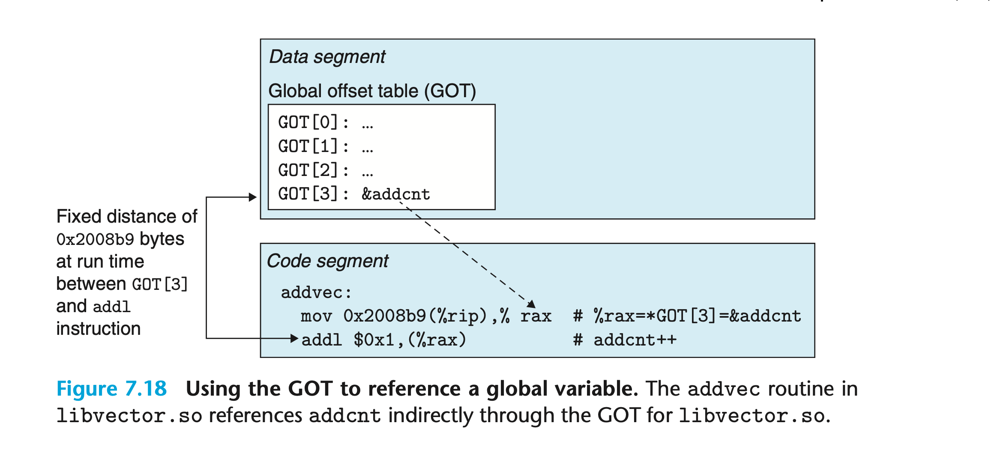

无论我们在何处加载共享模块，其数据段与代码段之间的距离始终相同。因此，代码段中的`addl`与数据段中的 GOT[3] 之间的偏移量是一个运行时常量。当函数`addvec`引用全局变量`addcnt`时，先通过`0x2008b9(%rip)`计算得到 GOT[3] 的地址，然后从中读取加载时被动态链接器赋予的`addcnt`的绝对地址。

### PIC 函数调用

PIC 函数调用的运行时地址是在该函数第一次被调用时确定的，这种技术被称为延迟绑定（Lazy Binding）。当应用程序导入了一个包含成百上千个函数的共享库（如`libc.so`），却只调用其中一小部分的函数时，这种技术可以大大减少加载时不必要的重定位操作。

延迟绑定是通过 GOT 和过程链接表（Procedure Linkage Table，PLT）共同实现的。只要目标模块调用了共享库中定义的函数，那么它就有自己的 GOT 和 PLT。上文提到，GOT 是数据段的一部分，而 PLT 则是代码段的一部分。

GOT 和 PLT 在运行时协同工作解析函数地址的过程如下图所示：

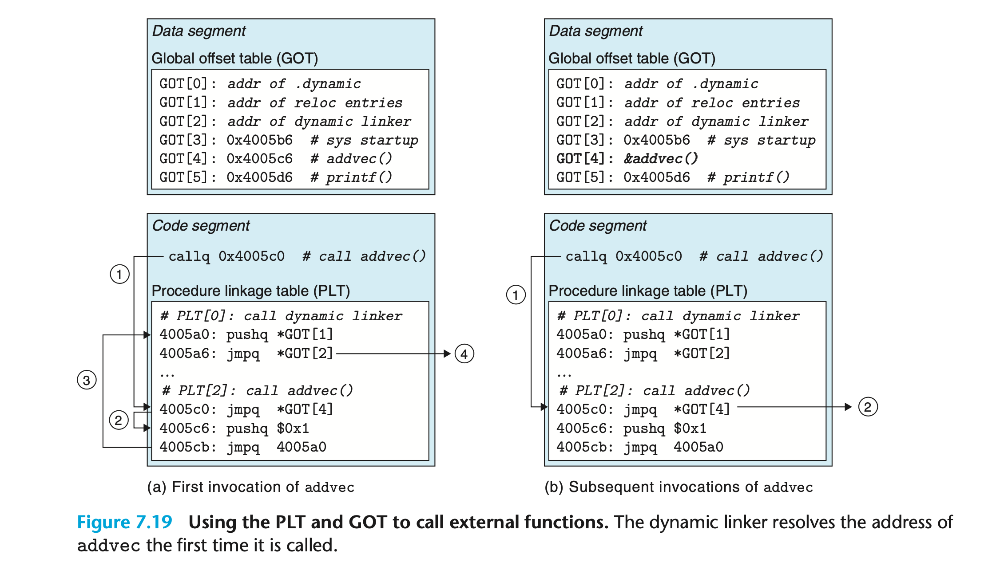

可执行文件中每个对共享库函数的调用都与 PLT 数组中的条目对应。其中，PLT[0] 是跳转到动态链接器的特殊条目，PLT[1] 对应系统启动函数`__libc_start_main`。从 PLT[2] 开始的条目对应用户代码调用的函数，如图中的`addvec`。

当与 PLT 一起使用时，GOT [0] 和 GOT[1] 包含了动态连接器在解析函数地址时所需的信息，GOT[2] 是动态链接器的入口点。其余的每个条目均对应于一个在运行时需要被解析地址的调用函数，以及一个 PLT 条目。例如，GOT[4] 和 PLT[2] 与`addvec`对应。

程序第一次调用`addvec`并解析其地址的过程如上图（a）所示：

1. PLT[2] 是该函数的入口，程序首先调用它；
2. PLT[2] 中的第一条指令间接跳转到 GOT[4]。由于最初每个 GOT 条目都指向对应 PLT 条目中的第二条指令，因此控制权将转移到 PLT[2] 中的第二条指令；
3. PLT[2] 中的第二条指令将`addvec`的 ID 0x1 压入栈中，第三条指令跳转到 PLT[0]；
4. PLT[0] 中的第一条指令将 *GOT[1] 压入栈中，第二条指令通过 GOT[2] 间接跳转到动态链接器。动态链接器根据被压入栈中的两个条目确定`addvec`的运行时地址并用它覆盖 GOT[4]，最终将控制权转移给`addvec`。

程序再次调用`addvec`的过程如上图（b）所示：

1. 程序依然首先调用 PLT[2]；
2. 此时 GOT[4] 指向了`addvec`，因此控制权将被直接转移到该函数。

## 库插入

库插入（Library Interpositioning）能够拦截程序对共享库函数的调用，并执行用户自定义的代码。基于这项技术，我们可以计算库函数的调用次数，验证并跟踪其输入和输出的值，甚至将其替换为完全不同的函数。

库插入的基本思想是创建一个与库函数原型相同的包装函数，然后“欺骗”系统调用包装函数而非库函数。通常，包装函数会执行自己的逻辑，调用库函数并将其返回值传递给调用者。

库插入可以在编译时、链接时以及运行时使用。
