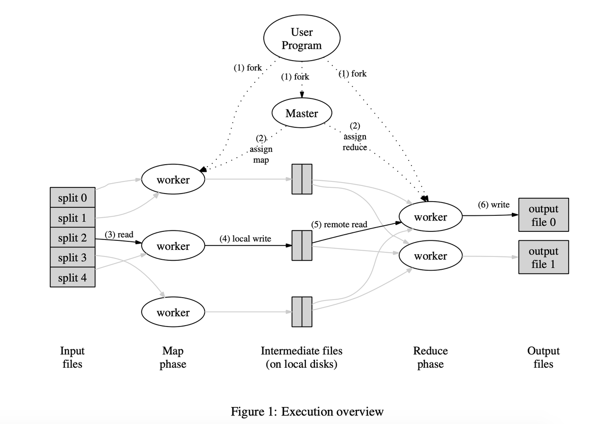
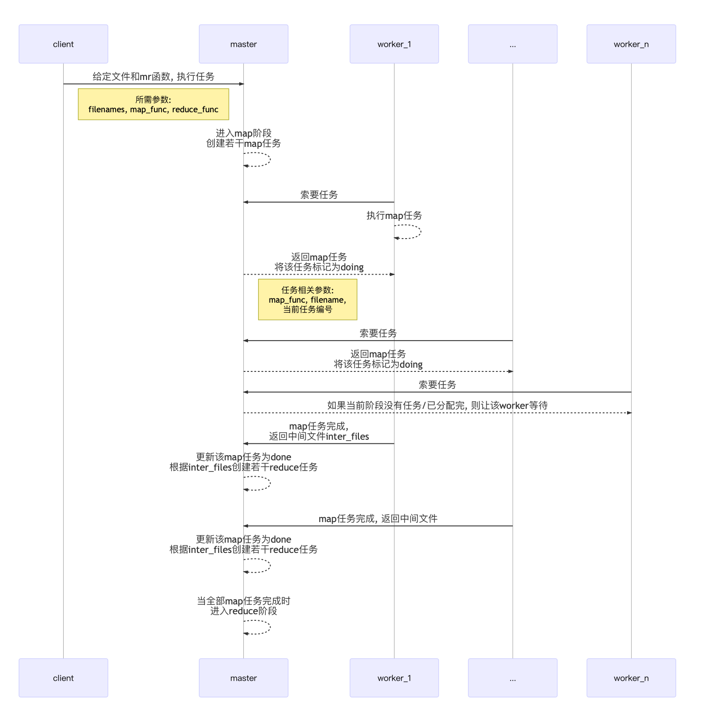
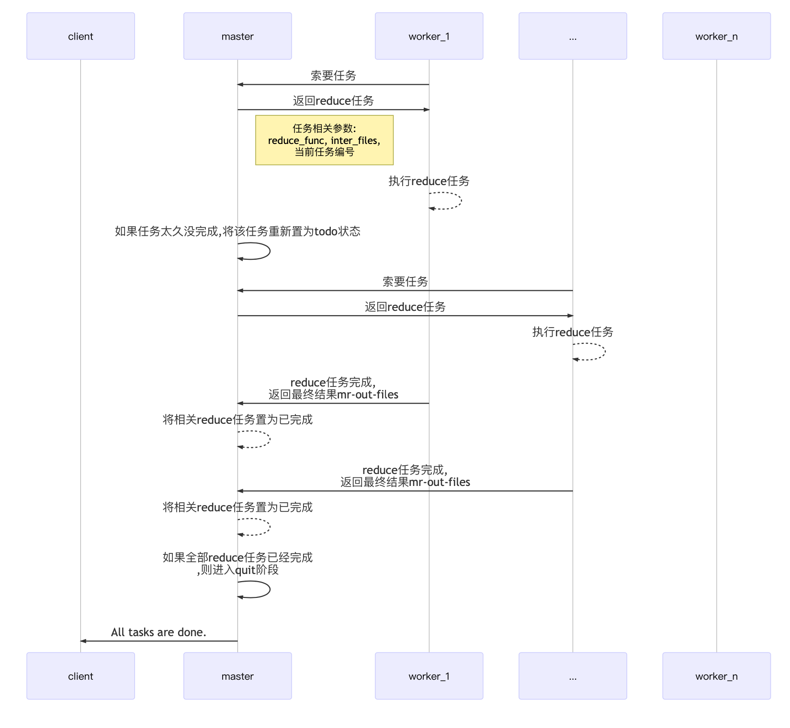

# Mapreduce

## 什么是mapreduce？
谷歌推出的，可水平扩展的，分布式计算框架

## 背景

早在2003年之前，谷歌作为一家搜索起家的公司，需要解决的问题有：统计单词在文本中出现的数量、建立单词在文档中出现的索引、统计url被点击的数量、排序。


每一个问题都很直观简单，但是当数据量增大至TB乃至PB量级的时候，没有一台单机可以进行这样简单的计算。


最开始，谷歌招募了一些懂分布式系统设计的程序员，针对具体任务去写分布式的业务代码。但是谷歌作为一家需要控制成本和盈利的公司，领导层绝不会希望每一个程序员都是需要懂分布式的。


于是，很自然的，谷歌提出设计一个系统，系统的设计者负责提供通用的分布式计算框架，该框架最重要的特性是支持水平扩展（scale）；而系统的使用者，只需要很少的心智负担，即可使用这个框架来解决他们的大数据量的计算问题。

## 以word_count为例，讲解什么是map和reduce

我们先来假设一个问题，通过这个问题来引出什么是map和reduce。假如你是一个大学的图书馆管理员，手底下有一群勤工俭学的大学生，现在校长想统计整个图书馆所有的图书中每个单词出现的次数。你应该怎么给手底下的学生分配任务呢？

在这个问题里，你是这个分布式系统的master，勤工俭学的学生是worker，而校长则是client。

---

首先很自然地想到，你可以先把图书平均分给每一个学生，然后让他们进行每一本书的单词统计。这样的话，比如学生A拿到了《他改变了中国》《He changed China》两本书，然后给出的统计结果是这样的：

```
当特首 1
吼啊 1
当然啦 1
naive 1
exciting 1
```

学生B拿到了《红楼梦》《The Red Building Dream》两本书，然后B给出的结果是

```
吼啊 1
当然啦 1
naive 1
exciting 1
```

--- 
那么然后呢？A和B的结果里包含了相同的key，我们如何对这些相同的key进行一个汇总？（在这里，汇总的语义是什么？）

不难想到，我们只要让A和B的统计结果中，具有相同的key被统一地进一步处理就好啦。比方说我们现在还有两个同学C和D，我们可以简单的让C处理中文的统计，D处理英文的统计。那么C的处理结果就是

```
当特首 1
吼啊 2
当然啦 2
```

D的处理结果就是

```
naive 2
exciting 2
```

于是我们只要把C和D的统计结果进行合并就好啦。

---

P.S: 作为程序员，很自然的可以想到一种key的分配方式：

假设我们有n个同学（编号为0, 1, 2, ..., n-1）被分配来做汇总工作，那么对于每个key，对它做汇总工作的同学的编号应为：

$$ i=hash(key) \% n $$

---

来整理和更细化一下刚才的过程吧，作为master，我们有A、B、C、D四个worker。   

首先在第一阶段，我们将要处理的文件进行了摊派(map)，A和B拿到了书名和书中的内容，对应到计算机中，即filename和content。

A和B处理完成后，A知道他需要把中文的key留给C做汇总，英文的key留给D做汇总。于是A输出的文件为"map-A-C"和"map-A-D"，同理B的输出文件为"map-B-C"和“map-B-D”。

在第二阶段，我们需要将第一阶段得到的中间结果进行汇总(reduce)，现在有C和D，C知道自己要处理的文件为"map-A-C"和"map-B-C"，D知道自己要处理的文件为"map-A-D"和"map-B-D"。   

最终C和D的输出文件为"reduce-C"和"reduce-D"，然后我们将这两个文件进行合并就是最后的结果。

于是，Mapreduce的抽象表达也就呼之欲出了⬇️

## Mapreduce的抽象表达

$$ map(k1, v1) \rightarrow     list(k2, v2') $$

$$ reduce(k2, list(v2'))  \rightarrow  v2 $$

`k1`一般是文件名，`v1`是文件里的内容，map的任务是将`k1`和`v1`转化成一堆键值对`k2, v2'`。   
`k2`和`v2'`是中间结果，reduce的任务就是对具有相同键的中间结果做处理，得到最终结果`v2`。


## 代码分析

### 先来看单点按顺序执行的程序

```bash

git clone git://g.csail.mit.edu/6.824-golabs-2021 6.824
cd 6.824

```

在`main`目录下的`mrsequential.go`中有：

```go
package main

//
// simple sequential MapReduce.
//
// go run mrsequential.go wc.so pg*.txt
//

import "fmt"
import "../mr"
import "plugin"
import "os"
import "log"
import "io/ioutil"
import "sort"

// for sorting by key.
type ByKey []mr.KeyValue

// for sorting by key.
func (a ByKey) Len() int           { return len(a) }
func (a ByKey) Swap(i, j int)      { a[i], a[j] = a[j], a[i] }
func (a ByKey) Less(i, j int) bool { return a[i].Key < a[j].Key }

func main() {
   if len(os.Args) < 3 {
      fmt.Fprintf(os.Stderr, "Usage: mrsequential xxx.so inputfiles...\n")
      os.Exit(1)
   }

   mapf, reducef := loadPlugin(os.Args[1])

   //
   // read each input file,
   // pass it to Map,
   // accumulate the intermediate Map output.
   //
   intermediate := []mr.KeyValue{}
   for _, filename := range os.Args[2:] {
      file, err := os.Open(filename)
      if err != nil {
         log.Fatalf("cannot open %v", filename)
      }
      content, err := ioutil.ReadAll(file)
      if err != nil {
         log.Fatalf("cannot read %v", filename)
      }
      file.Close()
      kva := mapf(filename, string(content))
      intermediate = append(intermediate, kva...)
   }

   //
   // a big difference from real MapReduce is that all the
   // intermediate data is in one place, intermediate[],
   // rather than being partitioned into NxM buckets.
   //

   sort.Sort(ByKey(intermediate))

   oname := "mr-out-0"
   ofile, _ := os.Create(oname)

   //
   // call Reduce on each distinct key in intermediate[],
   // and print the result to mr-out-0.
   //
   i := 0
   for i < len(intermediate) {
      j := i + 1
      for j < len(intermediate) && intermediate[j].Key == intermediate[i].Key {
         j++
      }
      values := []string{}
      for k := i; k < j; k++ {
         values = append(values, intermediate[k].Value)
      }
      fmt.Println(intermediate[i].Key)
      fmt.Println(values)
      output := reducef(intermediate[i].Key, values)

      // this is the correct format for each line of Reduce output.
      fmt.Fprintf(ofile, "%v %v\n", intermediate[i].Key, output)

      i = j
   }

   ofile.Close()
}

//
// load the application Map and Reduce functions
// from a plugin file, e.g. ../mrapps/wc.so
//
func loadPlugin(filename string) (func(string, string) []mr.KeyValue, func(string, []string) string) {
   p, err := plugin.Open(filename)
   if err != nil {
      log.Fatalf("cannot load plugin %v", filename)
   }
   xmapf, err := p.Lookup("Map")
   if err != nil {
      log.Fatalf("cannot find Map in %v", filename)
   }
   mapf := xmapf.(func(string, string) []mr.KeyValue)
   xreducef, err := p.Lookup("Reduce")
   if err != nil {
      log.Fatalf("cannot find Reduce in %v", filename)
   }
   reducef := xreducef.(func(string, []string) string)

   return mapf, reducef
}

```

mrapp/wc.go的代码如下：
```go

package main

//
// a word-count application "plugin" for MapReduce.
//
// go build -buildmode=plugin wc.go
//

import "6.824/mr"
import "unicode"
import "strings"
import "strconv"

//
// The map function is called once for each file of input. The first
// argument is the name of the input file, and the second is the
// file's complete contents. You should ignore the input file name,
// and look only at the contents argument. The return value is a slice
// of key/value pairs.
//
func Map(filename string, contents string) []mr.KeyValue {
   // function to detect word separators.
   ff := func(r rune) bool { return !unicode.IsLetter(r) }

   // split contents into an array of words.
   words := strings.FieldsFunc(contents, ff)

   kva := []mr.KeyValue{}
   for _, w := range words {
      kv := mr.KeyValue{w, "1"}
      kva = append(kva, kv)
   }
   return kva
}

//
// The reduce function is called once for each key generated by the
// map tasks, with a list of all the values created for that key by
// any map task.
//
func Reduce(key string, values []string) string {
   // return the number of occurrences of this word.
   return strconv.Itoa(len(values))
}

```

然后在shell里执行
```bash

go build -race -buildmode=plugin ../mrapps/wc.go
rm mr-out*
go run -race mrcoordinator.go pg-*.txt

```


最终可以得到结果`mr-out-0`
```
A 509
ABOUT 2
ACT 8
ACTRESS 1
ACTUAL 8
ADLER 1
ADVENTURE 12
...

```

## MR的分布式设计

那么如何设计一个具有水平扩展性的分布式计算框架呢？

在这个计算框架下，使用方只要写map和reduce函数，再指定所要执行的文件，就可以在成百上千的机器上并行的去跑这些执行任务，最终得到总的结果。

在这个框架下，如果有的计算节点没有完成它的map或者reduce任务，这个框架需要重新指定别的计算节点去执行任务。

谷歌给出的方案如下：



关于该图的具体解释请参考论文里的内容。

分布式理论最初应用在工业界的时候，为了达到最终一致性，为了容错，
人们倾向于有一个master和一群worker，worker出错了的话master会及时感知到，从而触发兜底方案。    

而master出错的话，就手动去恢复，相当于把错误限制在为数不多的master机器上。

而mit6.824的lab1中，就是实现这样一个框架。    

时序图如下：

### stage1——初始化和map阶段：



### stage2——reduce和完成阶段：




## 问题

1. 过了这么多年，目前好用的计算框架除了Mapreduce，还有什么？
2. Mapreduce不适合处理流式数据，或者数据之间存在关联的时候也不适合，那应该咋办？
