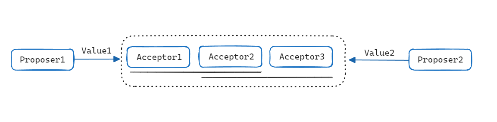

# Paxos 算法

## 关于Paxos

Paxos算法是Leslie Lamport于1990年提出的一种基于消息传递共识算法，能保证多副本数据强一致性与分区容错性；现已是当今分布式系统最重要的理论，为后续的如Raft、ZAB等算法、ZooKeeper、Etcd等分布式协调框架奠定了基础。

例如：Paxos可以协同让多个机器成为一个整体的系统，这个系统中的每个机器都必须让系统中的状态达成一致，如果在三副本集群中的一台机器上上传了一个文件，其他两台机器也必须复制这个文件，达到系统的一致性。

> Google Chubby的作者给了Paxos极高的评价：There is only one consensus protocol, and that’s “Paxos” — all other approaches are just broken versions of Paxos（世界上只有一种共识协议，就是Paxos，其他所有共识算法都是Paxos的退化版本）

## 问题-假设

**问题**：在分布式系统中进行节点通信大部分采用基于消息传递通信模型，不可避免的会发生如进程可能会慢、被杀死或者重启等问题，会对分布式系统中各个节点对某一个值达成一致性产生问题；而Paxos就是为了解决这个问题而生的。

**场景**：在一个分布式数据库系统中，如果各节点的初始状态一致，每个节点都执行相同的操作序列，那么他们最后能得到一个一致的状态。为保证每个节点执行相同的命令序列，需要在每一条指令上执行一个“一致性算法”以保证每个节点看到的指令一致。

**假设**：Lamport虚构了一个名为Paxos的希腊城邦，这个城邦按照民主制度制定法律，却又不存在一个中心化的专职立法机构，立法靠着“兼职议会”（Part-Time Parliament）来完成，无法保证所有城邦居民都能够及时地了解新的法律提案、也无法保证居民会及时为提案投票。Paxos算法的目标就是让城邦能够在每一位居民都不承诺一定会及时参与的情况下，依然可以按照少数服从多数的原则，最终达成一致意见。注意：Paxos算法并不考虑拜占庭将军问题，即假设信息可能丢失也可能延迟，但不会被错误传递。

Paxos算法运行在允许宕机故障的异步系统中，不要求可靠的消息传递，可容忍消息丢失、延迟、乱序以及重复，保证了2F+1的容错能力，即2F+1个节点的系统最多允许F个节点同时出现故障。

## 算法推演

在解决分布式环境下复制带来的副本一致性问题时，我们提到可以通过两类基本复制算法解决：Replication methods that prevent divergence (single copy systems) 与 Replication methods that risk divergence (multi-master systems) 。

以Replication methods that prevent divergence为例，可以通过如**Master/Slave（主从复制）**、**2-phase commit（两阶段提交）**、**Quorum机制(多数派读写)** 方式实现，但都或多或少存在着问题；本文讨论的Paxos可以看作是对Quorum机制（多数派读写）的进一步升级。

### Paxos算法中对应的角色

- **Proposer**：提出提案 (Proposal)；可以理解为客户端，Proposal信息包括提案编号 (Proposal ID) 和提议的值 (Value)。
- **Acceptor**：参与决策，可以理解为存储节点，回应Proposers的提案。收到Proposal后可以接受提案，若Proposal获得多数派Acceptors的接受，则称该Proposal被批准。
- **Learners**：用于学习被批准的提案

Paxos算法中的角色允许身兼数职，也有了如下的基本约束：

1. 决策（value）只有在被 proposers 提出后才能被批准（未经批准的称为提案）
2. 在一次 Paxos 算法的执行实例中，只批准（chosen）一个 value
3. Learners 只能获得被批准（chosen）的 value

作者Lamport主要通过不断加强上述3个约束（主要是第二个）获得了 Paxos 算法

### 系统模型

一个系统中，存在多个Proposer节点提出提案，多个Acceptor节点负责决策-接受提案。为了满足只批准一个 value 的约束，要求经Quorum（多数派）接受的 value 成为正式的决议。即**一个提案被选定需要被半数以上的Acceptor接受**

Quorum机制下，假设只有一个Proposer提出了一个value，该value也会被决策，要保证约束2，就会产生P1约束 **P1：一个Acceptor必须接受第一次收到的提案**

P1 是不完备的，不同的Proposer提出不同的value的话，如果遵循P1，就会出现无法形成多数派的情况；因为存在多个提案，这里就需要给每个提案加上一个提案编号以表示顺序，即提案=编号+Value；只要提案的 value 是一样的，批准多个提案不违背约束2，我们就可以保证只有一个值被选中，可以得到如下约束 **P2：如果某个value为v的提案被批准（chosen），那么之后批准（chosen）的提案必须具有 value v**

因为一个提案只有被Acceptor接受才可能被选定，所以我们可以把P2约束改写成对Acceptor接受的提案的约束 **P2a：一旦一个具有 value v 的提案被批准（chosen），那么之后任何 Acceptor 再次接受（accept）的提案必须具有 value v**

因为通信是异步的，系统是不可靠的，P2a和P1可能会存在冲突，例如一个 value 被批准后，一个Proposer 和一个 Acceptor 从休眠中苏醒，前者提出一个具有新的 value 的提案；这种情况下根据 P1，Acceptor应当接受，根据 P2a，则不应当接受（如下图所示）， P2a 和 P1 有矛盾。于是需要换个思路，转而对 proposer 的行为进行约束得到 **P2b：一旦一个具有 value v 的提案被批准（chosen），那么以后任何 Proposer 提出的提案必须具有 value v**

由于 acceptor 能接受的提案都必须由 proposer 提出，所以 P2b 蕴涵了 P2a，是一个更强的约束。但是根据 P2b 难以提出实现手段，需要进一步加强 P2b；假设一个编号为 m 的 Value v 已经获得批准，存在一个 Acceptors 的多数派 C，他们都接受（accept）了v，考虑到任何多数派都和 C 具有至少一个公共成员，可以找到一个蕴涵 P2b 的约束 **P2c：如果一个编号为 n 的提案具有 value v，该提案被提出，那么存在一个多数派，要么他们中所有人都没有接受（accept）编号小于 n 的任何提案，要么他们已经接受（accept）的所有编号小于 n 的提案中编号最大的那个提案具有 value v**

要满足P2c的约束，会涉及两个流程：

- **prepare阶段**：Proposer提出一个提案前，要和足以形成多数派的Acceptors进行通信，获得他们进行的最近一次接受（accept）的提案，根据回收的信息决定这次提案的value，形成提案开始投票
- **批准阶段**：当获得多数acceptors接受（accept）后，提案获得批准（chosen），由Acceptor将这个消息告知learner（这个过程逐渐细化，就形成了Paxos算法）

并发情况下：如果一个没有chosen过任何proposer提案的Acceptor在prepare过程中回答了一个proposer针对提案n的问题，但是在开始对n进行投票前，又接受（accept）了编号小于n的另一个提案（例如n-1），如果n-1和n具有不同的value，这个投票就会违背P2c。因此需要对P1进行加强，在prepare过程中，acceptor进行的回答后不会再接受（accept）编号小于n的提案，**P1a：当且仅当Acceptor没有回应过编号大于n的prepare请求时，Acceptor接受（accept）编号为n的提案**