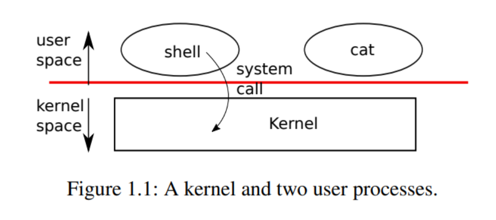

# Introduction

操作系统应该提供的功能：1. 多进程支持 2. 进程间隔离 3. 受控制的进程间通信

- xv6：一种在本课程中使用的类UNIX的教学操作系统，运行在RISC-V指令集处理器上，本课程中将使用QEMU模拟器代替
- kernel(内核)：为运行的程序提供服务的一种特殊程序。每个运行着的程序叫做进程，每个进程的内存中存储指令、数据和堆栈。一个计算机可以拥有多个进程，但是只能有一个内核。每当进程需要调用内核时，它会触发一个system call（系统调用），system call进入内核执行相应的服务然后返回。



- shell：一个普通的程序，其功能是让用户输入命令并执行它们，shell **不是** 内核的一部分

## 1 Processes and memory

每个进程拥有自己的用户空间内存以及内核空间状态，当进程不再执行时xv6将存储和这些进程相关的CPU寄存器直到下一次运行这些进程。kernel将每一个进程用一个PID(process identifier)指代。

**常用syscall**

- `fork`：形式：`int fork()`。其作用是让一个进程生成另外一个和这个进程的内存内容相同的子进程。在父进程中，`fork`的返回值是这个子进程的PID，在子进程中，返回值是0
- `exit`：形式：`int exit(int status)`。让调用它的进程停止执行并且将内存等占用的资源全部释放。需要一个整数形式的状态参数，0代表以正常状态退出，1代表以非正常状态退出
- `wait`：形式：`int wait(int *status)`。等待子进程退出，返回子进程PID，子进程的退出状态存储到`int *status`这个地址中。如果调用者没有子进程，`wait`将返回-1
    
    ```c
    int pid = fork();
    if (pid > 0) {
    	printf("parent: child=%d\\n", pid);
    	pid = wait((int *) 0);
    	printf("child %d is done\\n", pid);
    } else if (pid == 0) {
    	printf("child: exiting\\n");
    	exit(0);
    } else {
    	printf("fork error\\n");
    }
    ```
    
    前两行输出可能是
    
    ```
    parent: child=1234
    child: exiting
    ```
    
    也可能是
    
    ```
    child: exiting
    parent: child=1234
    ```
    
    这是因为在fork了之后，父进程和子进程将同时开始判断PID的值，在父进程中，PID为1234，而在子进程中，PID为0。看哪个进程先判断好PID的值，以上输出顺序才会被决定。
    最后一行输出为
    
    ```
    parent: child 1234 is done
    ```
    
    子进程在判断完`pid == 0`之后将`exit`，父进程发现子进程`exit`之后，`wait`执行完毕，打印输出
    
    尽管`fork`了之后子进程和父进程有相同的内存内容，但是内存地址和寄存器是不一样的，也就是说在一个进程中改变变量并不会影响另一个进程。
    
- `exec`：形式：`int exec(char *file, char *argv[])`。加载一个文件，获取执行它的参数，执行。如果执行错误返回-1，执行成功则不会返回，而是开始从文件入口位置开始执行命令。文件必须是ELF格式。

xv6 shell使用以上四个system call来为用户执行程序。在shell进程的`main`中主循环先通过`getcmd`来从用户获取命令，然后调用`fork`来运行一个和当前shell进程完全相同的子进程。父进程调用`wait`等待子进程`exec`执行完（在`runcmd`中调用`exec`）

```c
/* sh.c */
int
main(void)
{
  static char buf[100];
  int fd;

  // Ensure that three file descriptors are open.
  while((fd = open("console", O_RDWR)) >= 0){
    if(fd >= 3){
      close(fd);
      break;
    }
  }

  // Read and run input commands.
  while(getcmd(buf, sizeof(buf)) >= 0){
    if(buf[0] == 'c' && buf[1] == 'd' && buf[2] == ' '){
      // Chdir must be called by the parent, not the child.
      buf[strlen(buf)-1] = 0;  // chop \\n
      if(chdir(buf+3) < 0)
        fprintf(2, "cannot cd %s\\n", buf+3);
      continue;
    }
    if(fork1() == 0)
      runcmd(parsecmd(buf));
    wait(0);
  }
  exit(0);
}
```

## 2 I/O and File descriptors

- file descriptor：文件描述符，用来表示一个被内核管理的、可以被进程读/写的对象的一个整数，表现形式类似于字节流，通过打开文件、目录、设备等方式获得。一个文件被打开得越早，文件描述符就越小。
    
    每个进程都拥有自己独立的文件描述符列表，其中0是标准输入，1是标准输出，2是标准错误。shell将保证总是有3个文件描述符是可用的
    
    ```c
    while((fd = open("console", O_RDWR)) >= 0){
        if(fd >= 3){
            close(fd);
            break;
        }
    }
    ```
    
- `read`和`write`：形式`int write(int fd, char *buf, int n)`和`int read(int fd, char *bf, int n)`。从/向文件描述符`fd`读/写n字节`bf`的内容，返回值是成功读取/写入的字节数。每个文件描述符有一个offset，`read`会从这个offset开始读取内容，读完n个字节之后将这个offset后移n个字节，下一个`read`将从新的offset开始读取字节。`write`也有类似的offset
    
    ```c
    /* essence of cat program */
    char buf[512];
    int n;
    
    for (;;) {
        n = read(0, buf, sizeof buf);
        if (n == 0)
            break;
        if (n < 0){
            fprintf(2, "read errot\\n");
            exit(1);
        }
        if (write(1, buf, n) != n){
            fprintf(2, "write error\\n");
            exit(1);
        }
    }
    ```
    
- `close`。形式是`int close(int fd)`，将打开的文件`fd`释放，使该文件描述符可以被后面的`open`、`pipe`等其他system call使用。
    
    使用`close`来修改file descriptor table能够实现I/O重定向
    
    ```c
    /* implementation of I/O redirection,
     * more specifically, cat < input.txt
     */
    char *argv[2];
    argv[0] = "cat";
    argv[1] = 0;
    
    if (fork() == 0) {
        // in the child process
        close(0);  // this step is to release the stdin file descriptor
        open("input.txt", O_RDONLY); // the newly allocated fd for input.txt is 0, since the previous fd 0 is released
        exec("cat", argv); // execute the cat program, by default takes in the fd 0 as input, which is input.txt
    }
    ```
    
    父进程的fd table将不会被子进程fd table的变化影响，但是文件中的offset将被共享。
    
- `dup`。形式是`int dup(int fd)`，复制一个新的`fd`指向的I/O对象，返回这个新fd值，两个I/O对象(文件)的offset相同
    
    ```c
    fd = dup(1);
    write(1, "hello ", 6);
    write(fd, "world\\n", 6);
    // outputs hello world
    ```
    
    除了`dup`和`fork`之外，其他方式**不能**使两个I/O对象的offset相同，比如同时`open`相同的文件
    

## 3 Pipes

- pipe：管道，暴露给进程的一对文件描述符，一个文件描述符用来读，另一个文件描述符用来写，将数据从管道的一端写入，将使其能够被从管道的另一端读出
    
    `pipe`是一个system call，形式为`int pipe(int p[])`，`p[0]`为读取的文件描述符，`p[1]`为写入的文件描述符
    
    ```c
    /* run the program wc with stdin connected to the read end of pipe, parent process able to communicate with child process */
    int p[2];
    char *argv[2];
    
    argv[0] = "wc";
    argv[1] = 0;
    
    pipe(p); // read fd put into p[0], write fd put into p[1]
    if (fork() == 0) {
        close(0);
        dup(p[0]); // make the fd 0 refer to the read end of pipe
        close(p[0]); // original read end of pipe is closed
        close(p[1]); // fd p[1] is closed in child process, but not closed in the parent process. 注意这里关闭p[1]非常重要，因为如果不关闭p[1]，管道的读取端会一直等待读取，wc就永远也无法等到EOF
        exec("/bin/wc", argv); // by default wc will take fd 0 as the input, which is the read end of pipe in this case
    } else {
        close(p[0]); // close the read end of pipe in parent process will not affect child process
        write(p[1], "hello world\\n", 12);
        close(p[1]); // write end of pipe closed, the pipe shuts down
    }
    ```
    
    xv6中的实现和上述的类似
    
    ```c
    case PIPE:
    pcmd = (struct pipecmd*)cmd;
    if(pipe(p) < 0)
        panic("pipe");
    if(fork1() == 0){
        // in child process
        close(1); // close stdout
        dup(p[1]); // make the fd 1 as the write end of pipe
        close(p[0]);
        close(p[1]);
        runcmd(pcmd->left); // run command in the left side of pipe |, output redirected to the write end of pipe
    }
    if(fork1() == 0){
        // in child process
        close(0); // close stdin
        dup(p[0]); // make the fd 0 as the read end of pipe
        close(p[0]);
        close(p[1]);
        runcmd(pcmd->right); //  run command in the right side of pipe |, input redirected to the read end of pipe
    }
    close(p[0]);
    close(p[1]);
    wait(0); // wait for child process to finish
    wait(0); // wait for child process to finish
    break;
    ```

## 4 File system

xv6文件系统包含了文件(byte arrays)和目录(对其他文件和目录的引用)。目录生成了一个树，树从根目录`/`开始。对于不以`/`开头的路径，认为是是相对路径

- `mknod`：创建设备文件，一个设备文件有一个major device 和一个minor device 用来唯一确定这个设备。当一个进程打开了这个设备文件时，内核会将`read`和`write`的system call重新定向到设备上。
- 一个文件的名称和文件本身是不一样的，文件本身，也叫_inode_，可以有多个名字，也叫_link_，每个link包括了一个文件名和一个对inode的引用。一个inode存储了文件的元数据，包括该文件的类型(file, directory or device)、大小、文件在硬盘中的存储位置以及指向这个inode的link的个数
- `fstat`。一个system call，形式为`int fstat(int fd, struct stat *st)`，将inode中的相关信息存储到`st`中。
- `link`。一个system call，将创建一个指向同一个inode的文件名。`unlink`则是将一个文件名从文件系统中移除，只有当指向这个inode的文件名的数量为0时这个inode以及其存储的文件内容才会被从硬盘上移除

注意：Unix提供了许多在 **用户层面** 的程序来执行文件系统相关的操作，比如`mkdir`、`ln`、`rm`等，而不是将其放在shell或kernel内，这样可以使用户比较方便地在这些程序上进行扩展。但是`cd`是一个例外，它是在shell程序内构建的，因为它必须要改变这个calling shell本身指向的路径位置，如果是一个和shell平行的程序，那么它必须要调用一个子进程，在子进程里起一个新的shell，再进行`cd`，这是不符合常理的。