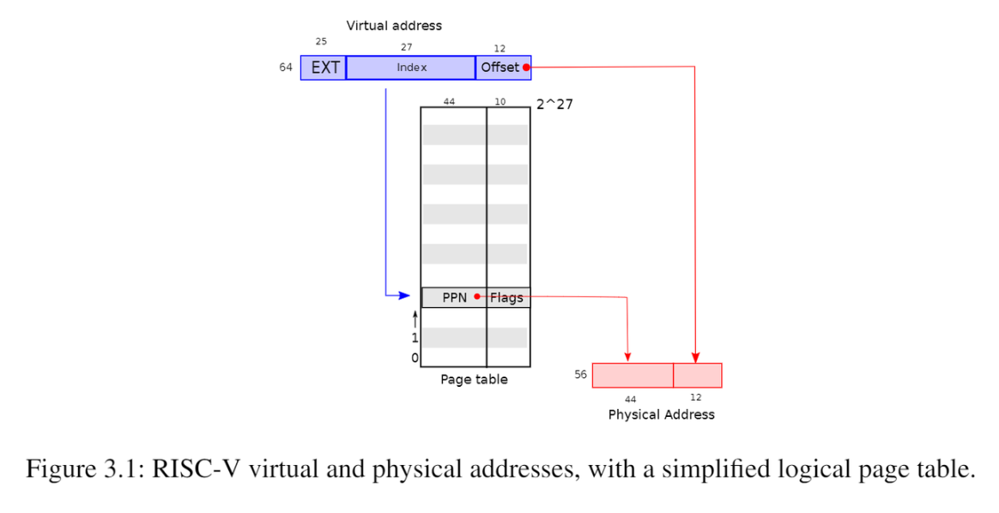
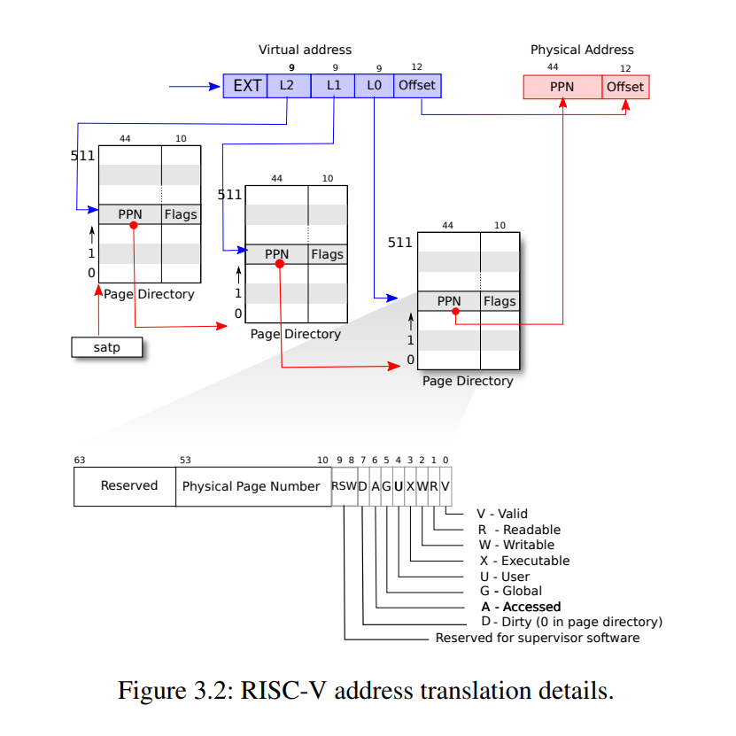
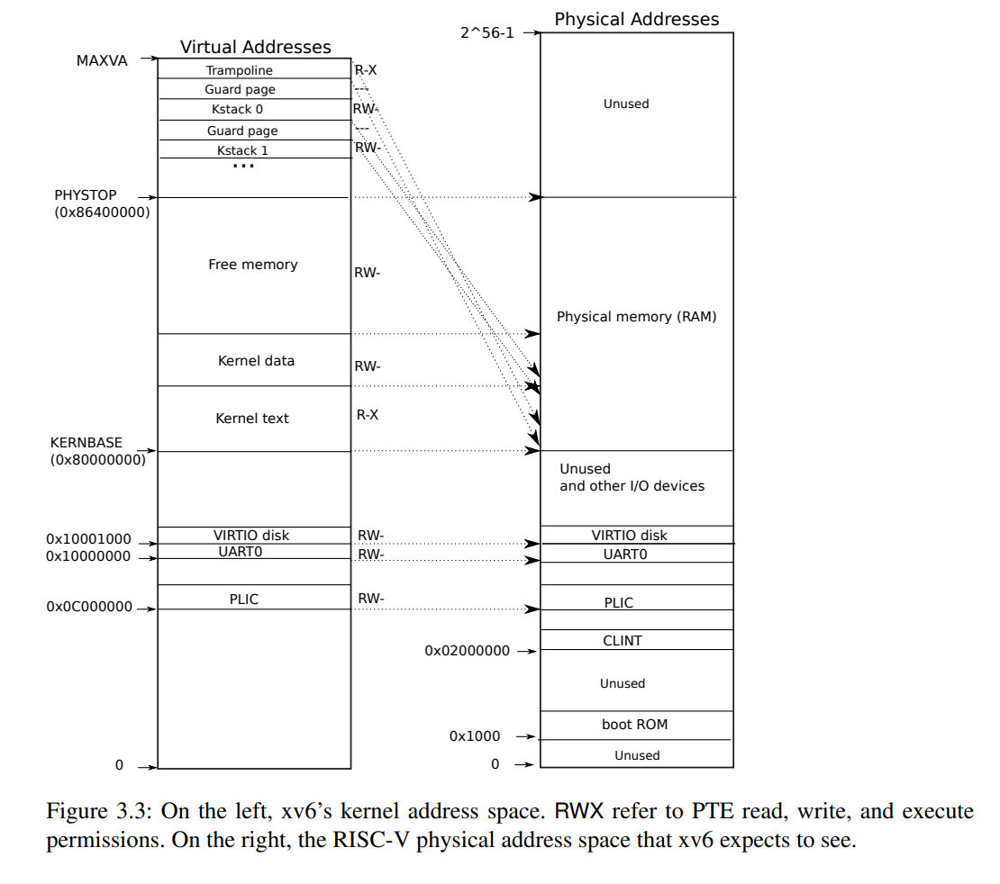
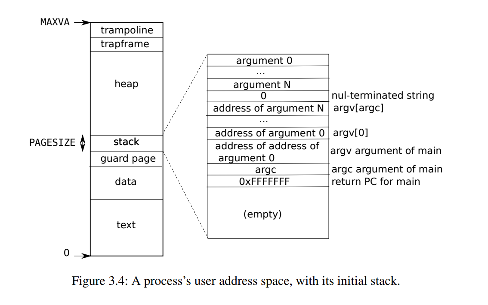

# Page Tables

## 1 Paging Hardware

xv6运行于Sv39 RISC-V，即在64位地址中只有最下面的39位被使用作为虚拟地址，其中底12位是页内偏移，高27位是页表索引，即4096字节($2^{12}$)作为一个page，一个进程的虚拟内存可以有 $2^{27}$个page，对应到页表中就是$2^{27}$个page table entry (PTE)。每个PTE有一个44位的physical page number (PPN)用来映射到物理地址上和10位flag，总共需要54位，也就是一个PTE需要8字节存储。即每个物理地址的高44位是页表中存储的PPN，低12位是页内偏移，一个物理地址总共由56位构成。

在实际中，页表并不是作为一个包含了$2^{27}$个PTE的大列表存储在物理内存中的，而是采用了三级树状的形式进行存储，这样可以让页表分散存储。每个页表就是一页。第一级页表是一个4096字节的页，包含了512个PTE（因为每个PTE需要8字节），每个PTE存储了下级页表的页物理地址，第二级列表由512个页构成，第三级列表由512*512个页构成。因为每个进程虚拟地址的高27位用来确定PTE，对应到3级页表就是最高的9位确定一级页表PTE的位置，中间9位确定二级页表PTE的位置，最低9位确定三级页表PTE的位置。如下图所示。第一级根页表的物理页地址存储在satp寄存器中，每个CPU拥有自己独立的satp

{width="400"}

PTE flag可以告诉硬件这些相应的虚拟地址怎样被使用，比如PTE_V

表明这个PTE是否存在，PTE_R、PTE_W、PTE_X控制这个页是否允许被读取、写入和执行，PTE_U

控制user mode是否有权访问这个页，如果PTE_U=0，则只有supervisor mode有权访问这个页。

## 2 Kernel address space

每个进程有一个页表，用于描述进程的用户地址空间，还有一个内核地址空间（所有进程共享这一个描述内核地址空间的页表）。为了让内核使用物理内存和硬件资源，内核需要按照一定的规则排布内核地址空间，以能够确定哪个虚拟地址对应自己需要的硬件资源地址。用户地址空间不需要也不能够知道这个规则，因为用户空间不允许直接访问这些硬件资源。

QEMU会模拟一个从0x80000000开始的RAM，一直到0x86400000。QEMU会将设备接口以控制寄存器的形式暴露给内核，这些控制寄存器在0x80000000以下。kernel对这些设备接口控制寄存器的访问是直接和这些设备而不是RAM进行交互的。

左边和右边分别是kernel virtual address和physical address的映射关系。在虚拟地址和物理地址中，kernel都位于KERNBASE=0x80000000的位置，这叫做直接映射。用户空间的地址分配在free memory中有一些不是直接映射的内核虚拟地址：

- trampoline page（和user pagetable在同一个虚拟地址，以便在user space和kernel space之间跳转时切换进程仍然能够使用相同的映射，真实的物理地址位于kernel text中的`trampoline.S`）
- kernel stack page：每个进程有一个自己的内核栈kstack，每个kstack下面有一个没有被映射的guard page，guard page的作用是防止kstack溢出影响其他kstack。当进程运行在内核态时使用内核栈，运行在用户态时使用用户栈。**注意**：还有一个内核线程，这个线程只运行在内核态，不会使用其他进程的kstack，内核线程没有独立的地址空间。

## 3 Code: creating an address space

xv6中和页表相关的代码在`kernel/vm.c`中。最主要的结构体是`pagetable_t`，这是一个指向页表的指针。`kvm`开头的函数都是和kernel virtual address相关的，`uvm`开头的函数都是和user virtual address相关的，其他的函数可以用于这两者

几个比较重要的函数：

- `walk`：给定一个虚拟地址和一个页表，返回一个PTE指针
- `mappages`：给定一个页表、一个虚拟地址和物理地址，创建一个PTE以实现相应的映射
- `kvminit`用于创建kernel的页表，使用`kvmmap`来设置映射
- `kvminithart`将kernel的页表的物理地址写入CPU的寄存器`satp`中，然后CPU就可以用这个kernel页表来翻译地址了
- `procinit`(kernel/proc.c)为每一个进程分配(`kalloc`)kstack。`KSTACK`会为每个进程生成一个虚拟地址（同时也预留了guard pages)，`kvmmap`将这些虚拟地址对应的PTE映射到物理地址中，然后调用`kvminithart`来重新把kernel页表加载到`satp`中去。

每个RISC-V **CPU** 会把PTE缓存到Translation Look-aside Buffer (TLB)中，当xv6更改了页表时，必须通知CPU来取消掉当前的TLB，取消当前TLB的函数是`sfence.vma()`，在`kvminithart`中被调用

## 4 Physical memory allocation for kernel

xv6对kernel space和PHYSTOP之间的物理空间在运行时进行分配，分配以页(4096 bytes)为单位。分配和释放是通过对空闲页链表进行追踪完成的，分配空间就是将一个页从链表中移除，释放空间就是将一页增加到链表中

kernel的物理空间的分配函数在`kernel/kalloc.c`中，每个页在链表中的元素是`struct run`，每个`run`存储在空闲页本身中。这个空闲页的链表`freelist`由spin lock保护，包装在`struct kmem`中。

- `kinit()`：对分配函数进行初始化，将kernel结尾到PHYSTOP之间的所有空闲空间都添加到kmem链表中，这是通过调用`freerange(end, PHYSTOP)`实现的
- `freerange()`对这个范围内所有页都调用一次`kfree`来将这个范围内的页添加到`freelist`链表中

## 5 User space memory

每个进程有自己的用户空间下的虚拟地址，这些虚拟地址由每个进程自己的页表维护，用户空间下的虚拟地址从0到MAXVA

当进程向xv6索要更多用户内存时，xv6先用kalloc来分配物理页，然后向这个进程的页表增加指向这个新的物理页的PTE，同时设置这些PTE的flag

图3.4是一个进程在刚刚被exec调用时的用户空间下的内存地址，stack只有一页，包含了exec调用的命令的参数从而使main(argc, argv)可以被执行。stack下方是一个guard page来检测stack溢出，一旦溢出将会产生一个page fault exception

`sbrk`是一个可以让进程增加或者缩小用户空间内存的system call。`sbrk`调用了`growproc`(kernel/proc.c)来改变`p->sz`从而改变**heap**中的program break，`growproc`调用了`uvmalloc`和`uvmdealloc`，前者调用了`kalloc`来分配物理内存并且通过`mappages`向用户页表添加PTE，后者调用了`kfree`来释放物理内存

## 6 Code: exec

`exec`是一个system call，为以ELF格式定义的文件系统中的可执行文件创建用户空间。

`exec`先检查头文件中是否有ELF_MAGIC来判断这个文件是否是一个ELF格式定义的二进制文件，用`proc_pagetable`来为当前进程创建一个还没有映射的页表，然后用`uvmalloc`来为每个ELF segment分配物理空间并在页表中建立映射，然后用`loadseg`来把ELF segment加载到物理空间当中。注意`uvmalloc`分配的物理内存空间可以比文件本身要大。

接下来`exec`分配user stack，它仅仅分配一页给stack，通过`copyout`将传入参数的string放在stack的顶端，在ustack的下方分配一个guard page

如果`exec`检测到错误，将跳转到`bad`标签，释放新创建的`pagetable`并返回-1。`exec`必须确定新的执行能够成功才会释放进程旧的页表`proc_freepagetable(oldpagetable, oldsz)`，否则如果system call不成功，就无法向旧的页表返回-1

## 7 Real world

xv6将kernel加载到0x8000000这一RAM物理地址中，但是实际上很多RAM的物理地址都是随机的，并不一定存在0x8000000这个地址

实际的处理器并不一定以4096bytes为一页，而可能使用各种不同大小的页