# Go 语言进阶与依赖管理

## Go语言进阶

从并发编程的视角了解Go高性能的本质

### 并发 VS 并行

Go可以充分发挥多核优势，高效运行

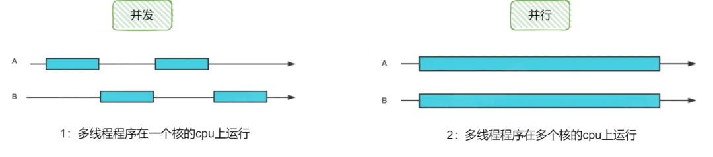

### Goroutine

**线程**：用户态，轻量级线程，栈MB级别。

**协程**：内核态，线程跑多个协程，栈KB级别。

<center>{width="500"}</center>


在go里面快速开启一个协程快速打印`hello goroutine: 0 ~ hello goroutine: 4`
```Go
func hello(i int) {
	println("hello world : " + fmt.Sprint(i))
}

func HelloGoRoutine() {
	for i := 0; i < 5; i++ {
		go func(j int) {
			hello(j)
		}(i)
	}
	time.Sleep(time.Second)
}
```

### CSP (Communicating Sequential Processes)

Go提倡**通过通信共享内存**而不是通过共享内存而实现通信

<center>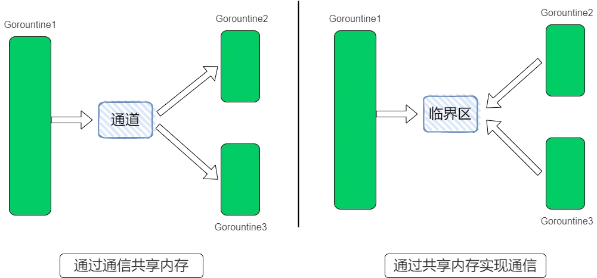{width="500"}</center>


### Channel

make(chan元素类型，[缓冲大小])

- 无缓冲通道make(chan int)
- 有缓冲通道make(chan int,2)

<center>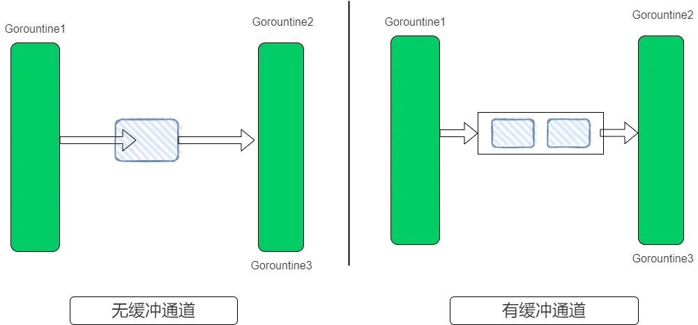{width="500"}</center>

```go
func CalSquare() {
	src := make(chan int)
	dest := make(chan int, 3)
	// A子协程发送0~9数字
	go func() {
		defer close(src)
		for i := 0; i < 10; i++ {
			src <- i
		}
	}()
	// B子协程计算输入数字的平方
	go func() {
		defer close(dest)
		for i := range src {
			dest <- i * i
		}
	}()
	// 主协程输出最后平方数
	for i := range dest {
		println(i)
	}
}
```

### 并发安全Lock

变量执行2000次+1操作，5个协程并发执行

```go
var (
	x int64
	lock sync.Mutex
)

func addWithLock() {
	for i := 0; i < 2000; i++ {
		lock.Lock()
		x += 1
		lock.Unlock()
	}
}

func addWithoutLock() {
	for i := 0; i < 2000; i++ {
		x += 1
	}
}

func Add() {
	x = 0
	for i := 0; i < 5; i++ {
		go addWithLock()
	}
	time.Sleep(time.Second)
	fmt.Println("WithLock:", x)
	x = 0
	for i := 0; i < 5; i++ {
		go addWithoutLock()
	}
	time.Sleep(time.Second)
	fmt.Println("WithoutLock:", x)
}
```

加锁之后得到预期值10000，未加锁输出值是不确定的

<center>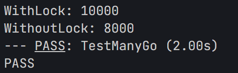{width="300"}</center>

### WaitGroup

- Add方法：计数器+delta
- Done方法：计数器-1
- Wait方法：阻塞到计数器为0

计数器：开启协程 +1；执行结束-1；主协程阻塞直到计数器为0

<center>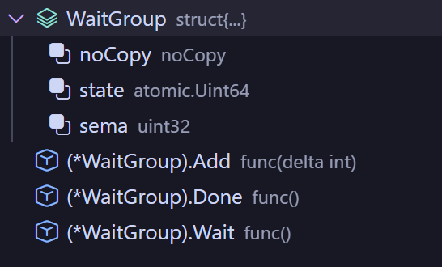{width="300"}</center>

回到最初多个协程带打印hello gorouting的例子，现在用watigroup实现协程的同步阻塞。

首先通过add方法，对计数器+5，然后开启协程，每个协程执行完后，通过done对计数器减少1，最后wait主协程阻塞，计数器为0退出主协程
```go
func ManyGo() {
	var wg sync.WaitGroup
	for i := 0; i < 5; i++ {
		wg.Add(1)
		go func(j int) {
			defer wg.Done()
			hello(j)
		}(i)
	}
	wg.Wait()
}
```

### 小结

主要涉及3个方面：

- 协程Goroutine，通过高效的调度模型实现高并发操作
- 通道channel，通过通信实现共享内存
- sync相关关键字，实现并发安全操作和协程间的同步

## 依赖管理

### 背景

对于hello world以及类似的单体函数只需要依赖原生SDK,而实际工程会相对复杂，我们不可能基于标准库0~1编码搭建，而更多的关注业务逻辑的实现，而其他的涉及框架、日志、driver、 以及collection等一系列依赖都会通过sdk的方式引入，这样对依赖包的管理就显得尤为重要。

<center>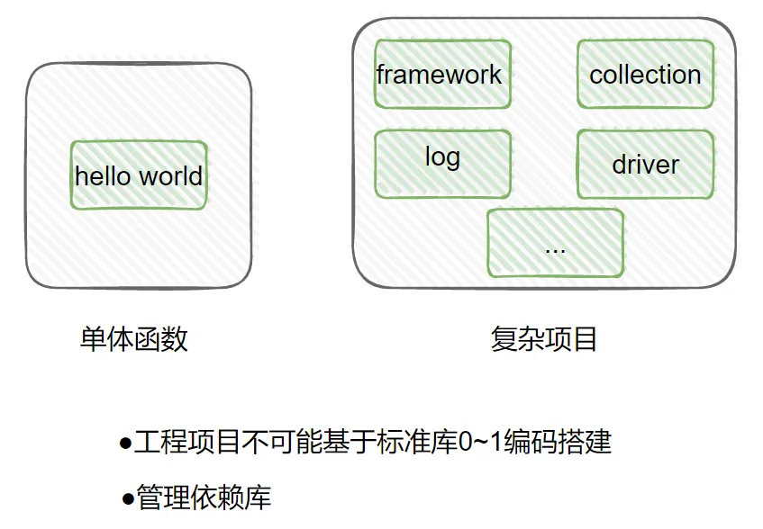{width="500"}</center>

### Go依赖管理演进

Go的依赖管理主要经历了3个阶段，分别是：GOPATH-->Go Vendor-->Go Module。到目前被广泛应用的go module，整个演进路线主要围绕实现两个目标来迭代发展的

<center>{width="500"}</center>

#### GOPATH

GOPATH是Go语言支持的一个环境变量，value是GO项目的工作区。目录有以下结构:

- bin：存放Go项目编译生成的二进制文件
- pkg：存放编译的中间产物，加快编译速度
- src：存放Go项目的源码

#### GOPATH——弊端

<center>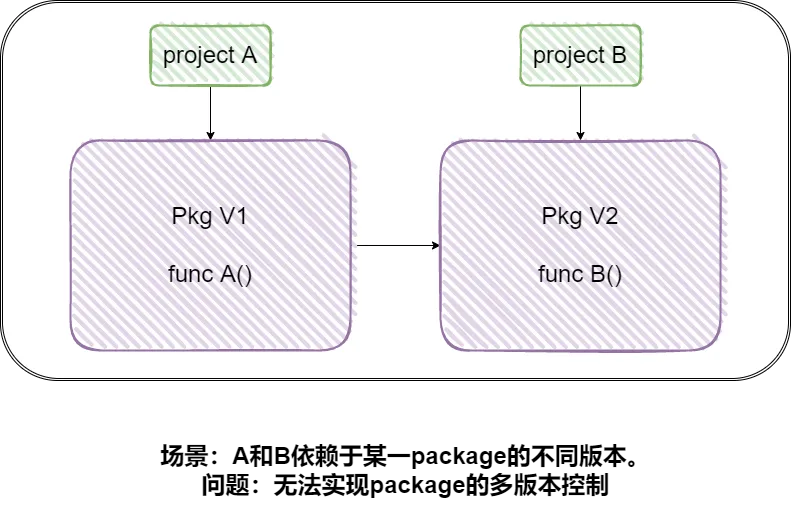{width="500"}</center>

如图，同一个pkg，有2个版本，A-->A0、B-->B0，而src下只能有一个版本存在，那AB项目无法保证都能编译通过。也就是在go path管理模式下，如果多个项目依赖同一个库，则依赖该库是同一份代码，所以不同项目不能依赖同一个库的不同版本，这很显然不能满足我们的项目依赖需求。为了解决这问题，go vender出现了。 

#### Go Vendor——弊端

Vendor是当前项目中的一个目录，其中存放了当前项目依赖的副本。在Vendor机制下，如果当前项目存在Vendor目录，会优先使用该目录下的依赖，如果依赖不存在，会从GOPATH中寻找

但vendor无法很好解决依赖包的版本变动问题和一个项目依赖同一个包的不同版本的问题，下面我们看一个场景

<center>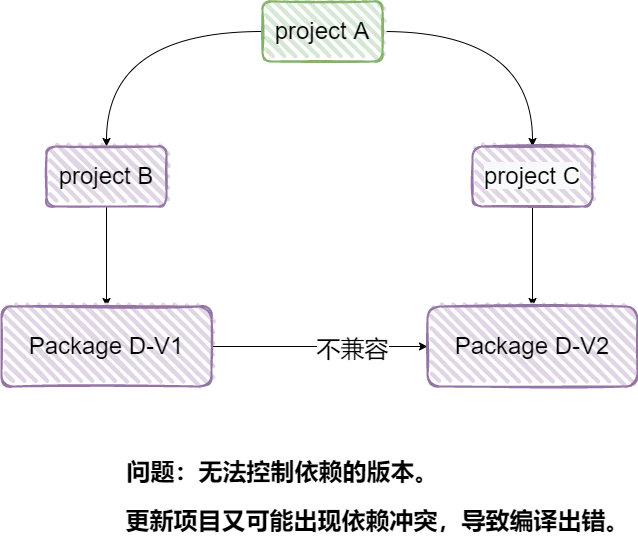{width="500"}</center>

#### Go Module

- 通过go.mod文件管理依赖包版本
- 通过go get/go mod指令工具管理依赖包

GO Module是Go语言官方推出的依赖管理系统，解决了之前依赖管理系统存在的诸如无法依赖同一个库的多个版本等问题，go module从Go 1.11开始实验性引入Go 1.16默认开启

### 依赖管理三要素

- 配置文件，描述依赖go.mod
- 中心仓库管理依赖库Proxy
- 本地工具go get/mod

### 依赖配置 

#### go.mod

<center>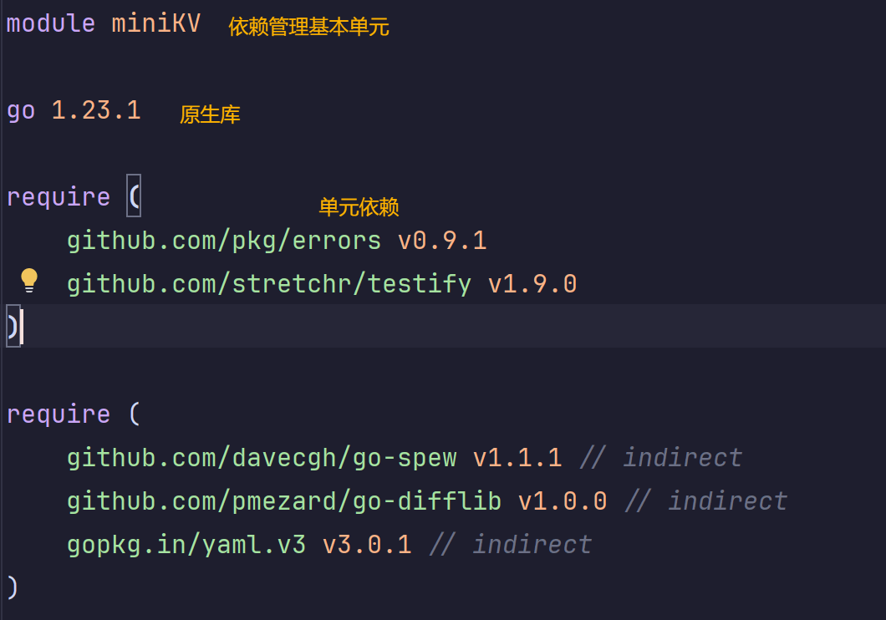{width="500"}</center>


依赖标识：[Module Path] [Version/Pseudo-version]

#### version

go path和go vendor都是源码副本方式依赖，没有版本规则概念，而go mod为了放方便管理则定义了版本规则，分为语义化版本；其中语义化版本包括不同的MAJOR版本表示是不兼容的AP,所以即使是同一个库，MAJOR版本不同也会被认为是不同的模块；MINOR版本通常是新增函数或功能，向后兼容；

而patch版本一般是修复bug基础版本前缀是和语义化版本一样的；时间戳(yyymmddhhmmss)，也就是提交Commit的时间，最后是校验(abcdefabcdef)，包含12位的哈希前缀；每次提交commit后Go都会默认生成一个伪版本号。

#### indirect

indirect后缀，表示go.mod对应的当前模块，没有直接导入该依赖模块的包，也就是非直接依赖，表示间接依赖

例如：A-->B-->C

- A-->B 直接依赖
- A-->C 间接依赖 

#### incompatible

下一个常见是的是incompatible，主版本2+模块会在模块路径增加/vN后缀，这能让go module按照不同的模块来处理同一个项目不同主版本的依赖。

由于go module是1.11实验性引入所以这项规则提出之前已经有一些仓库打上了2或者更高版本的tag了，为了兼容这部分仓库，对于没有go.mod文件并且主版本在2或者以上的依赖，会在版本号后加上+incompatible后缀

#### 依赖配置依赖图

!!! Question

	如果X项目依赖了A、B两个项目，且A、B分别依赖了C项目的v1.3、v1.4两个版本，最终编译时所使用的C项目的版本为如下哪个选项? (单选) 

	<center>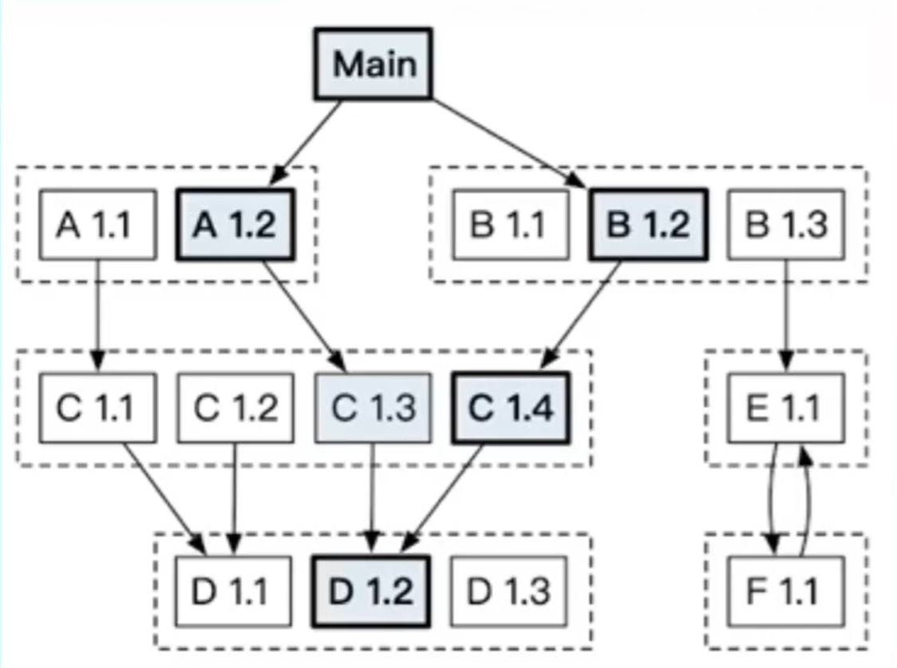{width="300"}</center>

	A. v1.3

	B. v1.4

	C. A用到C时用v1. 3编译, B用到C时用v1.4编译

	答案：**B 选择最低的兼容版本**

### 依赖分发

#### 依赖分发——回源

> go module的依赖分发。也就是从哪里下载，如何下载的问题？

github是比较常见给的代码托管系统平台，而Go Modules系统中定义的依赖，最终可以对应到多版本代码管理系统中某一项目的特定提交或版本，这样的话，对于go.mod中定义的依赖，则直接可以从对应仓库中下载指定软件依赖，从而完成依赖分发。

<center>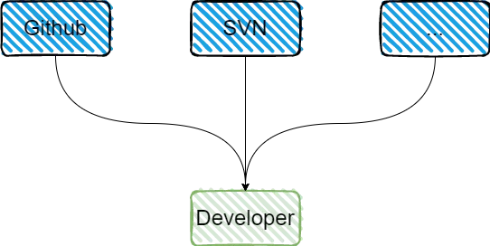{width="500"}</center>

但直接使用版本管理仓库下载依赖，存在多个问题，首先无法保证构建确定性:软件作者可以直接代码平台增加修改/删除软件版本，导致下次构建使用另外版本的依赖，或者找不到依赖版本。无法保证依赖可用性:依赖软件作者可以直接代码平台删除软件，导致依赖不可用;大幅增加第三方代码托管平台压力。

#### 依赖分发——Proxy

而go proxy就是解决这些问题的方案，Go Proxy是一个服务站点，它会缓源站中的软件内容，缓存的软件版本不会改变，并且在源站软件删除之后依然可用，从而实现了供"immutability"和"available"的依赖分发;使用Go Proxy之后，构建时会直接从Go Proxy站点拉取依赖。类比项目中，下游无法满足我们上游的需求

<center>{width="500"}</center>

#### 依赖分发——变量GOPROXY

GOPROXY="https://proxy1.cn, https://proxy2.cn ,direct'

服务站点URL列表，“direct" 表示源站

<center>{width="500"}</center>

**go proxy**的使用：Go Modules通过GOPROXY环境变量控制如何使用Go Proxy；GOPROXY是一个Go Proxy站点URL列表，可以使用directr表示源站。对于示例配置，整体的依赖寻址路径，会优先从proxy1下载依赖，如果proxy1不存在，后下钻proxy2寻找，如果proxy2中不存在则会回源到源站直接下载依赖，缓存到proxy站点中

### 工具 go get

<center>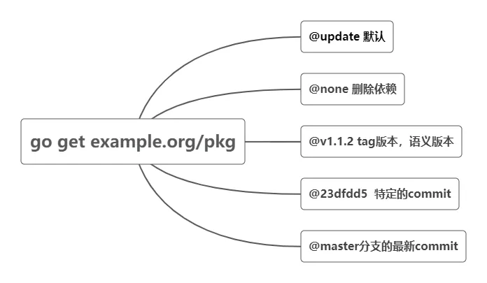{width="500"}</center>

### 工具 go mod

尽量提交之前执行下go tidy，减少构建时无效依赖包的拉取

<center>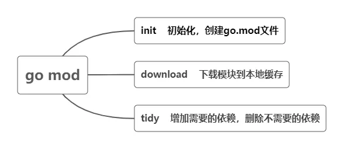{width="500"}</center>


### 小结

依赖管理三要素

- 配置文件，描述依赖 go.mod
- 中心仓库管理依赖库 Proxy
- 本地工具 go get/mod