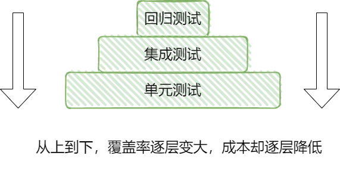
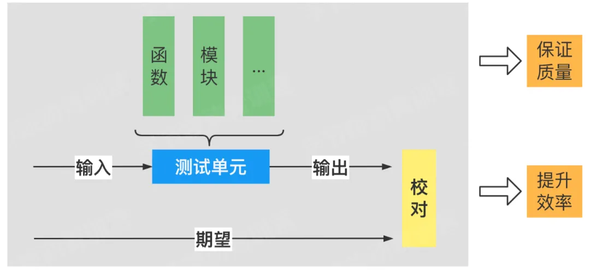
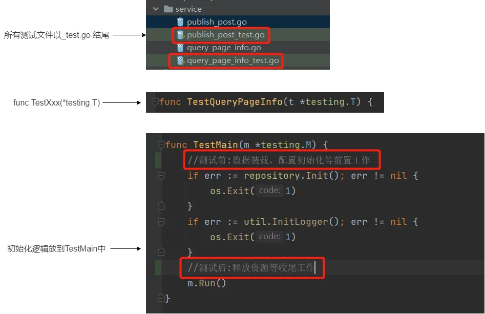
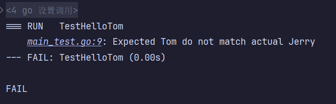
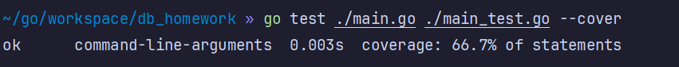
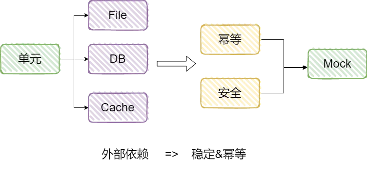
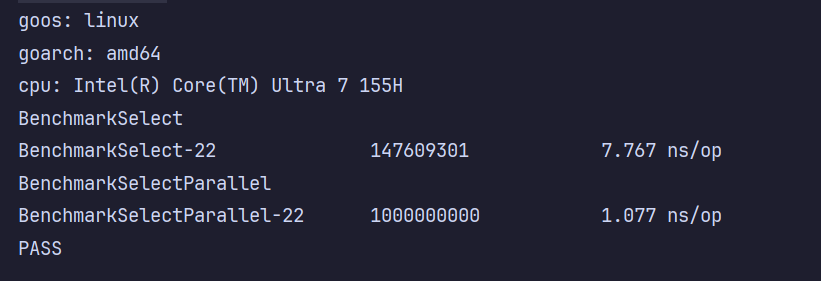
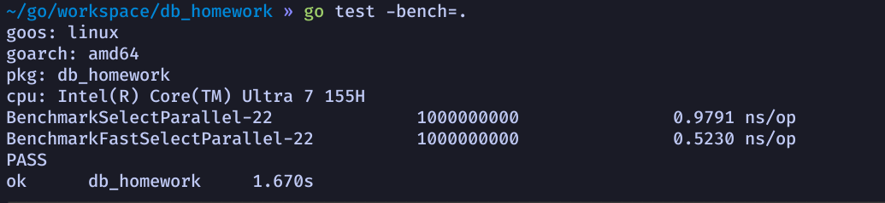

# Go语言工程实践之测试

在实际工程开发中，另一个重要概念就是单元测试，这里主要是go测试相关的内容，包括**单元测试、Mock测试以及基准测试**

<center>{width="500"}</center>

测试是避免事故的最后一道屏障

<center>{width="500"}</center>

测试一般分为，回归测试一般是QA同学手动通过终端回归一些固定的主流程场景，集成测试是对系统功能维度做测试验证，而单元测试测试开发阶段，开发者对单独的函数、模块做功能验证，层级从上至下，测试成本逐渐减低，而测试覆盖率确逐步上升，所以单元测试的覆盖率一定程度上决定这代码的质量

## 单元测试

<center>{width="500"}</center>

单元测试主要包括，输入、测试单元、输出以及校对，单元的概念比较广，包括接口，函数，模块等；用最后的校对来保证代码的功能与我们的预期相符

单测一方面可以保证质量，在整体覆盖率足够的情况下，一定程度上既保证了新功能本身的正确性，又未破坏原有代码的正确性

另一方面可以提升效率，在代码有bug的情况下，通过编写单测，可以在一个较短周期内定位和修复问题


### 规则

从文件上就很好了区分源码和测试代码，以Test开头，且连接的第一个字母大写

<center>{width="600"}</center>

### 例子

```go
// main.go
func HelloTom() string {
	return "Jerry"
}
// main_test.go
func TestHelloTom(t *testing.T) {
	output := HelloTom()
	expectOutput := "Tom"
	if output != expectOutput {
		t.Errorf("Expected %s do not match actual %s", expectOutput, output)
	}
}
```

### 运行

go test [flags] [packages]

<center>{width="500"}</center>

### assert

```go
import (
  "github.com/stretchr/testify/assert"
  "testing"
)

func TestHelloTom(t *testing.T) {
  output := HelloTom()
  expectOutput := "Tom"
  assert.Equal(t, expectOutput, output)
}
```

### 覆盖率

```go
// main.go
func JudgePassLine(score int16) bool {
	if score >= 60 {
		return true
	}
	return false
}
// main_test.go
func TestJudgePassLine(t *testing.T) {
	isPass := JudgePassLine(80)
	assert.Equal(t, true, isPass)
}
```
<center>{width="600"}</center>

### Tips

- 一般覆盖率: 50%~60%，较高覆盖率80%+
- 测试分支相互独立、全面覆盖
- 测试单元粒度足够小，函数单一职责 (要求函数体足够小，这样就比较简单的提升覆盖率，也符合函数设计的单一职责)

## 单元测试——依赖

我们的单测需要保证稳定性和幕等性，稳定是指相互隔离，能在任何时间，任何环境，运行测试。幂等是指每一次测试运行都应该产生与之前一样的结果。而要实现这一目的就要用到mock机制。

<center>{width="600"}</center>


## 单元测试——文件处理

```go
package test

import (
  "bufio"
  "os"
  "strings"
)

func ReadFirstLine() string {
  open, err := os.Open("log")
  defer open.Close()
  if err != nil {
  return ""
  }
  scanner := bufio.NewScanner(open)
  for scanner.Scan() {
  return scanner.Text()
  }
  return ""
}

func ProcessFirstLine() string {
  line := ReadFirstLine()
  destLine := strings.ReplaceAll(line, "11", "00")
  return destLine
}
```

测试类

```go
package test

import (
  "bou.ke/monkey"
  "github.com/stretchr/testify/assert"
  "testing"
)

func TestProcessFirstLine(t *testing.T) {
  firstLine := ProcessFirstLine()
  assert.Equal(t, "line00", firstLine)
}
```

## 单元测试——Mock

快速Mock函数

- 为一个函数打桩
- 为一个方法打桩

monkey: https://github.com/bouk/monkey

monkey是一个开源的mock测试库，可以对method，或者实例的方法进行mock反射，指针赋值
Mockey Patch的作用域在Runtime，在运行时通过Go的unsafe包，能够将内存中函数的地址替换为运行时函数的地址

**注意**：因为unsafe操作是不安全的，绕过了 Go 的内存安全原则，所以应该在测试环境中使用Monkey Patch，并且只在需要的时候使用，确保真正需要Mocking的testing函数只使用这种方式。

以上面文件操作的为例，通过patch对ReadFirstLine进行打桩，默认返回`line110`，这里通过defer卸载mock，这样整个测试函数就摆脱了本地文件的束缚和依赖

```go
package test

import (
  "bou.ke/monkey"
  "github.com/stretchr/testify/assert"
  "testing"
)

func TestProcessFirstLineWithMock(t *testing.T) {
  monkey.Patch(ReadFirstLine, func() string {
  return "line110"
  })
  defer monkey.Unpatch(ReadFirstLine)
  line := ProcessFirstLine()
  assert.Equal(t, "line000", line)
}
```

## 基准测试

Go语言还提供了基准测试框架，基准测试是指测试一段程序的运行性能及耗费CPU的程度。而我们在实际项目开发中，经常会遇到代码性能瓶颈，为了定位问题经常要对代码做性能分析，这就用到了基准测试。使用方法类似于单元测试

- 优化代码，需要对当前代码分析
- 内置的测试框架提供了基准测试的能力

### 例子

这里举一个服务器负载均衡的例子，首先我们有10个服务器列表，每次随机执行select函数随机选择一 个执行。

```go
package benchmark

import (
  "github.com/bytedance/gopkg/lang/fastrand"
  "math/rand"
)

var ServerIndex [10]int

func InitServerIndex() {
  for i := 0; i < 10; i++ {
    ServerIndex[i] = i+100  
  }
}

func Select() int {
  return ServerIndex[rand.Intn(10)]
}
```

### 运行

```go
func BenchmarkSelect(b *testing.B) {
	InitServerIndex()
	b.ResetTimer()
	for i := 0; i < b.N; i++ {
		Select()
	}
}

func BenchmarkSelectParallel(b *testing.B) {
	InitServerIndex()
	b.ResetTimer()
	b.RunParallel(func(pb *testing.PB) {
		for pb.Next() {
			Select()
		}
	})
}
```
测试结果如下：

<center>{width="600"}</center>

### 优化

https://github.com/bytedance/gopkg

```go
func FastSelect() int {
  return ServerIndex[fastrand.Intn(10)]
}
```

而bytedance为了解决这一随机性能问题，开源了一个高性能随机数方法fastrand，上面有开源地址，我们这边再做一下基准测试，性能得到了提升

<center>{width="600"}</center>

主要的思路是牺牲了一定的数列一致性，在大多数场景是适用的。