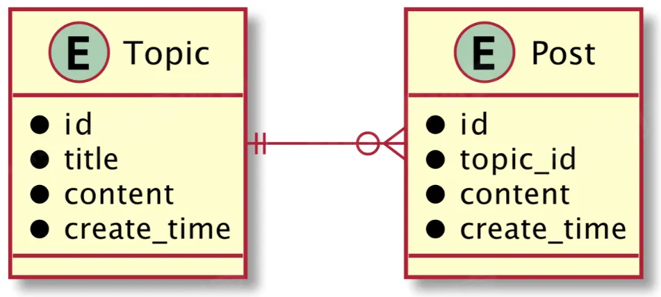

# 社区话题页面demo实践

## 需求描述

社区话题页面

- 展示话题（标题，文字描述）和回帖列表
- 暂不考虑前端页面实现，仅仅实现一个本地web服务
- 话题和回帖数据用文件存储

## 需求用例

主要涉及功能点，用户浏览消费，涉及页面的展示，包括话题内容和回帖的列表，其实从图中我们应该会抽出2个实体的，而实体的属性有哪些，他们之间的联系又如何？

<center>{width="400"}</center>

## ER图-Entity Relationship Diagram

ER图，用来描述现实世界的概念模型

<center>{width="400"}</center>

## 分层结构

整体分为三层，repository数据层， service逻辑层， controoler视图层。

数据层关联底层数据模型，也就是这里的model，封装外部数据的增删改查，我们的数据存储在本地文件，通过文件操作拉取话题，帖子数据；数据层面向逻辑层，对service层透明，屏蔽下游数据差异，也就是不管下游是文件，还是数据库，还是微服务等，对service层的接口模型是不变的

Servcie逻辑层处理核心业务逻辑，计算打包业务实体entiy，对应我们的需求，就是话题页面，包括话题和回帖列表，并上送给视图层

Cortroller视图层负责处理和外部的交互逻辑，以view视图的形式返回给客户端，对于我们需求，我们封装json格式化的请求结果，api形式访问就好

<center>{width="600"}</center>

- 数据层：数据Model，外部数据的增删改查
- 逻辑层：业务Entity，处理核心业务逻辑输出
- 视图层：视图view，处理和外部的交互逻辑

## 组件工具

1. **Gin**高性能go web框架 https://github.com/gin-gonic/gin#installation
2. Go Mod 
  
      go mod init

      go get  gopkg.in/gin-gonic/gin.v1@v1.3.0

介绍下开发涉及的基础组件和工具，首先是gin， 高性能开源的go web框架，我们基于gin搭建web服务器，这里我们只是简单的使用，主要涉及路由分发，不会涉及其他复杂的概念。

因为我们引入了web框架，所以就涉及go module依赖管理，如前面依赖管理课程内容讲解，我们首先通过go mod是初始化go mod管理配置文件，然后go get下载gin依赖，这里显示用了V1.3.0版本。

有了框架依赖，我们只需要关注业务本身的实现，从reposity --> service  --> contoller我们一步步实现。

##  Repository

| Topic            |             Post      |
| :--------------: | :---------------: |
| <center>{width="300"}</center> | <center>{width="300"}</center> |
|   QueryTopicByld        |     QueryPostsByParentld           |

### Repository——index

一方面查询我们可以用全扫描遍历的方式，但是这虽然能达到我们的目的，但是并非高效的方式，所以这里引出索引的概念，索引就像书的目录，可以引导我们快速查找定位我们需要的结果；这里我们用map实现内存索引，在服务对外暴露前，利用文件元数据初始化全局内存索引，这样就可以实现$O(1)$的时间复杂度查找操作。

```go
var (
	topicIndexMap map[int64]*Topic
	postIndexMap  map[int64][]*Post
)
```

下面是具体的实现，首先是打开文件，基于file初始化scanner，通过迭代器方式遍历数据行，转化为结构体存储至内存map，这就是初始化话题内存索引

```go

func initTopicIndexMap(filePath string) error {
	open, err := os.Open(filePath + "topic")
	if err != nil {
		return err
	}
	scanner := bufio.NewScanner(open)
	topicTmpMap := make(map[int64]*Topic)
	for scanner.Scan() {
		text := scanner.Text()
		var topic Topic
		if err := json.Unmarshal([]byte(text), &topic); err != nil {
			return err
		}
		topicTmpMap[topic.Id] = &topic
	}
	topicIndexMap = topicTmpMap
	return nil
}
```

### Repository——查询

有了查询内存索引，下一步实现查询操作就比较简单了，直接根据查询key获得map中的value就好了 ，这里用到了sync.once，主要适用高并发的场景下只执行一次的场景，这里的基于once的实现模式就是我们平常说的单例模式，减少存储的浪费

```go
var (
	postDao *PostDao
	postOnce sync.Once
)
func NewPostDaoInstance() *PostDao {
	postOnce.Do(
		func() {
			postDao = &PostDao{}
		})
	return postDao
}
func (*PostDao) QueryPostsByParentId(parentId int64) []*Post {
	return postIndexMap[parentId]
}
```

## Service

实体

```go
type PageInfo struct {
  Topic    *repository.Topic
  PostList []*repository.Post
}
```

流程：

<center>{width="500"}</center>

```go
// 代码流程编排
func (f *QueryPageInfoFlow) Do() (*PageInfo, error) {
	if err := f.checkParam(); err != nil {
		return nil, err
	}
	if err := f.prepareInfo(); err != nil {
		return nil, err
	}
	if err := f.packPageInfo(); err != nil {
		return nil, err
	}
	return f.pageInfo, nil
}
```
关于prepareInfo方法，话题和回帖信息的获取都依赖topicId，这样2这就可以并行执行，提高执行效率

<center>{width="500"}</center>

```go

func (f *QueryPageInfoFlow) prepareInfo() error {
	//获取topic信息
	var wg sync.WaitGroup
	wg.Add(2)
	go func() {
		defer wg.Done()
		topic := repository.NewTopicDaoInstance().QueryTopicById(f.topicId)
		f.topic = topic
	}()
	//获取post列表
	go func() {
		defer wg.Done()
		posts := repository.NewPostDaoInstance().QueryPostsByParentId(f.topicId)
		f.posts = posts
	}()
	wg.Wait()
	return nil
}
```
**在做项目开发中，一定要思考流程是否可以并行处理，通过压榨CPU，降低接口耗时，不要一味的串行实现，浪费多核CPU的资源**

## Controller

Service实现完成，下面就是controller层。这里我们定义一个view对象，通过code msg打包业务状态信息，用data承载业务实体信息

```go
type PageData struct {
	Code int64       `json:"code"`
	Msg  string      `json:"msg"`
	Data interface{} `json:"data"`
}

func QueryPageInfo(topicIdStr string) *PageData {
	topicId, err := strconv.ParseInt(topicIdStr, 10, 64)
  // 构建View对象业务错误码
	if err != nil {
		return &PageData{
			Code: -1,
			Msg:  err.Error(),
		}
	}
	pageInfo, err := service.QueryPageInfo(topicId)
	if err != nil {
		return &PageData{
			Code: -1,
			Msg:  err.Error(),
		}
	}
	return &PageData{
		Code: 0,
		Msg:  "success",
		Data: pageInfo,
	}
}
```

## Router

```go
func main() {
	// 初始化数据索引
	if err := Init("./data/"); err != nil {
		os.Exit(-1)
	}
	// 初始化引擎配置
	r := gin.Default()
	// 构建路由
	r.GET("/community/page/get/:id", func(c *gin.Context) {
		topicId := c.Param("id")
		data := cotroller.QueryPageInfo(topicId)
		c.JSON(200, data)
	})
	// 启动服务
	err := r.Run()
	if err != nil {
		return
	}
}

func Init(filePath string) error {
	if err := repository.Init(filePath); err != nil {
		return err
	}
	return nil
}
```

## 运行

终端执行：`curl --location --request GET 'http://127.0.0.1:8080/community/page/get/2'`

<center>{width="500"}</center>

## Homework

- 支持发布帖子
- 本地ID生成需要保证不重复、唯一性
- Append文件，更新索引，注意Map的并发安全问题